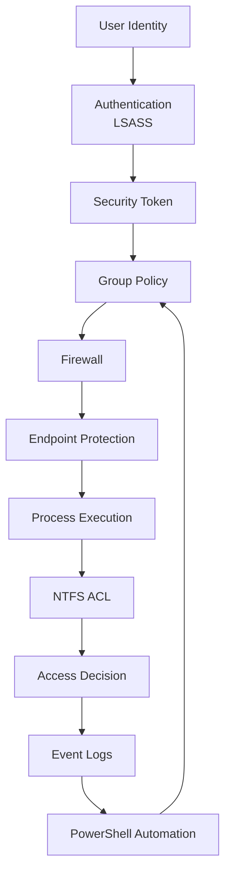
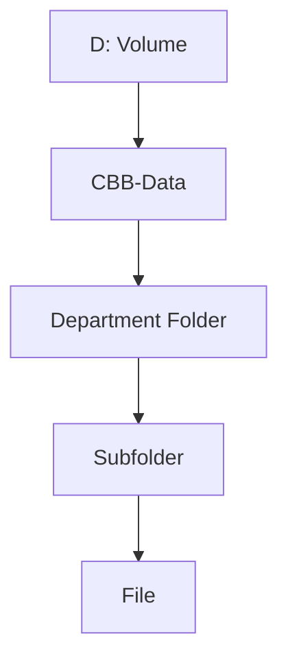
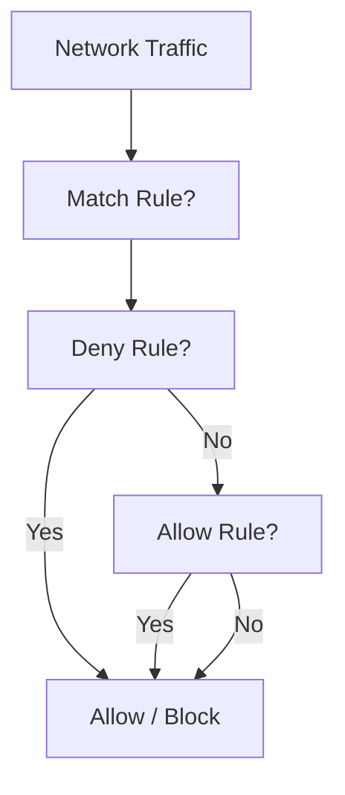
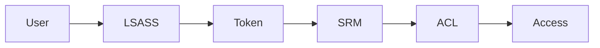
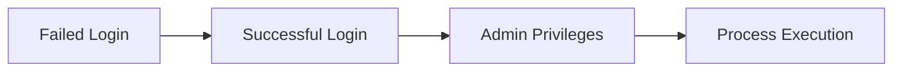
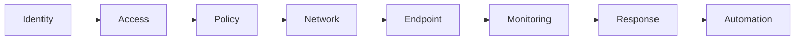

# **OSYS2020 – Windows Security**

# **Final Exam Preparation Pack**

This guide consolidates everything you’ve learned into:

* **Core diagrams**
* **Practice scenarios**
* **Quick-reference sheets**
* **Likely exam questions**

---

# **1. Key Diagrams Recap (Security Brain)**

---

## **1.1 Complete Windows Security Architecture**



---

## **1.2 NTFS Permission Flow**



---

## **1.3 Firewall Decision Flow**



---

## **1.4 Authentication & Access Decision**



---

## **1.5 Incident Timeline Model**



---

# **2. Practice Scenarios (Exam-Level Thinking)**

---

## **Scenario 1 – NTFS Misconfiguration**

A user can open a folder but cannot access files inside.

### Ask Yourself:

* Was **“This folder only”** used?
* Did inheritance propagate correctly?
* What are effective permissions?

---

## **Scenario 2 – Firewall Issue**

A web server works locally but not from another machine.

### Ask Yourself:

* Is port 80 blocked inbound?
* Which firewall profile is active?
* Is the service running?

---

## **Scenario 3 – Suspicious Login Activity**

You see:

* multiple 4625 events
* followed by a 4624

### Ask Yourself:

* Is this a brute-force attack?
* What account is targeted?
* What happened next?

---

## **Scenario 4 – Privilege Escalation**

User logs in and receives Event ID 4672.

### Ask Yourself:

* What privileges were assigned?
* Is this expected behavior?
* What groups is the user in?

---

## **Scenario 5 – Malware Detection**

Defender blocks a file.

### Ask Yourself:

* What type of threat?
* Was it quarantined?
* How did it get there?

---

## **Scenario 6 – Broken Inheritance**

Permissions differ across subfolders.

### Ask Yourself:

* Where was inheritance disabled?
* Is this intentional?
* Is there permission drift?

---

# **3. Quick-Reference Cheat Sheets**

---

## **3.1 Core Security Layers**

```text
Identity → Authentication → Token → Policy → Firewall → Defender → Process → NTFS → Logs → Automation
```

---

## **3.2 Key Event IDs**

| Event ID | Meaning          |
| -------- | ---------------- |
| 4624     | Successful login |
| 4625     | Failed login     |
| 4672     | Admin privileges |
| 4688     | Process created  |

---

## **3.3 NTFS Rules**

* Use **groups, not users**
* Inheritance = scalability
* Avoid **Deny**
* Watch **“This folder only”**

---

## **3.4 Firewall Rules**

* Deny overrides Allow
* Profiles matter
* Block inbound by default

---

## **3.5 Defender Concepts**

* Real-time protection
* Quarantine threats
* Scan before execution

---

## **3.6 Incident Detection Model**

```text
Single event ≠ incident
Pattern of events = incident
```

---

## **3.7 Automation Model**

```text
Script → Execute → Verify → Report
```

---

# **4. Likely Exam Questions**

---

## **4.1 Conceptual Questions**

* What is a **security token**?
* How does **LSASS** function?
* What is **RBAC** and why is it used?
* What is **inheritance in NTFS**?

---

## **4.2 Scenario-Based Questions**

* Why can a user access a folder but not files?
* Why does a service work locally but not remotely?
* What indicates a brute-force attack in logs?

---

## **4.3 Diagram Questions**

* Explain the **Windows Security Architecture**
* Draw the **NTFS inheritance model**
* Explain **firewall rule evaluation**

---

## **4.4 Troubleshooting Questions**

* Diagnose a permission issue
* Identify a firewall misconfiguration
* Analyze event logs for suspicious activity

---

## **4.5 Applied Questions**

* How would you secure a file server?
* How would you detect an attack?
* How would you respond to a compromise?

---

# **5. Study Strategy (Instructor Guidance)**

---

## **Focus on Understanding, Not Memorization**

Students should aim to understand:

```text
WHY systems behave the way they do
```

---

## **Think Like a Security Analyst**

Ask:

* What is happening?
* Why is it happening?
* What layer is responsible?
* What evidence supports this?

---

## **Use the Security Brain Model**

If stuck:

```text
Trace the flow:
User → Token → Policy → Firewall → Defender → NTFS → Logs
```

---

# **6. Final Mental Model**



---

# **Final Message to Students**

If you understand:

* how security layers interact
* how access decisions are made
* how attacks appear in logs
* how systems enforce rules

You are not memorizing Windows Security…

```text
You are thinking like a security professional.
```
