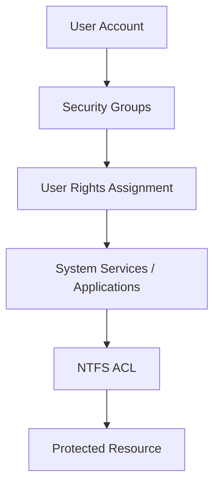

Given what you’ve already built in **WS04 (Identity & Privilege Control)** and **WS05 (NTFS ACLs & File Server Architecture)**, you are actually at a **perfect pivot point in the Windows security model**.

Right now students understand:

WS04

* Users
* Groups
* Roles
* Privilege delegation

WS05

* NTFS ACLs
* Inheritance
* RBAC applied to files
* Effective access evaluation

The **next logical step** is **NOT more file permissions**.

The next step is to show students **how roles control access to SYSTEM SERVICES and APPLICATIONS**, not just files.

That’s where Windows security becomes real.

---

# The Correct Next Step: Built-In Roles and System Privileges

Students need to understand that **Windows roles extend beyond NTFS**.

Permissions control access to:

* files
* services
* applications
* registry keys
* Active Directory objects
* system configuration

So the next workshop should move from:

```
Resource RBAC (files)
```

to

```
Platform RBAC (system capabilities)
```

---

# Recommended Workshop 06

## **WS06 – Built-in Security Groups, User Rights, and System Roles**

This workshop should explore:

### Built-in Groups

Examples students should examine:

| Group                  | Purpose                 |
| ---------------------- | ----------------------- |
| Administrators         | Full system control     |
| Domain Admins          | Domain-wide control     |
| Server Operators       | Server operations       |
| Backup Operators       | Backup privilege bypass |
| Account Operators      | Manage accounts         |
| Print Operators        | Manage printers         |
| Remote Desktop Users   | RDP access              |
| Event Log Readers      | Read logs               |
| Hyper-V Administrators | Manage Hyper-V          |

Students are often shocked to discover that **many of these groups bypass NTFS protections**.

Example:

```
Backup Operators can read any file
even if NTFS denies access.
```

This becomes a **powerful security lesson**.

---

# Second Topic: User Rights Assignment

Students should explore **Local Security Policy → User Rights Assignment**

Examples:

| Right                         | Meaning                  |
| ----------------------------- | ------------------------ |
| Log on locally                | Console access           |
| Log on through Remote Desktop | RDP                      |
| Back up files and directories | Backup privilege         |
| Restore files and directories | Restore privilege        |
| Shut down the system          | Power control            |
| Debug programs                | Very dangerous privilege |

These are **not NTFS permissions**.

They are **system privileges** enforced by the **Security Reference Monitor**.

---

# Third Topic: Application Role Permissions

This connects directly to real environments.

Examples students can investigate:

| Application          | Role Model           |
| -------------------- | -------------------- |
| SQL Server           | SQL roles            |
| IIS                  | Application pools    |
| Hyper-V              | Hyper-V Admins       |
| Windows Event Viewer | Event Log Readers    |
| Remote Desktop       | Remote Desktop Users |

Students should see that **applications often rely on Windows groups** for authorization.

---

# Why This Matters

Right now students might think:

```
Security = file permissions
```

But real Windows security is:

```
Identity
 ↓
Group Membership
 ↓
User Rights
 ↓
System Roles
 ↓
Application Access
 ↓
File Access
```

This is a **layered security architecture**.

---

# Suggested WS06 Learning Goal

Students should answer this question:

> Why can a user sometimes access data even when NTFS denies them?

Possible answers include:

* Backup Operators privilege
* Administrators taking ownership
* System privileges overriding ACLs
* Application-level permissions

This is an **excellent critical thinking moment**.

---

# Recommended WS06 Lab Activities

Students should investigate the system.

### Activity 1

Enumerate built-in groups.

Tools:

```
Active Directory Users and Computers
Computer Management
```

Questions:

* What groups exist?
* What privileges do they imply?

---

### Activity 2

Explore **User Rights Assignment**

Location:

```
Local Security Policy
 → Security Settings
 → Local Policies
 → User Rights Assignment
```

Students should map:

```
Right → Group → Impact
```

---

### Activity 3

Privilege Investigation

Example scenario:

```
User denied NTFS access
but backup operator can still read file
```

Students analyze **why**.

---

# Concept Diagram for Next Workshop

This would be the architecture students should see.



This diagram bridges:

WS04 → WS05 → WS06.

---

# Where This Leads Next

After WS06 you will be perfectly positioned to teach:

### WS07 – Windows Security Architecture

Topics:

* Security Reference Monitor
* LSASS
* Security Tokens
* Kernel vs User Mode

This ties **everything together**.

---

# Suggested Workshop Roadmap

| Workshop | Topic                         |
| -------- | ----------------------------- |
| WS04     | Identity and Groups           |
| WS05     | NTFS Permissions              |
| WS06     | Built-in Roles and Privileges |
| WS07     | Windows Security Architecture |
| WS08     | Group Policy Security         |
| WS09     | Windows Firewall              |
| WS10     | Windows Defender              |
| WS11     | Registry Security             |

---

# My Recommendation

Your next workshop should be:

## **Workshop 06 – Built-in Security Roles and User Privileges**

Focus on:

* Built-in groups
* User rights assignment
* Privilege bypass scenarios
* Application role permissions

This expands RBAC from:

```
File Security
```

to

```
Operating System Security
```

which is exactly where OSYS2020 should go next.

---

If you want, I can also build a **very strong WS06 workshop package** that includes:

* a **Security Privilege Map diagram**
* a **Built-in group investigation lab**
* a **privilege escalation case study**
* a **student discovery exercise**

It would match the **same depth and style as WS05**, which clearly worked very well.
