# **OSYS2020 – Windows Security**

## **Instructor Workplan Grid (NSCC Official Format)**

| Week / Unit | Theme / Focus                                          | Relevant Learning Outcome(s) | Topics / Description                                                                                                        | Learning Activities / Workshops                                                                                               | Evaluation / Assessment |
| ----------- | ------------------------------------------------------ | ---------------------------- | --------------------------------------------------------------------------------------------------------------------------- | ----------------------------------------------------------------------------------------------------------------------------- | ----------------------- |
| **Week 1**  | Course Introduction & Windows Security Fundamentals    | LO1                          | Course expectations; Windows security goals; CIA triad; common threat types; overview of Windows host security architecture | **WS00 – Lab Environment Setup** – Build lab environment (domain controller and workstation); introduce security architecture | Workshop participation  |
| **Week 2**  | Operating System Hardening                             | LO1, LO2                     | Operating system vulnerabilities; patch management; Windows Update; service packs; system hardening principles              | **WS02 – Patch Management and OS Hardening**                                                                                  | Workshop participation  |
| **Week 3**  | Security Baselines and Configuration Standards         | LO2                          | Security templates; configuration baselines; system hardening standards; evaluating secure configurations                   | **WS03 – Security Baselines & Security Templates**                                                                            | Workshop participation  |
| **Week 4**  | Identity and Privilege Control                         | LO2, LO3                     | Identity management; users; groups; RBAC; OU structure and role management                                                  | **WS04 – Identity & Groups Implementation**                                                                                   | Workshop participation  |
| **Week 5**  | NTFS Permissions and Access Control                    | LO2, LO3                     | NTFS ACLs; ACEs; inheritance; effective permissions; file server security architecture                                      | **WS05 – NTFS Access Control Implementation**                                                                                 | Workshop participation  |
| **Week 6**  | Built-in Roles and System Privileges                   | LO2, LO3                     | Built-in security groups; privileges; user rights assignment; privilege escalation risk                                     | **WS06 – Built-in Groups and Privilege Investigation**                                                                        | Workshop participation  |
| **Week 7**  | Windows Security Architecture                          | LO1, LO2                     | LSASS; security tokens; Security Reference Monitor; kernel vs user mode; Windows security enforcement                       | **WS07 – Windows Security Architecture Investigation**                                                                        | Workshop participation  |
| **Week 8**  | Group Policy Security Enforcement                      | LO2, LO3                     | Group Policy architecture; centralized security management; policy inheritance; LSDOU processing order                      | **WS08 – Group Policy Security Lab**                                                                                          | Workshop participation  |
| **Week 9**  | Host Network Security                                  | LO2, LO3                     | Windows Defender Firewall; firewall profiles; inbound/outbound rules; host network protection                               | **WS09 – Windows Firewall Security Lab**                                                                                      | Workshop participation  |
| **Week 10** | **Break Week**                                         | —                            | No scheduled classes                                                                                                        | —                                                                                                                             | —                       |
| **Week 11** | Windows Security Operations – Protection & Monitoring  | LO1, LO2, LO3                | Endpoint protection architecture; malware detection; security auditing; authentication logs; security monitoring            | **WS10 – Endpoint Protection & Malware Defense** + **WS11 – Security Monitoring with Windows Event Logs**                     | Workshop participation  |
| **Week 12** | Windows Security Operations – Investigation & Response | LO2, LO3                     | Registry architecture; persistence mechanisms; malware artifacts; incident investigation techniques                         | **WS12 – Registry Security & Persistence Analysis** + **WS13 – Host-Based Security Incident Investigation**                   | Workshop participation  |
| **Week 13** | Security Operations Automation                         | LO2, LO3                     | PowerShell scripting; automation of security tasks; auditing security configurations; automating administrative controls    | **WS14 – PowerShell Security Automation**                                                                                     | Workshop participation  |
| **Week 14** | Course Review and Final Evaluation                     | LO1, LO2, LO3                | Review of Windows security architecture; identity management; permissions; monitoring; investigation techniques             | **Final Written + Practical Test**                                                                                            | Summative evaluation    |

---

# **Complete OSYS2020 Security Architecture Flow**

The workshops follow the **Windows Security Brain model**, moving from **foundations → identity → authorization → enforcement → protection → monitoring → investigation → automation**.

```mermaid
flowchart TD

Foundation[Security Foundations<br>WS00 – Lab Setup<br>WS01 – Security Fundamentals]

Hardening[System Hardening<br>WS02 – Patch Management]

Baselines[Security Baselines<br>WS03 – Configuration Templates]

Identity[Identity & Access Management<br>WS04 – Users, Groups, RBAC]

Authorization[Resource Authorization<br>WS05 – NTFS Permissions]

Privileges[System Privileges<br>WS06 – Built-in Roles]

Architecture[Security Architecture<br>WS07 – LSASS, Tokens, SRM]

Policy[Policy Enforcement<br>WS08 – Group Policy]

NetworkSecurity[Host Network Security<br>WS09 – Windows Firewall]

Protection[Endpoint Protection<br>WS10 – Windows Defender]

Monitoring[Security Monitoring<br>WS11 – Event Logs]

Forensics[System Forensics<br>WS12 – Registry Security]

Incident[Incident Investigation<br>WS13 – Security Incident Analysis]

Automation[Security Automation<br>WS14 – PowerShell Security Automation]

Testing[Final Evaluation<br>Week 14 Test]

Foundation --> Hardening
Hardening --> Baselines
Baselines --> Identity
Identity --> Authorization
Authorization --> Privileges
Privileges --> Architecture
Architecture --> Policy
Policy --> NetworkSecurity
NetworkSecurity --> Protection
Protection --> Monitoring
Monitoring --> Forensics
Forensics --> Incident
Incident --> Automation
Automation --> Testing
```



---

# **Security Operations Theme (Weeks 11–13)**

The final block of the course now forms a **clear security operations lifecycle**.

| Phase                 | Workshops | Focus                                        |
| --------------------- | --------- | -------------------------------------------- |
| **Protection**        | WS10      | Prevent attacks (Defender)                   |
| **Detection**         | WS11      | Detect suspicious activity (Event Logs)      |
| **Forensics**         | WS12      | Identify persistence mechanisms (Registry)   |
| **Incident Response** | WS13      | Investigate host-based incidents             |
| **Automation**        | WS14      | Automate security operations with PowerShell |

Students experience the **real-world defensive security workflow**:

```
Prevent → Detect → Investigate → Respond → Automate
```

---

# **Instructor Insight**

This course progression now mirrors **real Windows security operations architecture**:

1. **Security Foundations**
2. **Identity and Authorization**
3. **Security Enforcement**
4. **Host Protection**
5. **Security Monitoring**
6. **Incident Investigation**
7. **Security Automation**

By Week 13 students understand **how Windows security is designed, implemented, monitored, and automated in enterprise environments**.

---

