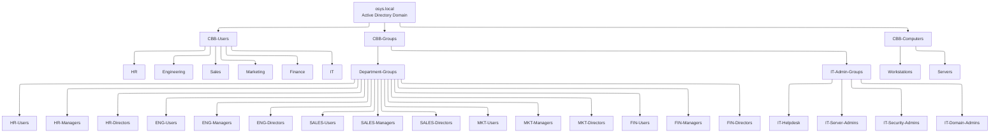

# **OSYS2020 – Windows Security**

## **Workshop 04 (WS04): Local Security Policies, Users, Groups, Rights, and Privileges**

### **Case Study Organization: CBB – Circuit Board Breakers**

---

## **1. Assignment Details**

| Field                | Information                                             |
| -------------------- | ------------------------------------------------------- |
| **Workshop Title**   | Workshop 04 – Identity & Privilege Control (CBB)        |
| **Course Code**      | OSYS2020                                                |
| **Course Title**     | Windows Security                                        |
| **Instructor**       | Davis Boudreau                                          |
| **Assignment Type**  | Guided Hands-On + Policy Analysis Workshop              |
| **Weight**           | Not Graded (Formative – Required for later evaluations) |
| **Estimated Effort** | 2–3 hours                                               |
| **Delivery Mode**    | In-class / Remote (GNS3 + VPN)                          |
| **Prerequisites**    | WS00, WS02a, WS03                                       |
| **Due**              | End of Week 4                                           |

---

## **2. Overview / Purpose / Objectives**

### **Overview**

In this workshop, you will implement the **identity and privilege layer** of the **CBB (Circuit Board Breakers)** security model.

You will work with:

* Organizational Units (OUs)
* Domain users
* Domain security groups
* Local security policies
* User rights and privileges

This workshop is **intentionally limited** to identity and authority.
You will **not** configure file or folder permissions yet — that work is reserved for **Workshop 05 (WS05)**.

---

### **Purpose**

The purpose of this workshop is to help you understand that:

* Access control begins with **identity**, not files
* Poor group and privilege design undermines all other security controls
* Least privilege must be applied **before** data is protected

You will see how Windows decides **who can log in**, **where**, and **with what power**.

---

### **Objectives**

By the end of this workshop, you will be able to:

* Build a structured OU model for users, groups, and computers
* Create domain users using semantic naming
* Create and populate role-based security groups
* Interpret local security policies and user rights
* Validate privilege behavior using test accounts
* Confirm readiness for NTFS permissions in WS05

---

## **3. Learning Outcomes Addressed**

This workshop supports:

* **LO1:** Describe steps required to harden an operating system
* **LO2:** Interpret and manipulate Windows security components
* **LO3:** Implement Windows security administration practices

---

## **4. Assignment Description / Use Case**

### **Use Case – CBB (Circuit Board Breakers)**

CBB is an electronics company with multiple departments, each requiring **different levels of authority and responsibility**.

Before securing data, CBB must ensure:

* identities are predictable and auditable
* privileges are granted by role, not convenience
* administrative power is limited and separated
* access decisions align with business needs

Your task is to implement this **identity and privilege model**.

---

## **5. Tasks / Instructions**

You will work primarily on:

* **OSYS-DC01** – Domain Controller
* **OSYS-W11-01** – Domain-joined workstation

---

## **Part A – Build and Verify the CBB Organizational Unit (OU) Structure**

### **Purpose**

To create a directory structure that supports **delegation, GPO scoping, and risk isolation**.

Yes — and this is an **excellent idea pedagogically** 👍
An **OU org-chart style Mermaid diagram** is *perfect* for helping students visualize **structure vs permissions vs policy flow**.

Below is a **clean, student-friendly Mermaid diagram** that represents the **CBB OU model** exactly as used in **Workshop 04**, and intentionally shows **structure only** (no permissions yet).

---

## ✅ CBB Active Directory OU Structure (Mermaid)

### Mermaid Code (Org-Chart Style)



---

## 🧠 How to Explain This to Students (Recommended Script)

> “This diagram shows **structure, not access**.
> Nothing here grants permissions.
> This is the scaffolding that lets us apply security **correctly later**.”

Key Learning points:

* **Users live in User OUs**
* **Groups live separately**
* **Computers are isolated by role**
* **Permissions come later (WS05)**
* **Policies come later (WS06+)**

---

### **Tasks**

On **OSYS-DC01**:

1. Open **Active Directory Users and Computers**
2. Under `osys.local`, create the following **top-level OUs**:

```
CBB-Users
CBB-Groups
CBB-Computers
```

3. Under **CBB-Users**, create:

```
HR
Engineering
Sales
Marketing
Finance
IT
```

4. Under **CBB-Groups**, create:

```
Department-Groups
IT-Admin-Groups
```

5. Under **CBB-Computers**, create:

```
Workstations
Servers
```

### **Important**

* ❌ Do **NOT** move any computers
* ❌ Do **NOT** apply Group Policy Objects
* This step defines **structure only**

### **Required Evidence**

* OU tree matches the CBB model
* Confirmation that computers were **not moved**

---

## **Part B – Create CBB Users (Semantic Naming)**

### **Purpose**

To create predictable identities for privilege testing and future access control.

### **Username Standard**

```
<dept>-<role>-<firstname>
```

### **Tasks**

1. In each department OU, create **three users**:

   * Standard user (`user`)
   * Manager (`mgr`)
   * Director (`dir`)

   Example:

   * `hr-user-alex`
   * `hr-mgr-jamie`
   * `hr-dir-taylor`

2. In the **IT** OU, create:

   * `it-helpdesk-lee`
   * `it-sysadmin-ash`
   * `it-secadmin-morgan`
   * Domain admin **only if instructed**

3. Verify:

   * Users exist in the correct OU
   * Naming standard is followed
   * Accounts are enabled

---

## **Part C – Create CBB Security Groups and Assign Membership**

### **Purpose**

Groups are the **only mechanism** used to grant authority and later NTFS access.

### **Department Groups**

(Create in `CBB-Groups → Department-Groups`)

For each department:

* `<DEPT>-Users`
* `<DEPT>-Managers`
* `<DEPT>-Directors`

### **IT Administrative Groups**

(Create in `CBB-Groups → IT-Admin-Groups`)

* `IT-Helpdesk`
* `IT-Server-Admins`
* `IT-Security-Admins`
* `IT-Domain-Admins`

All groups must be:

* **Global**
* **Security**

### **Membership Rules**

* Standard user → `<DEPT>-Users`
* Manager → `<DEPT>-Users` + `<DEPT>-Managers`
* Director → `<DEPT>-Users` + `<DEPT>-Managers` + `<DEPT>-Directors`
* IT users → appropriate IT group only

---

## **Part D – Explore Local Security Policy**

On **OSYS-W11-01**:

1. Open:

```
secpol.msc
```

2. Review:

* Account Policies
* User Rights Assignment
* Security Options

Identify which settings control:

* logon capability
* administrative authority

---

## **Part E – Analyze User Rights and Privileges**

For **at least three** of the following:

* Log on locally
* Log on through Remote Desktop Services
* Access this computer from the network
* Shut down the system

Document:

* current assignments
* CBB expectation
* whether the configuration is appropriate

---

## **Part F – Controlled Privilege Testing**

On **OSYS-W11-01**:

1. Log in as a **standard departmental user**
2. Attempt administrative actions
3. Log in as an **IT Helpdesk user**
4. Compare results

Document:

* what was allowed
* what was blocked
* why separation of duties matters

---

## **Part G – Reflection**

Answer thoughtfully:

* Why must identity and privileges be secured before file permissions?
* What risks exist if privilege design is rushed?
* How does least privilege reduce attack surface?

---

## **Part H – WS05 Readiness Check (Required)**

Confirm the following:

✔ CBB OUs exist and are structured correctly
✔ Users exist in correct department OUs
✔ Security groups exist and are populated
✔ No permissions assigned directly to users
✔ Sales and Marketing users exist for cross-access testing
✔ HR users exist with **no cross-department access planned**

Answer:

* Which CBB groups will be used for NTFS permissions in WS05?
* Which users will be used to test allowed vs denied access?

---

## **6. Deliverables**

Complete the **Workshop 04 fillable work form**.

**Filename:**

```
StudentID_OSYS2020_Workshop04_CBB_IdentitySecurity.docx
```

Submit via **Brightspace**.

---

## **7. Assessment & Rubric**

**Assessment Type:** Formative (Not Graded)

**Success Criteria**

* CBB model implemented correctly
* Groups used consistently
* Privilege behavior validated
* WS05 readiness confirmed

---

## **8. How This Leads to Workshop 05 (WS05)**

In WS05 you will:

* create `CBB-Data`
* apply NTFS permissions using these groups
* test real access control scenarios
* observe allowed vs denied outcomes

---

## **9. Resources / Equipment**

* OSYS2020 Domain (WS00)
* CBB Security Policy Grid
* Active Directory Users & Computers
* Local Security Policy (`secpol.msc`)

---

## **10. Academic Policies**

* Collaboration encouraged for troubleshooting
* Work must reflect your own environment
* Academic integrity policies apply

---

## **11. Copyright Notice**

© Nova Scotia Community College
For educational use within OSYS2020 only.

---
