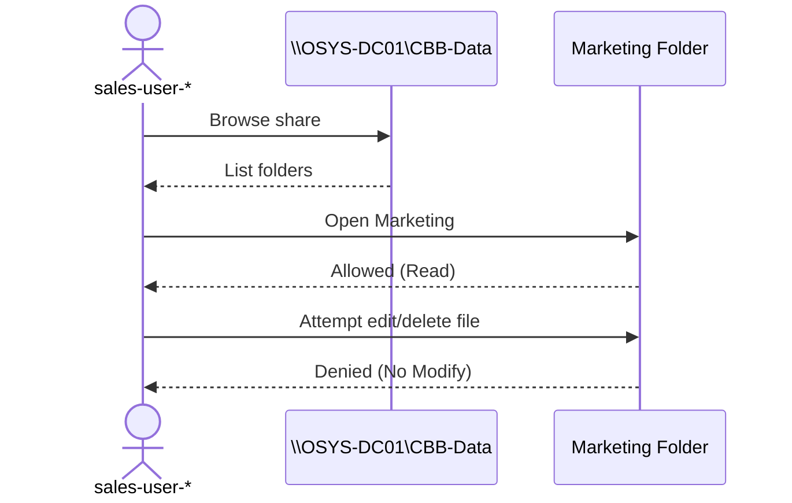

# **OSYS2020 – Windows Security**

## **Workshop 05 (WS05): NTFS Permissions, Object Security, and Access Control Scenarios**

**Case Study Organization:** **CBB – Circuit Board Breakers**
**Continues from:** **Workshop 04 (Identity & Privilege Control)**

---

## **1. Assignment Details**

| Field                | Information                                                     |
| -------------------- | --------------------------------------------------------------- |
| **Workshop Title**   | Workshop 05 – NTFS Permissions & Access Control Scenarios (CBB) |
| **Course Code**      | OSYS2020                                                        |
| **Course Title**     | Windows Security                                                |
| **Instructor**       | Davis Boudreau                                                  |
| **Assignment Type**  | Guided Hands-On Workshop + Scenario Testing                     |
| **Weight**           | Not Graded (Formative – required for later evaluations)         |
| **Estimated Effort** | 2–3 hours                                                       |
| **Delivery Mode**    | In-class / Remote (GNS3 + VPN)                                  |
| **Prerequisites**    | WS00, WS02a, WS03, **WS04**                                     |
| **Due**              | End of Week 5                                                   |

---

## **2. Overview / Purpose / Objectives**

### **Overview**

In Workshop 04, you built the **CBB identity model** (OUs, users, groups, and role membership).
In this workshop, you will secure **objects** — specifically **folders and files** — using:

* **NTFS permissions**
* **Share permissions (overview + safe defaults)**
* **Effective Access verification**
* **Realistic access control scenarios**

You will implement CBB’s department data structure (`CBB-Data`) and validate access using **test users** from WS04.

---

### **Purpose**

Most real-world security failures are not “hackers” — they are:

* overly broad access
* shared folders with “Everyone: Full Control”
* privileges assigned to the wrong group
* lack of testing (“I think it’s secure”)

This workshop trains you to **build, verify, and prove** access control.

---

### **Objectives**

By the end of this workshop, you will be able to:

* Create a shared storage structure for CBB
* Apply NTFS permissions using **group-based RBAC**
* Enforce **HR confidentiality** (no cross-department visibility)
* Implement typical cross-department access (Sales read Marketing)
* Validate access using **effective permissions** and test logins
* Troubleshoot common permission failures (inheritance, deny, conflicts)
* Document findings like a Windows administrator

---

## **3. Learning Outcomes Addressed**

* **LO2:** Interpret and manipulate Windows security components (permissions, rights, objects)
* **LO3:** Implement Windows network security and security administration (access control enforcement, testing, admin practice)

---

## **4. Assignment Description / Use Case**

### **Use Case – Department File Security at CBB**

CBB stores departmental files on a central Windows server. Each department must have appropriate access:

* HR data is **highly confidential**
* Finance and Engineering are confidential
* Marketing materials can be **read by Sales**, but not changed
* IT groups must have separated administrative duties

Your job is to implement this access model using **NTFS permissions** and prove it works.

---

## **5. Tasks / Instructions**

You will work primarily on:

* **OSYS-DC01** (acting as the file server for this course lab)
* **OSYS-W11-01** (client used for access testing)

> **Security rule:** Assign permissions to **groups**, not users.

---

# **Part A — Create the CBB Data Share (Structure First)**

## **A.1 Create folder structure**

On **OSYS-DC01**, create a root folder:

```
C:\CBB-Data
```

Inside it, create:

```
CBB-Data
├── HR
├── Engineering
├── Sales
├── Marketing
├── Finance
└── IT
```

✅ **Checkpoint:** All folders exist.

---

## **A.2 Share the root folder (safe default)**

Share `C:\CBB-Data` as:

* Share name: `CBB-Data`

**Share permissions (recommended for this course):**

* `Everyone` → **Full Control** (Share level)
* Security enforced at **NTFS level**

> This is a common admin pattern: *share permissive, NTFS restrictive* — but only when NTFS is properly configured.

✅ **Checkpoint:** From OSYS-W11-01 you can browse to:

```
\\OSYS-DC01\CBB-Data
```

---

# **Part B — Apply the CBB NTFS Permission Model (Groups Only)**

## **B.1 NTFS baseline rule for CBB-Data root**

On `C:\CBB-Data`:

* Ensure inheritance is **enabled at the root**
* Root should not be “Everyone Full Control” at NTFS
* Keep required system/admin entries

**Recommended baseline entries to keep:**

* `SYSTEM` → Full Control
* `Administrators` → Full Control
* `CREATOR OWNER` (optional depending on approach)

✅ **Checkpoint:** Root is secure and ready to delegate to child folders.

---

## **B.2 Configure HR (highly confidential)**

Folder: `C:\CBB-Data\HR`

Apply NTFS permissions:

* `HR-Users` → **Read**
* `HR-Managers` → **Modify**
* `HR-Directors` → **Full Control**

**Explicit restriction:**

* No other department group should have access (not even read)

✅ **Checkpoint:** A non-HR user cannot open HR folder.

---

## **B.3 Configure Marketing + Sales read-only access**

Folder: `C:\CBB-Data\Marketing`

* `MKT-Users` → **Modify**
* `MKT-Managers` → **Modify**
* `MKT-Directors` → **Full Control**
* `SALES-Users` → **Read** *(cross-department access)*

✅ **Checkpoint:** Sales can open/read marketing files but cannot edit/delete.

---

## **B.4 Configure Sales (normal departmental control)**

Folder: `C:\CBB-Data\Sales`

* `SALES-Users` → **Modify**
* `SALES-Managers` → **Modify**
* `SALES-Directors` → **Full Control**

✅ **Checkpoint:** A Sales user can create/edit files in Sales.

---

## **B.5 Configure Engineering (confidential + controlled)**

Folder: `C:\CBB-Data\Engineering`

* `ENG-Users` → **Read**
* `ENG-Managers` → **Modify**
* `ENG-Directors` → **Full Control**
* Optional: `IT-Security-Admins` → **Read** (audit)

✅ **Checkpoint:** Regular engineering staff can view but not change key files.

---

## **B.6 Configure Finance (confidential + audit-capable)**

Folder: `C:\CBB-Data\Finance`

* `FIN-Users` → **Read**
* `FIN-Managers` → **Modify**
* `FIN-Directors` → **Full Control**
* Optional: `IT-Security-Admins` → **Read** (audit)

✅ **Checkpoint:** Finance is controlled and supports audit oversight.

---

## **B.7 Configure IT (separated duties)**

Folder: `C:\CBB-Data\IT`

Create subfolders:

```
IT
├── Helpdesk
├── Servers
├── Security
└── Domain
```

Apply:

* `IT-Helpdesk` → Modify (Helpdesk only)
* `IT-Server-Admins` → Modify (Servers only)
* `IT-Security-Admins` → Modify (Security only)
* `IT-Domain-Admins` → Full Control (Domain only)

✅ **Checkpoint:** IT roles cannot access other IT areas by default.

---

# **Part C — Access Control Scenario Testing (Prove It Works)**

You must test access using **real logins** on **OSYS-W11-01**.

## **C.1 Testing Instructions**

For each scenario:

1. Log in as the specified user
2. Browse to:

   ```
   \\OSYS-DC01\CBB-Data
   ```
3. Attempt:

   * Open folder
   * Create a file (test.txt)
   * Edit file
   * Delete file (if permitted)
4. Record what happened and why

---

## **C.2 Required Scenarios (Minimum 6)**

### Scenario 1 — HR isolation

* User: `sales-user-*`
* Action: Attempt to open `HR`
* Expected: **Denied**

### Scenario 2 — Marketing cross-access

* User: `sales-user-*`
* Action: Open `Marketing` and read a file
* Expected: **Allowed read**, **Denied edit/delete**

### Scenario 3 — Marketing owner access

* User: `mkt-user-*`
* Action: Create + edit file in `Marketing`
* Expected: **Allowed modify**

### Scenario 4 — Sales department access

* User: `sales-user-*`
* Action: Create/edit file in `Sales`
* Expected: **Allowed modify**

### Scenario 5 — Engineering controlled editing

* User: `eng-user-*`
* Action: Attempt to edit an Engineering file
* Expected: **Denied** *(if ENG-Users are read-only)*

### Scenario 6 — IT separation of duties

* User: `it-helpdesk-*`
* Action: Try to access `IT\Security`
* Expected: **Denied**

✅ **Checkpoint:** You can clearly justify every allow/deny outcome.

---

# **Part D — Troubleshooting & Effective Access**

## **D.1 Use “Effective Access”**

On **OSYS-DC01**:

1. Right-click a folder (example: HR) → **Properties**
2. Security → Advanced → **Effective Access**
3. Select a test user (example: sales-user-morgan)
4. View effective permissions

Explain:

* Why the access was granted or denied
* Which group membership caused it

---

## **D.2 Identify common failure causes**

Briefly answer:

* What happens when inheritance is left on incorrectly?
* What happens when a user is accidentally added to the wrong group?
* Why is “Deny” dangerous if used carelessly?

---

# **Part E — Reflection (Security Thinking)**

Answer thoughtfully:

1. Why is HR isolation more than just “policy” — what is the real risk?
2. What is the advantage of giving Sales **read-only** Marketing access?
3. What is the risk of using “Everyone: Full Control” at NTFS?
4. What was the most difficult part of NTFS permissions to reason about?

---

## **6. Deliverables**

Submit **one Word document** containing:

* Confirmation of folder + share creation
* NTFS permission summary for each department folder
* Results for at least **6 scenarios**
* Evidence of Effective Access for at least **2 scenarios**
* Reflection answers

**File name:**

```
StudentID_OSYS2020_Workshop05_CBB_NTFS.docx
```

Submit via **Brightspace**.

---

## **7. Assessment & Rubric**

**Assessment Type:** Formative (Not Graded)

**Success Criteria**

* Folder structure created correctly
* NTFS permissions applied using groups only
* HR is isolated as required
* Cross-department access behaves as intended
* Testing is thorough and documented
* Reflection shows security reasoning

---

## **8. Resources / Equipment**

* OSYS2020 domain (WS00 + WS04)
* Active Directory Users and Computers
* Windows File Explorer + NTFS Security tab
* Effective Access tool

---

## **9. Academic Policies**

* Collaboration encouraged for troubleshooting
* Work must reflect your own results and tests
* Academic integrity policies apply

---

## **10. Copyright Notice**

© Nova Scotia Community College
For educational use within OSYS2020 only.

---

## Mermaid Diagram Set (WS05 Visual Aids)

### Diagram 1 — CBB-Data Folder Structure (WS05)

```mermaid
---
config:
  layout: elk
---
flowchart TD
    R[\\OSYS-DC01\\CBB-Data]
    R --> HR[HR]
    R --> ENG[Engineering]
    R --> SALES[Sales]
    R --> MKT[Marketing]
    R --> FIN[Finance]
    R --> IT[IT]
    IT --> ITH[Helpdesk]
    IT --> ITS[Servers]
    IT --> ITSEC[Security]
    IT --> ITD[Domain]
```

### Diagram 2 — Example Access Scenario (Sales → Marketing Read-Only)

