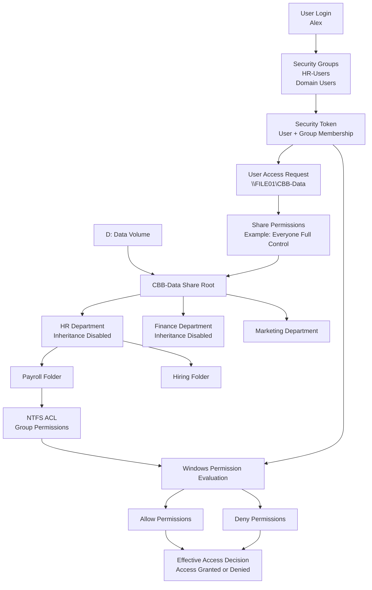

# **NTFS Security Map — Complete Access Control Architecture**

This diagram shows how Windows determines whether a user can access a file on a shared NTFS volume.



---

# How to Read the NTFS Security Map

### 1️⃣ User Authentication

The process begins when a user logs into the system.

Example:

```
User: Alex
```

Windows builds a **Security Token** containing:

* user identity
* group memberships

Example groups:

```
HR-Users
Domain Users
```

---

### 2️⃣ Share Access Layer

The user attempts to access a shared folder:

```
\\FILE01\CBB-Data
```

Windows first evaluates **Share Permissions**.

Example configuration:

```
Share: Everyone → Full Control
```

Best practice is to keep share permissions permissive and enforce security using **NTFS ACLs**.

---

### 3️⃣ NTFS Folder Hierarchy

The request then reaches the NTFS file system.

Example structure:

```
D:\CBB-Data
   ├ HR
   │   ├ Payroll
   │   └ Hiring
   ├ Finance
   └ Marketing
```

Department folders represent **security boundaries**.

---

### 4️⃣ NTFS Access Control Lists

Each folder contains an **ACL**.

Example:

| Group        | Permission   |
| ------------ | ------------ |
| HR-Users     | Read         |
| HR-Managers  | Modify       |
| HR-Directors | Full Control |

---

### 5️⃣ Inheritance

Permissions flow downward automatically unless inheritance is disabled.

Example:

```
HR
 ├ Payroll
 └ Hiring
```

Payroll and Hiring inherit permissions from HR.

---

### 6️⃣ Windows Permission Evaluation

Windows combines:

* Security Token
* NTFS ACL
* Inheritance
* Deny rules

Evaluation sequence:

```
Check Allow permissions
Check Deny permissions
Combine results
```

Deny entries override Allow entries.

---

### 7️⃣ Effective Access

The final result determines whether the user can access the resource.

Example outcomes:

```
Access Granted
Access Denied
```

This is called **Effective Access**.

---

# Why This Diagram Matters

This single architecture diagram demonstrates the **complete NTFS security pipeline**:

```
User
 ↓
Security Token
 ↓
Share Permissions
 ↓
NTFS Folder Structure
 ↓
ACL Evaluation
 ↓
Inheritance
 ↓
Effective Access Decision
```

Understanding this process allows administrators to:

* design scalable file servers
* troubleshoot permission issues
* prevent data exposure
* manage enterprise storage systems

---
