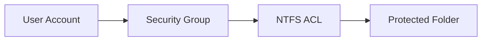
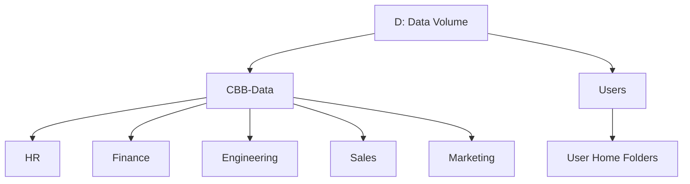
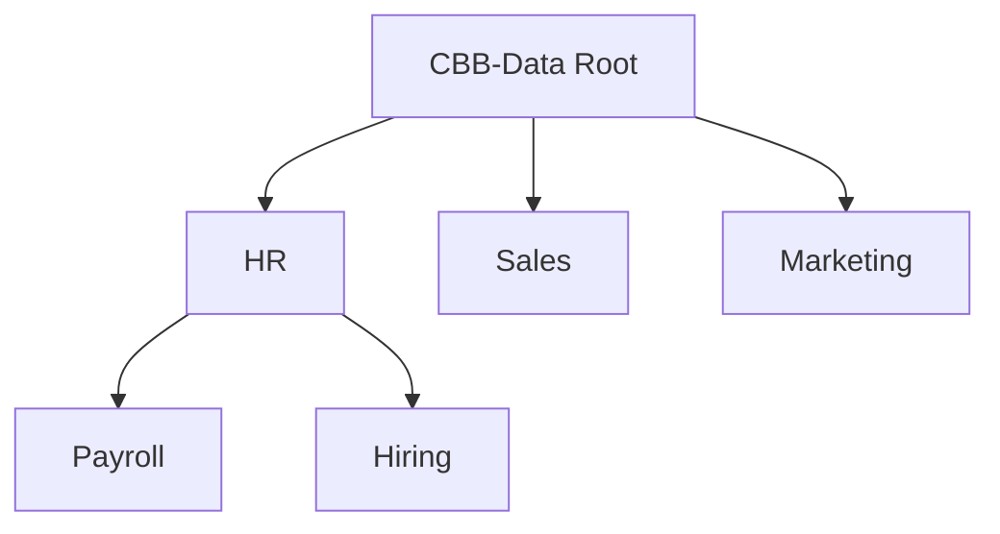
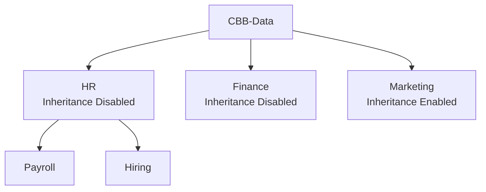
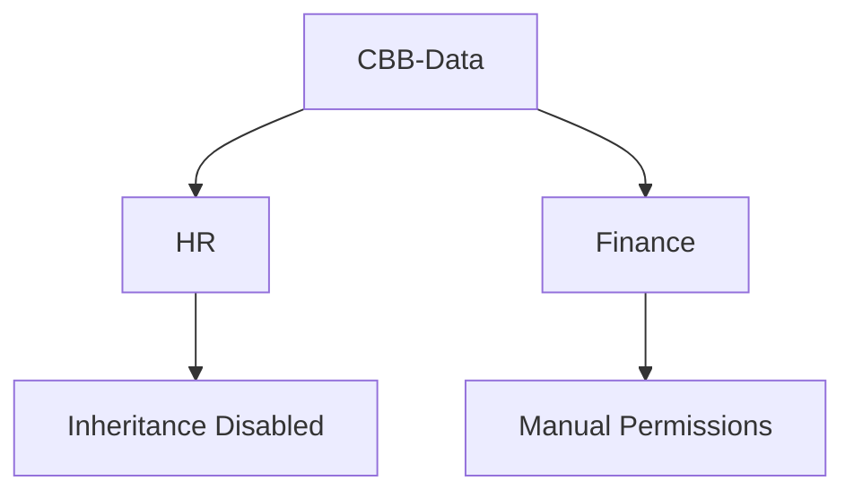
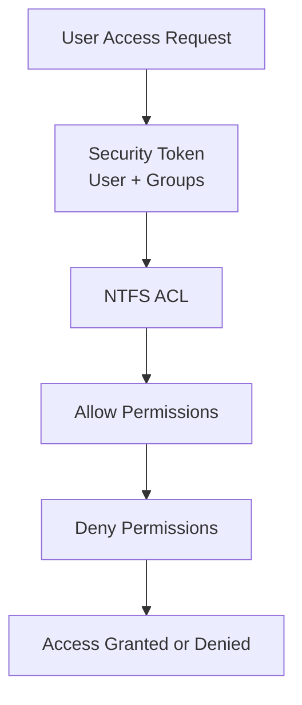
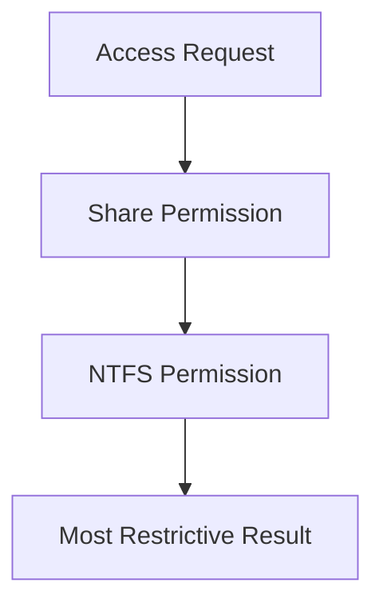
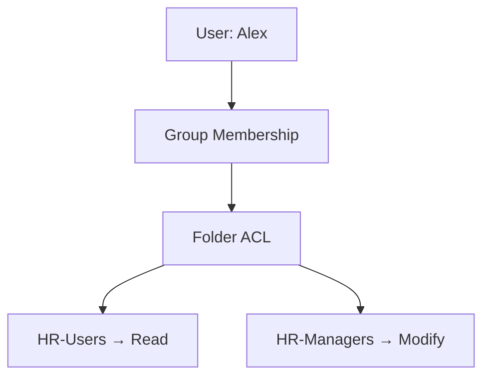
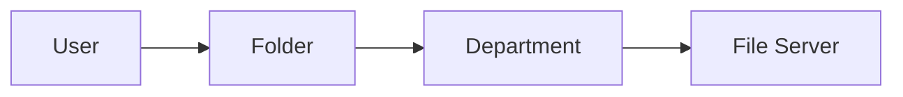

# **OSYS2020 – Windows Security**

# **NTFS Architecture Cheat Sheet**

### Quick Reference for ACL Design, Inheritance, and File Server Security

---

# 1. NTFS Security Model (Core Concept)

Every file and folder in Windows has a **Security Descriptor** that contains an **Access Control List (ACL)**.

An ACL contains **Access Control Entries (ACEs)**.

```
ACE = Identity + Permission + Scope
```

Example:

```
HR-Users → Read → This folder, subfolders, and files
```

---

## NTFS Permission Relationship



Key rule:

```
Users → Groups → Permissions
```

Never assign permissions directly to users.

---

# 2. Where NTFS Permissions Originate

When a disk is formatted with **NTFS**, Windows creates **default permissions on the volume root**.

Example:

```
C:\
```

Typical default ACL:

| Identity       | Permission     |
| -------------- | -------------- |
| SYSTEM         | Full Control   |
| Administrators | Full Control   |
| Users          | Read & Execute |
| CREATOR OWNER  | Special        |

These permissions **propagate downward through inheritance**.

---

# 3. Enterprise File Server Structure

Enterprise environments **do NOT store business data on C:**.

Instead they use **data volumes**.

Example:

```
D:\
```

Typical structure:



Hierarchy:

```
Volume → Share → Department → Folder → File
```

---

# 4. Role-Based Access Control (RBAC)

Professional NTFS design uses **RBAC**.

```
User → Group → Permission
```

Example:

| Group        | Permission   |
| ------------ | ------------ |
| HR-Users     | Read         |
| HR-Managers  | Modify       |
| HR-Directors | Full Control |

Benefits:

* scalable
* easy to audit
* easier user management

---

# 5. Why NTFS Inheritance Is Critical

Inheritance allows permissions to **flow downward automatically**.



Benefits:

* configure permissions **once**
* consistent security
* manageable at scale

Large enterprises may contain:

```
Millions of files
Hundreds of thousands of folders
```

Without inheritance, management becomes impossible.

---

# 6. When to Disable Inheritance

Inheritance should be disabled **only for security boundaries**.

Examples:

| Folder  | Reason                 |
| ------- | ---------------------- |
| HR      | Employee data          |
| Finance | Payroll                |
| Legal   | Confidential documents |

Example:



---

# 7. Permission Drift (Broken Inheritance)

Incorrect inheritance design causes **permission drift**.



Problems:

* inconsistent access
* difficult auditing
* security exposure

---

# 8. NTFS Permission Scope

When assigning permissions you must define **scope**.

| Scope                          | Effect                  |
| ------------------------------ | ----------------------- |
| This folder only               | Only the current folder |
| This folder, subfolders, files | Everything below        |
| Subfolders and files only      | Not the root            |

Example problem:

```
HR-Users → Read → This folder only
```

Users see the HR folder but **cannot access Payroll or Hiring**.

---

# 9. NTFS Permission Evaluation

When a user accesses a file, Windows evaluates permissions in stages.



Steps:

1. User requests access
2. Windows builds **security token**
3. ACL is checked
4. Allow/Deny entries evaluated
5. Final decision returned

---

# 10. Share Permissions vs NTFS Permissions

Windows evaluates **two permission layers**.



Example:

| Share        | NTFS   | Result |
| ------------ | ------ | ------ |
| Full Control | Read   | Read   |
| Read         | Modify | Read   |
| Full Control | Modify | Modify |

Best practice:

```
Share = Full Control
NTFS = Security Control
```

---

# 11. Effective Permissions

Effective access depends on:

* user permissions
* group membership
* inheritance
* deny entries



Deny permissions override Allow.

---

# 12. NTFS Best Practices

✔ Use **groups not users**

✔ Keep **root permissions simple**

```
SYSTEM → Full Control
Administrators → Full Control
```

✔ Use **inheritance wherever possible**

✔ Break inheritance **only at security boundaries**

✔ Avoid **Deny permissions**

✔ Use standard permission bundles:

| Permission   | Use            |
| ------------ | -------------- |
| Read         | View           |
| Modify       | Edit           |
| Full Control | Administration |

---

# Quick Memory Model

Think of a file server like a building.



Users should only access **rooms they are authorized to enter**.

---

# Exam Memory Trigger

If you remember nothing else, remember this hierarchy:

```
Volume
   ↓
Share
   ↓
Department
   ↓
Folder
   ↓
File
```

Permissions flow **downward through inheritance** unless intentionally modified.

---
