# **OSYS2020 – Windows Security**

# **Workshop 05 Takeaway: NTFS ACL Design & Secure File Server Architecture**

After completing Workshop 05, you should now understand **how to configure permissions** on Windows folders. However, professional system administrators must also understand **why permissions are designed a certain way**.

This takeaway summarizes the **core principles of NTFS Access Control Lists (ACLs)** and explains how administrators design **secure and manageable file sharing environments** in real-world organizations.

---

# 1. What an NTFS ACL Really Is

Every file and folder in Windows has a **Security Descriptor** that contains an **Access Control List (ACL)**.

An ACL contains **Access Control Entries (ACEs)** that define:

```
Who can access the object
What they are allowed to do
How that permission is inherited
```

Example ACE structure:

```
Identity → Permission → Scope
```

Example:

```
HR-Users → Read → This folder, subfolders and files
```

This means:

* Members of the **HR-Users group**
* Can **read files**
* Inside the **entire HR folder structure**

---

## Conceptual Model

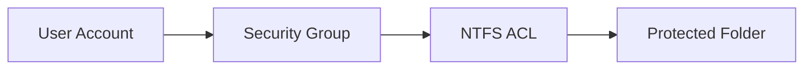

In enterprise environments:

```
Users never receive direct permissions.
Groups receive permissions.
```

This makes access control scalable and manageable.

---

# 2. Where NTFS Permissions Originally Come From

Before administrators configure folders, the **NTFS volume itself already has security permissions**.

When a disk is formatted with **NTFS**, Windows creates **default ACLs on the root of the volume**.

Example:

```
C:\
```

Typical default permissions include:

| Identity       | Permission     |
| -------------- | -------------- |
| SYSTEM         | Full Control   |
| Administrators | Full Control   |
| Users          | Read & Execute |
| CREATOR OWNER  | Special        |

These permissions exist to ensure:

* Windows can operate correctly
* Administrators can manage the system
* Users can access necessary system directories

These **root permissions propagate through inheritance** to child folders unless inheritance is broken.

However, in **real enterprise systems**, business data is typically **not stored on the operating system volume (C:)**.

Instead, organizations use **dedicated data volumes**, such as:

```
D:\
```

Reasons include:

* Easier backups
* Separation of OS and business data
* Reduced risk during OS upgrades or recovery
* Storage expansion flexibility
* Improved security management

---

# Visualizing NTFS Permission Flow from Volume to File

Understanding NTFS inheritance becomes easier when we visualize how permissions originate at the **volume root** and flow downward through the folder hierarchy.

In an enterprise file server, permissions typically propagate through **three logical layers**:

1. **Volume Layer**
2. **Department Layer**
3. **File Layer**

---

### NTFS Permission Flow Architecture

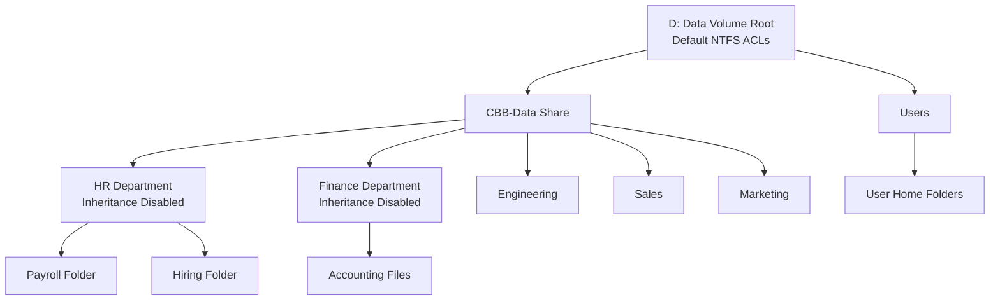

---

## Why This Hierarchy Matters

This layered model allows organizations to:

* Maintain **consistent default security**
* Create **clear department boundaries**
* Reduce administrative overhead through **inheritance**
* Maintain **predictable permission structures**
* Scale to **thousands of users and millions of files**

---

# 3. The Principle of Role-Based Access Control (RBAC)

The design used in Workshop 05 follows **Role-Based Access Control**.

Instead of:

```
User → Permission
```

We use:

```
User → Group → Permission
```

Example:

```
Alice → HR-Users → Read access to HR folder
Bob → HR-Managers → Modify access to HR folder
```

Benefits:

* Easier onboarding and offboarding
* Simplified auditing
* Reduced configuration errors
* Cleaner security architecture

---

# 4. Why NTFS Inheritance Is Extremely Important

Inheritance allows **child folders to automatically receive permissions from parent folders**.

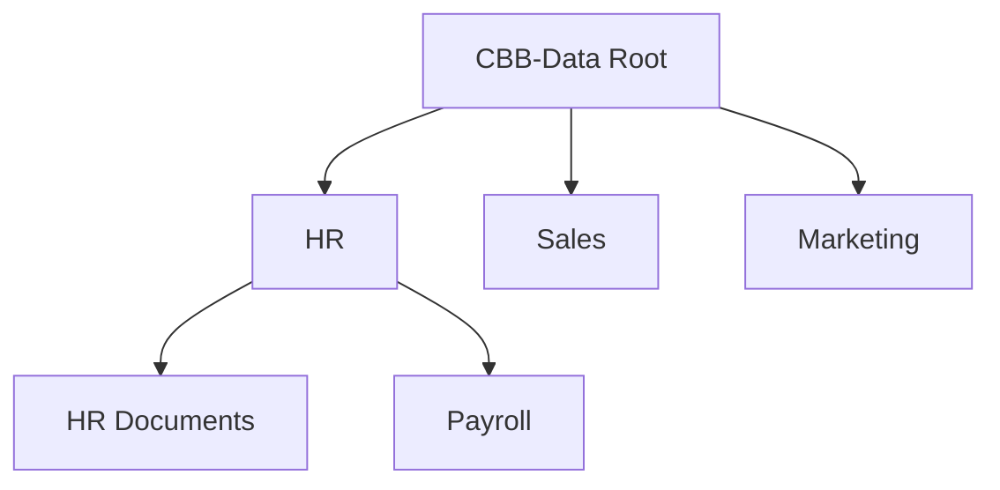

Without inheritance, administrators would have to configure **every folder individually**, which becomes impossible at enterprise scale.

---

# 5. When You SHOULD Disable Inheritance

Inheritance should be disabled **only when a folder represents a security boundary**.

| Folder  | Reason                        |
| ------- | ----------------------------- |
| HR      | Sensitive employee data       |
| Finance | Payroll and financial records |
| Legal   | Confidential contracts        |

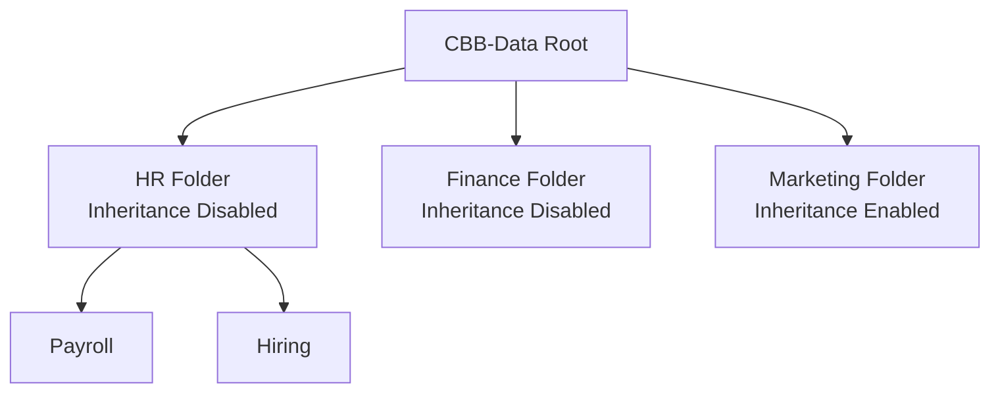

---

# 6. What Happens When Inheritance Is Broken Incorrectly

NTFS inheritance is powerful because it allows administrators to manage permissions **once at a higher level** and have those permissions automatically propagate throughout the folder structure.

However, if inheritance is disabled **improperly**, security can become inconsistent and difficult to manage.

This problem is known as **permission drift**.

Permission drift occurs when:

* inheritance is disabled unnecessarily
* permissions are manually modified at many levels
* administrators lose visibility into the overall access structure

---

## Example: Correct Permission Architecture

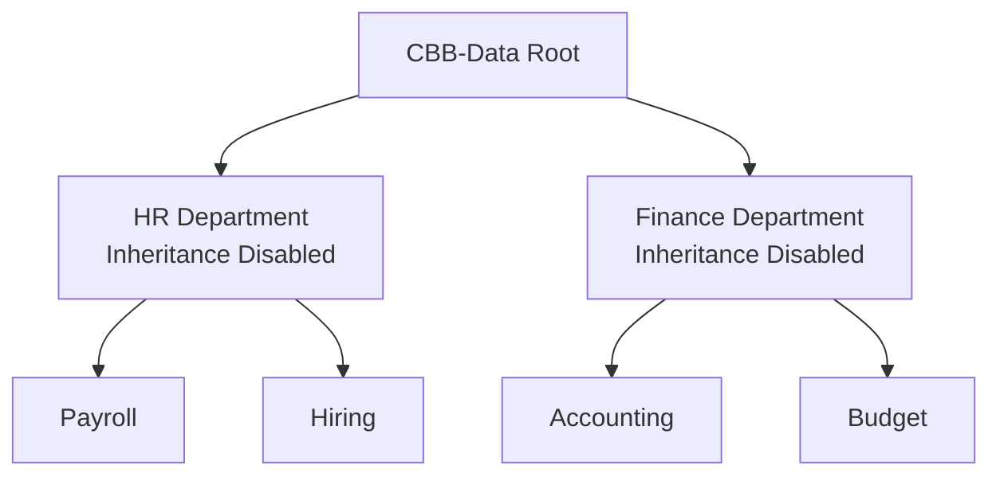

---

## Example: Broken Inheritance and Permission Drift

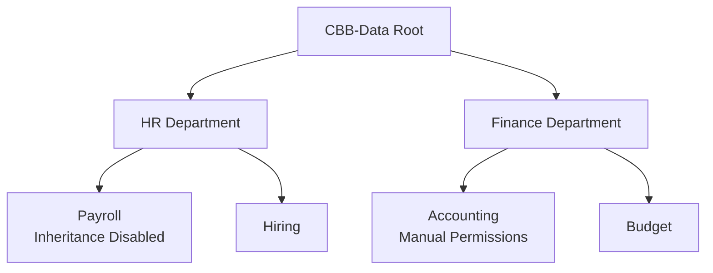

Problems now occur:

* Payroll no longer follows HR security rules
* Accounting permissions may differ from Finance policies
* Administrators must manually inspect each folder
* Access becomes inconsistent across the organization

---

## Real-World Consequences

### Data Exposure

```
Payroll records accidentally readable by Sales staff
```

### Access Failures

```
Finance staff blocked from budget documents
```

### Administrative Complexity

Administrators must manually audit ACLs and inheritance chains.

### Compliance Risks

Misconfigured permissions can violate:

* PCI-DSS
* HIPAA
* ISO 27001
* SOC2

---

# 7. Understanding "This Folder Only"

When applying NTFS permissions, administrators must choose **how far the permission applies**.

| Scope                              | Meaning                    |
| ---------------------------------- | -------------------------- |
| This folder only                   | Applies only to the folder |
| This folder, subfolders, and files | Applies everywhere below   |
| Subfolders and files only          | Does not apply to root     |

Example misconfiguration:

```
HR-Users → Read → This folder only
```

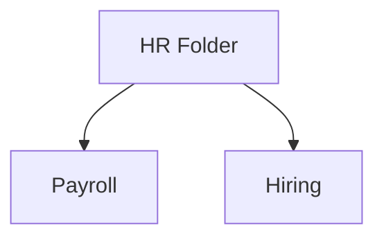

Users can open HR but **cannot access subfolders**.

---

# 8. How Windows Evaluates NTFS Permissions

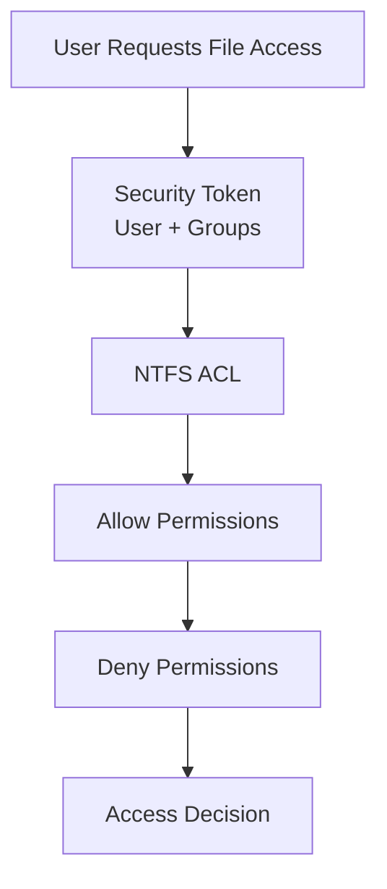

---

# 9. How Share Permissions Combine with NTFS Permissions

Windows evaluates **two permission systems**:

1. Share permissions
2. NTFS permissions

Final access = **most restrictive result**

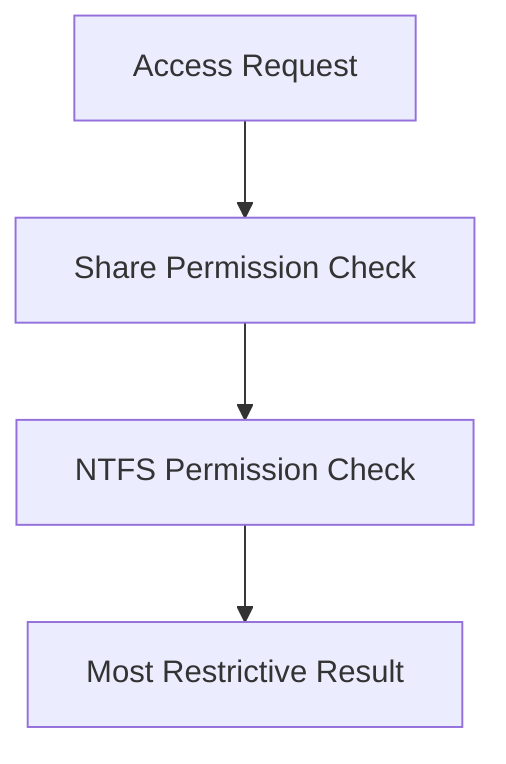

---

## Important Default Domain Shares

### SYSVOL

Contains:

* Group Policy Objects
* Domain scripts
* Security templates

### NETLOGON

Contains:

* login scripts
* drive mapping scripts
* environment configuration scripts

These are replicated across **domain controllers** to maintain consistent domain configuration.

---

# 10. How Effective Permissions Are Calculated

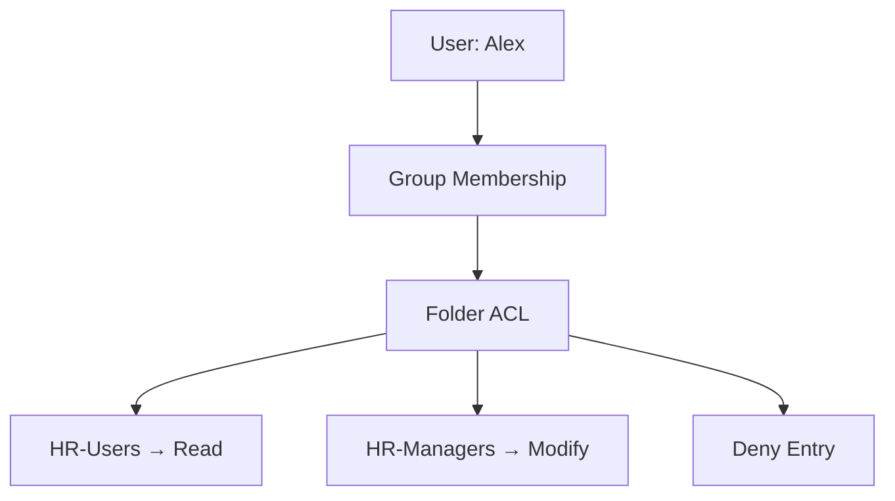

Effective access combines:

* user permissions
* group permissions
* inheritance
* deny rules

---

# 11. NTFS Permission Bundles (Best Practice)

| Permission   | Use                   |
| ------------ | --------------------- |
| Read         | View files            |
| Modify       | Edit files            |
| Full Control | Administrative access |

---

# 12. Real Enterprise File Server Example

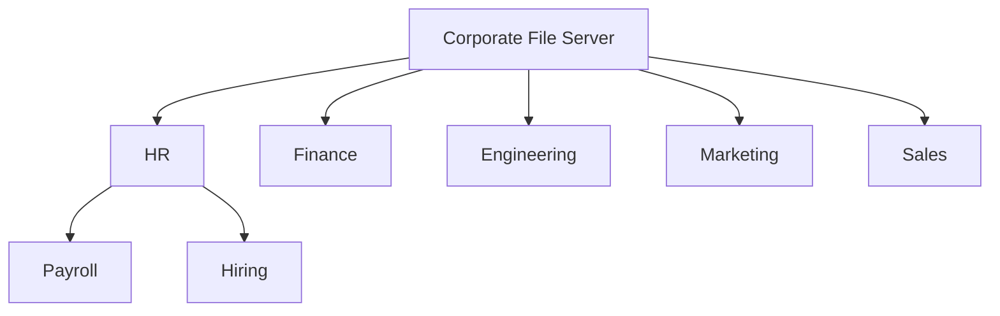

---

# 13. Real Security Failure Example

A common mistake:

```
Everyone → Full Control
```

This exposes sensitive organizational data.

---

# 14. Core NTFS Design Rules

### Use Groups Not Users

```
User → Group → Permission
```

### Keep Root Permissions Simple

```
SYSTEM → Full Control
Administrators → Full Control
```

### Use Inheritance Carefully

Break inheritance only at **security boundaries**.

### Avoid Deny Permissions

Deny overrides all other permissions.

---

# 15. The Professional Mental Model

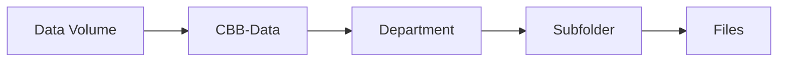

Permissions flow **downward through the hierarchy**.

---

# 16. Final Key Takeaways

After Workshop 05, remember:

1. **NTFS ACLs control access to every file and folder in Windows.**

2. **Default permissions originate from the volume root when the disk is formatted.**

3. **Enterprise environments store shared data on dedicated data volumes (e.g., D:) rather than the OS volume.**

4. **Permissions should always be assigned to security groups rather than individual users.**

5. **NTFS inheritance allows administrators to manage permissions efficiently across extremely large directory structures.**

6. **Inheritance should only be disabled when creating a security boundary such as HR or Finance.**

7. **Improperly disabling inheritance can cause permission drift, inconsistent access control, and serious security risks.**

8. **Scope settings such as "This folder only" can unintentionally block access to subfolders.**

9. **Share permissions and NTFS permissions combine, and the most restrictive result determines final access.**

10. **Effective access is calculated using group membership, inheritance, and deny rules.**

11. **A well-designed NTFS hierarchy allows organizations to manage millions of files securely and efficiently.**

---
