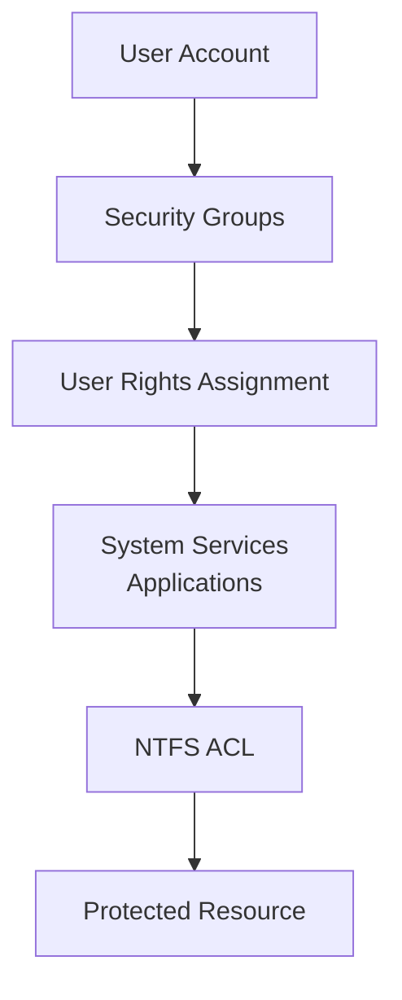

# **OSYS2020 – Windows Security**

# **Workshop 06 (WS06): Built-in Security Roles, Privileges, and System Access**

**Case Study Organization:** **CBB – Circuit Board Breakers**
**Continues from:** **WS04 (Identity & Groups)** and **WS05 (NTFS Permissions)**

---

# 1. Assignment Details

| Field            | Information                                          |
| ---------------- | ---------------------------------------------------- |
| Workshop Title   | Workshop 06 – Built-in Roles and Security Privileges |
| Course Code      | OSYS2020                                             |
| Course Title     | Windows Security                                     |
| Instructor       | Davis Boudreau                                       |
| Assignment Type  | Guided Investigation Workshop                        |
| Weight           | Engagement + Reflections Graded (Formative)          |
| Estimated Effort | 2–3 hours                                            |
| Delivery Mode    | In-class / Remote Lab                                |
| Prerequisites    | WS04, WS05                                           |
| Due              | See LMS (Brightspace)                                |

---

# 2. Overview / Purpose / Objectives

## Overview

In previous workshops you learned:

WS04
• User accounts
• Security groups
• Role-Based Access Control

WS05
• NTFS Access Control Lists
• Inheritance
• File server security design

However, **Windows security extends far beyond file permissions**.

The operating system also controls **who can perform powerful system actions**, such as:

* logging in remotely
* backing up files
* shutting down systems
* managing services
* reading event logs
* administering virtualization

These capabilities are controlled through **built-in security groups and user rights**.

---

## Purpose

This workshop teaches students to understand **how Windows assigns system privileges to roles** and how these privileges can affect system security.

Students will investigate:

• built-in groups
• system privileges
• user rights assignments
• application role permissions

---

## Objectives

By the end of this workshop students will be able to:

• Identify built-in Windows security groups
• Explain the privileges associated with those groups
• Investigate system roles and capabilities
• Understand how privileges interact with NTFS permissions
• Recognize potential privilege escalation risks

---

# 3. Windows Security Privilege Map

Before beginning the investigation, it is important to understand **how Windows evaluates security roles**.

The following architecture diagram shows the **security pipeline**.



---

## What This Diagram Means

Security decisions in Windows follow multiple layers:

```
Identity
 ↓
Group Membership
 ↓
User Rights / Privileges
 ↓
Application or Service Access
 ↓
NTFS Permissions
 ↓
Resource Access
```

A user may gain access **through multiple paths**, not just NTFS permissions.

---

# 4. Built-in Windows Security Groups

Windows includes **many built-in security roles**.

These groups grant access to system capabilities.

Examples include:

| Group                  | Purpose                  |
| ---------------------- | ------------------------ |
| Administrators         | Full system control      |
| Backup Operators       | Backup/restore files     |
| Server Operators       | Manage server operations |
| Account Operators      | Manage user accounts     |
| Print Operators        | Manage printers          |
| Remote Desktop Users   | Remote login access      |
| Event Log Readers      | Read event logs          |
| Hyper-V Administrators | Manage virtualization    |

Some of these roles can **bypass NTFS protections**.

Example:

```
Backup Operators can read any file during backup operations
even if NTFS denies access.
```

Understanding these privileges is critical for system security.

---

# 5. Built-in Group Investigation Lab

Students will investigate the built-in groups on the server.

---

## Step 1 – Open Computer Management

On **OSYS-DC01**:

```
Server Manager
 → Tools
 → Computer Management
```

Navigate to:

```
Local Users and Groups
 → Groups
```

---

## Step 2 – Investigate Built-in Groups

For each group below, record:

* description
* default members
* capabilities

| Group                |
| -------------------- |
| Administrators       |
| Backup Operators     |
| Server Operators     |
| Account Operators    |
| Remote Desktop Users |
| Event Log Readers    |

Students should answer:

```
What capability does this role provide?
What risks could this role introduce?
```

---

# 6. User Rights Assignment Investigation

Windows also assigns **privileges** through security policy.

These privileges are **not NTFS permissions**.

---

## Step 1 – Open Local Security Policy

```
Local Security Policy
 → Security Settings
 → Local Policies
 → User Rights Assignment
```

Students should investigate the following rights.

| User Right                    | Meaning             |
| ----------------------------- | ------------------- |
| Log on locally                | Console login       |
| Log on through Remote Desktop | Remote login        |
| Back up files and directories | Backup privilege    |
| Restore files and directories | Restore privilege   |
| Shut down the system          | Power control       |
| Debug programs                | High-risk privilege |

---

## Step 2 – Record Assigned Groups

Students should document:

```
Which group holds each privilege?
```

Example table:

| User Right     | Assigned Group   |
| -------------- | ---------------- |
| Log on locally | Administrators   |
| Back up files  | Backup Operators |

---

# 7. Privilege Escalation Case Study

## Scenario

At CBB, a junior IT technician named **Morgan** is assigned to perform backup operations.

Morgan is added to the **Backup Operators** group.

Morgan does not have permission to view HR salary records.

However, during a backup operation, Morgan can still **read the files**.

---

## Why Does This Happen?

Because **backup privileges override NTFS permissions**.

This privilege allows backup software to read files regardless of ACL restrictions.

---

## Security Implication

If misused, privileged roles may allow:

```
Sensitive data exposure
Unauthorized data extraction
Privilege escalation
```

This is why **privileged groups must be tightly controlled**.

---

# 8. Student Discovery Exercise

Students will investigate a real security question.

---

## Scenario

A user named **Alex** cannot access a file in the HR folder because NTFS denies access.

However, another user named **Jordan** can read the file.

Why?

Students should investigate:

• group memberships
• user rights
• system privileges

Possible explanations include:

```
Jordan is a member of Backup Operators
Jordan has administrative privileges
Jordan has a system role that bypasses NTFS
```

Students must determine **which privilege explains the behavior**.

---

# 9. Reflection Questions

Students should answer the following questions.

1. Why are built-in security groups powerful in Windows systems?

2. How can privileges override NTFS permissions?

3. Why should organizations limit membership in privileged groups?

4. What risks exist if too many users are assigned administrative roles?

---

# 10. Deliverables

Students `who are not present during the workshop` must submit a document containing:

• Investigation of built-in groups
• User Rights Assignment table
• Case study explanation
• Discovery exercise findings
• Reflection answers

File name:

```
StudentID_OSYS2020_WS06_Privileges.docx
```

Submit via **Brightspace**.

---

# 11. Success Criteria

Students demonstrate that they can:

• identify built-in roles
• explain system privileges
• analyze privilege escalation scenarios
• understand layered Windows security architecture

---

# 12. Key Takeaway

Windows security is **not controlled by NTFS permissions alone**.

Access decisions may involve:

```
Identity
Group Membership
User Rights
System Roles
Application Access
NTFS ACLs
```

Understanding these layers is essential for building **secure Windows systems**.

---