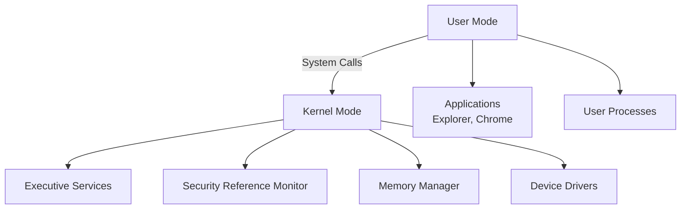
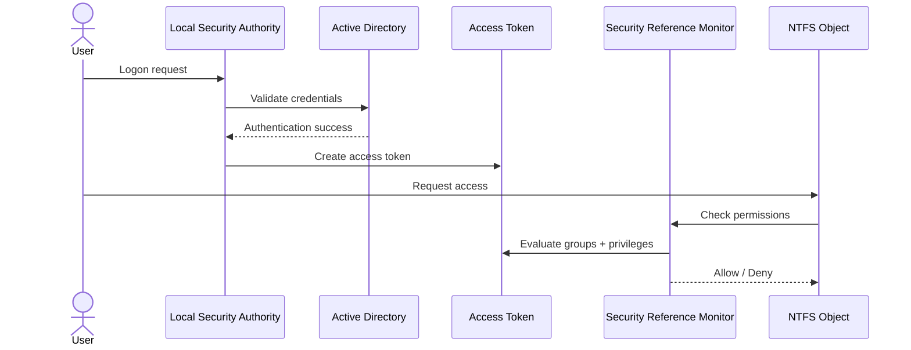
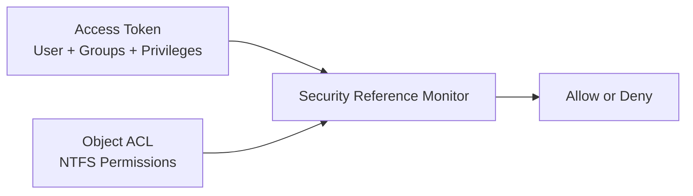
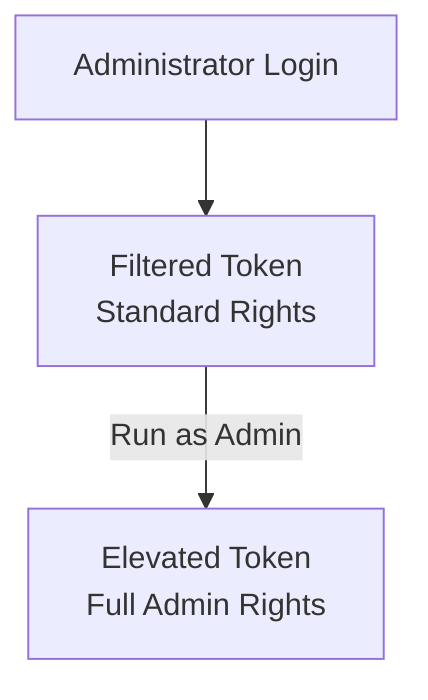

# **OSYS2020 – Windows Security**

## **Workshop 06 (WS06): User Mode vs Kernel Mode, Windows Security Architecture & Security Reference Monitor (SRM)**

**Case Study Context:** CBB – Circuit Board Breakers
**Builds On:** WS04 (Identity) + WS05 (NTFS Object Security)

---

## **1. Assignment Details**

| Field                | Information                                           |
| -------------------- | ----------------------------------------------------- |
| **Workshop Title**   | Workshop 06 – Windows Security Architecture & SRM     |
| **Course Code**      | OSYS2020                                              |
| **Course Title**     | Windows Security                                      |
| **Instructor**       | Davis Boudreau                                        |
| **Assignment Type**  | Guided Architecture Workshop + Controlled Testing     |
| **Weight**           | Not Graded (Formative – supports upcoming evaluation) |
| **Estimated Effort** | 2–3 hours                                             |
| **Delivery Mode**    | In-class / Remote (GNS3 + VPN)                        |
| **Prerequisites**    | WS00–WS05                                             |
| **Due**              | End of Week 6                                         |

---

# **2. Overview / Purpose / Objectives**

## **Overview**

In Workshop 04, you created identity.
In Workshop 05, you secured objects (NTFS).

Now we answer the deeper question:

> **How does Windows actually enforce those decisions?**

This workshop explores:

* User Mode vs Kernel Mode
* Windows security architecture
* Security Reference Monitor (SRM)
* Access tokens
* Privilege enforcement

You will connect architecture theory directly to what you observed in WS05.

---

## **Purpose**

Students often configure permissions without understanding what enforces them.

This workshop ensures you understand:

* Where security decisions happen
* How Windows evaluates access
* Why kernel mode must be protected
* What happens when security boundaries are bypassed

---

## **Objectives**

By the end of this workshop, you will be able to:

* Explain the difference between user mode and kernel mode
* Describe Windows security components and their interaction
* Identify the role of the Security Reference Monitor
* Trace how an access request is evaluated
* Relate WS05 NTFS outcomes to internal architecture
* Explain why privilege escalation attacks are dangerous

---

# **3. Learning Outcomes Addressed**

* **LO2:** Interpret Windows security principles and components
* **LO3:** Relate how Security Reference Monitor, Local Security Authority, and UAC secure access

---

# **4. Conceptual Foundation**

---

# **Part A – User Mode vs Kernel Mode**

## What is User Mode?

* Applications run here (Word, Chrome, File Explorer)
* Limited access to hardware
* Cannot directly manipulate system memory
* Failures usually crash the application only

## What is Kernel Mode?

* Windows core components
* Device drivers
* Memory manager
* Security Reference Monitor
* Direct hardware access

---

## Mermaid Diagram — User Mode vs Kernel Mode



---

### Key Teaching Point

> NTFS permissions are NOT enforced in user mode.
> They are enforced in **kernel mode** by the **Security Reference Monitor**.

---

# **Part B – Windows Security Architecture Overview**

Windows security is built from multiple cooperating components:

* **LSA (Local Security Authority)** – authentication
* **SAM / Active Directory** – identity store
* **Access Token** – user identity + group membership + privileges
* **Security Reference Monitor (SRM)** – enforces access
* **Object Manager** – tracks securable objects

---

## Mermaid Diagram — Windows Security Flow



---

### Connect to WS05

When `sales-user-morgan` accessed Marketing:

1. Logon created an **access token**
2. Token contained:

   * SALES-Users group
3. SRM compared token to NTFS ACL
4. Result = Read allowed

---

# **Part C – The Security Reference Monitor (SRM)**

## What is the SRM?

The **Security Reference Monitor**:

* Runs in **kernel mode**
* Enforces access checks
* Compares access token to object ACL
* Generates audit events

It does NOT:

* Authenticate users (LSA does)
* Store passwords (AD/SAM does)

---

## Mermaid Diagram — SRM Decision Model



---

## Why Kernel Mode Matters

If malware gains kernel access:

* It can bypass SRM
* Modify access tokens
* Disable auditing
* Escalate privileges

This is why kernel exploits are severe.

---

# **Part D – Hands-On Analysis (Controlled Observation)**

You will now connect architecture to your lab.

---

## Task 1 – Observe Access Token

On OSYS-W11-01:

1. Log in as a standard user (example: sales-user-*)
2. Open Command Prompt
3. Run:

```
whoami /groups
```

Document:

* Which department groups appear?
* Which IT groups appear (if any)?
* Does the token match WS04 group design?

---

## Task 2 – Observe Privileges

Run:

```
whoami /priv
```

Document:

* Which privileges are enabled?
* Do standard users have shutdown privilege?
* Compare with IT user if available.

---

## Task 3 – Trigger Access Denied

1. Log in as sales-user-*
2. Attempt to access HR folder
3. Observe “Access Denied”

Explain:

* Did Explorer deny it?
* Or did SRM deny it?

Answer: Explorer requested access; SRM evaluated token and denied.

---

# **Part E – UAC and Privilege Escalation**

## What is UAC?

User Account Control:

* Separates standard token from elevated token
* Prevents silent administrative escalation
* Creates filtered tokens for administrators

---

## Mermaid Diagram — UAC Elevation



---

## Test (Optional if permitted)

1. Log in as IT admin
2. Run an administrative task
3. Observe UAC prompt
4. Explain how this protects kernel integrity

---

# **Part F – Reflection Questions**

Answer thoughtfully:

1. Why must SRM run in kernel mode?
2. How does the access token connect WS04 and WS05?
3. What would happen if group membership is misconfigured?
4. Why is privilege escalation dangerous?
5. How does UAC reduce attack surface?

---

# **6. Deliverables**

Submit one Word document containing:

* User mode vs kernel explanation
* Annotated explanation of diagrams
* Output from:

  * `whoami /groups`
  * `whoami /priv`
* Explanation of access denied scenario
* Reflection responses

**File name:**

```
StudentID_OSYS2020_Workshop06_WindowsArchitecture.docx
```

Submit via Brightspace.

---

# **7. Assessment & Rubric**

**Assessment Type:** Formative

Success Criteria:

* Clear explanation of architecture
* Correct identification of SRM role
* Proper interpretation of access token
* Accurate connection to WS04 & WS05
* Thoughtful reflection

---

# **8. Resources**

* Microsoft Learn – Windows Security Architecture
* `whoami` command
* Local Security Policy
* Event Viewer (optional deeper exploration)

---

# **9. Academic Policies**

* Collaboration allowed for discussion
* Written work must reflect your understanding
* Academic integrity applies

---

# **10. Instructor Note (Strategic Positioning)**

WS04 → Identity
WS05 → Object Security
**WS06 → Enforcement Engine**

After this workshop, students understand:

* Not just *how* to configure permissions
* But *why* Windows enforces them the way it does

---