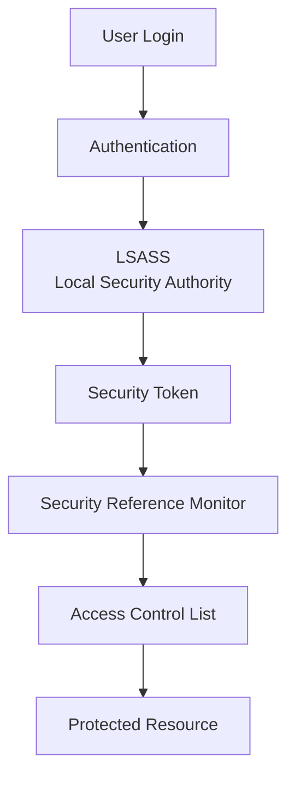
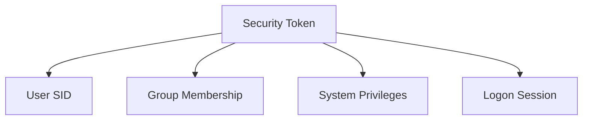
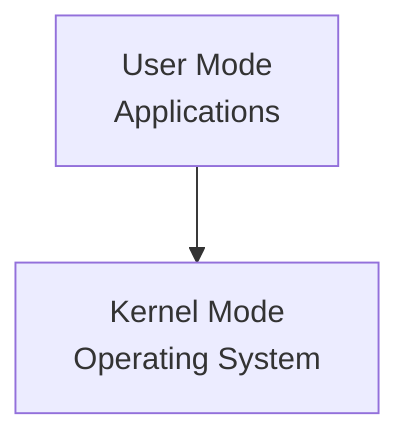
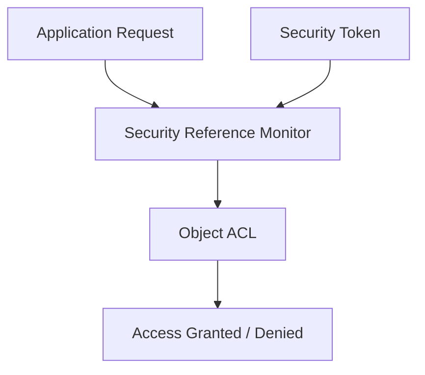
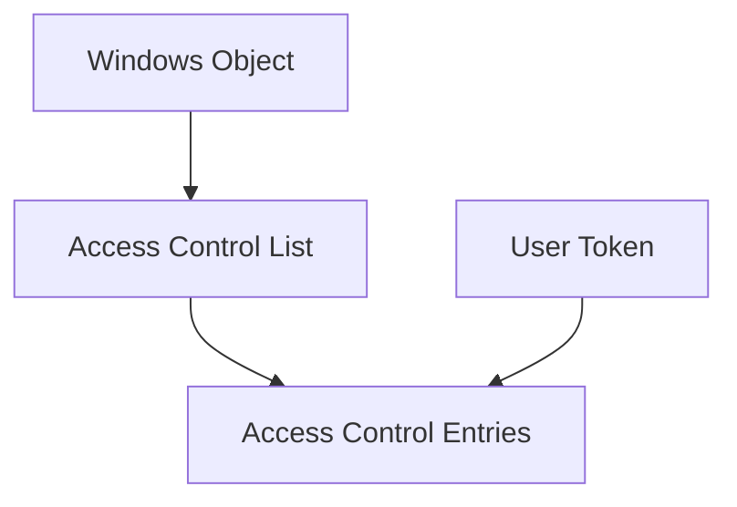
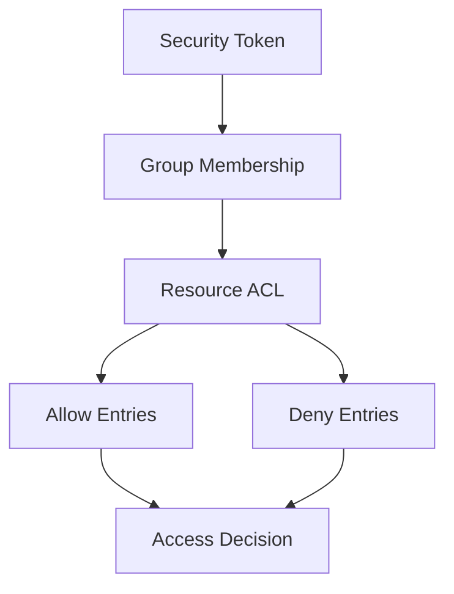
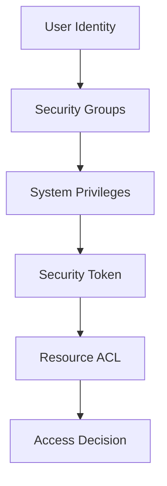

# **OSYS2020 – Windows Security**

# **Workshop 07 Takeaway: Windows Security Architecture – LSASS, Security Tokens, and Access Enforcement**

After completing Workshop 07, you should now understand **how Windows internally enforces security decisions**.

Previous workshops taught you:

* **WS04 – Identity and Groups**
* **WS05 – NTFS Permissions and ACLs**
* **WS06 – Built-in Roles and Privileges**

Workshop 07 explains **the internal architecture that ties all of those systems together**.

Windows security decisions are made through a coordinated set of components that evaluate **identity, privileges, and permissions** before allowing access to a resource.

---

# 1. The Windows Security Model

Windows security decisions follow a layered architecture.



---

## What This Architecture Represents

When a user attempts to access a resource:

1. The user **authenticates**
2. Windows creates a **security token**
3. The **Security Reference Monitor** evaluates access
4. The resource ACL is checked
5. Windows returns **Access Granted or Denied**

This process occurs **every time a protected object is accessed**.

---

# 2. Authentication and the Local Security Authority (LSASS)

The **Local Security Authority Subsystem Service (LSASS)** is responsible for authentication and security policy enforcement.

Process name:

```
lsass.exe
```

LSASS performs several important tasks:

* authenticates users
* generates security tokens
* enforces local security policy
* manages password validation
* coordinates authentication protocols

Examples of authentication systems used by LSASS include:

| Protocol  | Purpose                      |
| --------- | ---------------------------- |
| Kerberos  | Domain authentication        |
| NTLM      | Legacy authentication        |
| Local SAM | Local account authentication |

---

## Why LSASS Is Critical

If LSASS fails:

```
Authentication fails
Security tokens cannot be created
The operating system cannot enforce security
```

This is why LSASS is a **high-value target for attackers**.

Many attacks attempt to extract credentials from LSASS memory.

---

# 3. Security Tokens – The Identity of the User

After authentication, Windows generates a **security token**.

A security token represents the user's **identity and capabilities**.

Example token contents:

```
User: Alex

Groups:
Domain Users
HR-Users

Privileges:
SeChangeNotifyPrivilege
SeShutdownPrivilege
```

The token contains:

| Component     | Meaning                |
| ------------- | ---------------------- |
| User SID      | Unique identity        |
| Group SIDs    | Role membership        |
| Privileges    | System capabilities    |
| Logon session | Authentication context |

---

## Token Architecture



This token is attached to **every process the user launches**.

---

# 4. User Mode vs Kernel Mode

Windows protects the operating system using two execution environments.



---

## User Mode

User mode contains normal applications.

Examples:

```
explorer.exe
notepad.exe
chrome.exe
```

Applications cannot directly access system resources.

They must request access through the operating system.

---

## Kernel Mode

Kernel mode contains critical operating system components.

Examples include:

* device drivers
* memory management
* process scheduling
* security enforcement

The **Security Reference Monitor** operates in kernel mode.

This ensures that security decisions **cannot be bypassed by normal applications**.

---

# 5. The Security Reference Monitor (SRM)

The **Security Reference Monitor** is responsible for enforcing security decisions.

It performs the following tasks:

* evaluates access requests
* compares security tokens to ACLs
* determines whether access is allowed

---

## Access Evaluation Process



---

## Why the SRM Is Important

The SRM ensures that **every resource access follows Windows security rules**.

Resources include:

* files
* registry keys
* processes
* services
* Active Directory objects

---

# 6. The Windows Object Manager

Windows treats many system components as **objects**.

Examples include:

| Object Type  | Example                   |
| ------------ | ------------------------- |
| File         | NTFS file                 |
| Registry Key | Windows registry          |
| Process      | Running application       |
| Service      | Background system service |

Each object can contain an **Access Control List**.

---

## Object Security Model



This is how Windows protects **all system resources**.

---

# 7. How Security Tokens Interact with ACLs

When a program requests a resource:

1. The program presents the **user's security token**
2. Windows retrieves the resource **ACL**
3. The Security Reference Monitor compares them
4. Windows determines **effective access**

---

## Access Decision Diagram



Deny entries override Allow permissions.

---

# 8. Security Layers in Windows

Windows security operates across multiple layers.



Each layer contributes to the **final access decision**.

---

# 9. Real-World Security Risks

Understanding Windows security architecture helps explain many real-world attacks.

Examples include:

### Credential Theft

Attackers attempt to extract passwords from:

```
LSASS memory
```

---

### Privilege Escalation

Attackers attempt to obtain privileges such as:

```
SeDebugPrivilege
SeBackupPrivilege
```

---

### Token Manipulation

Malware may attempt to steal or impersonate a security token.

---

# 10. Why This Architecture Matters

This architecture ensures that:

* applications cannot bypass security
* access decisions are centralized
* administrators can enforce policies
* resources remain protected

Without these components, Windows could not enforce **access control at scale**.

---

# 11. Connecting the Previous Workshops

The previous workshops fit into this architecture.

| Workshop | Concept                       |
| -------- | ----------------------------- |
| WS04     | Users and Groups              |
| WS05     | NTFS Permissions              |
| WS06     | Built-in Roles and Privileges |
| WS07     | Security Architecture         |

The architecture connects them together.

---

# 12. Final Key Takeaways

After Workshop 07 you should remember:

1. **Windows security decisions are enforced by internal architecture, not just permissions.**

2. **LSASS authenticates users and creates security tokens.**

3. **Security tokens contain the user’s identity, group membership, and privileges.**

4. **The Security Reference Monitor enforces access decisions by comparing tokens to ACLs.**

5. **User mode applications cannot bypass kernel mode security enforcement.**

6. **All Windows objects (files, registry keys, services) can contain ACLs.**

7. **Access decisions depend on identity, privileges, group membership, and permissions working together.**

8. **Understanding Windows security architecture is essential for troubleshooting permissions and detecting attacks.**

---
