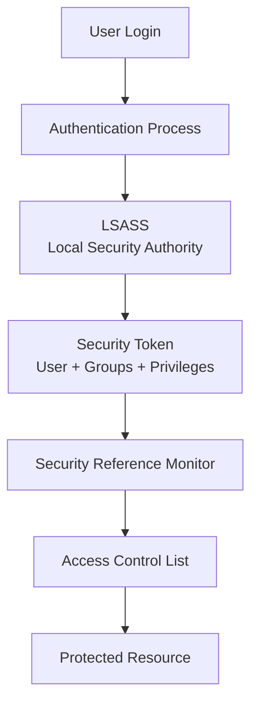
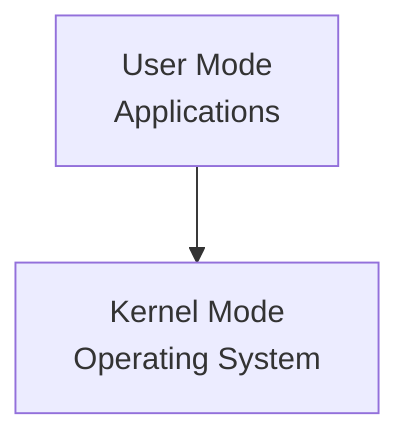
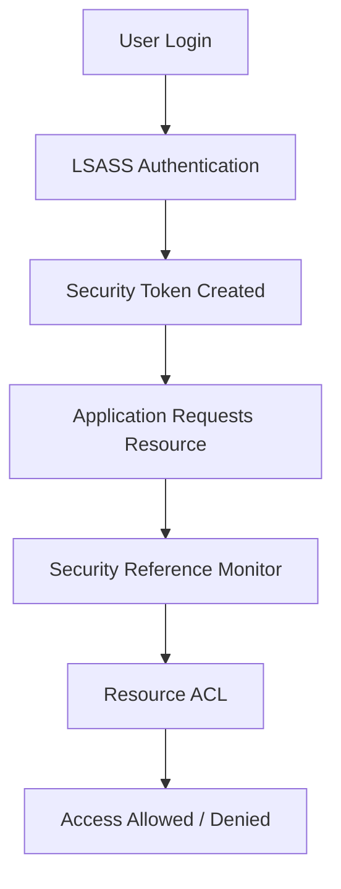

# **OSYS2020 – Windows Security**

# **Workshop 07 (WS07): Windows Security Architecture – LSASS, Security Tokens, and the Security Reference Monitor**

**Case Study Organization:** **CBB – Circuit Board Breakers**
**Continues from:**
WS04 – Identity and Security Groups
WS05 – NTFS ACLs
WS06 – Built-in Roles and Privileges

---

# 1. Assignment Details

| Field            | Information                                 |
| ---------------- | ------------------------------------------- |
| Workshop Title   | Workshop 07 – Windows Security Architecture |
| Course Code      | OSYS2020                                    |
| Course Title     | Windows Security                            |
| Instructor       | Davis Boudreau                              |
| Assignment Type  | Guided Investigation Workshop               |
| Weight           | Formative                                   |
| Estimated Effort | 1 hour                                   |
| Delivery Mode    | In-class / Remote Lab                       |
| Prerequisites    | WS04–WS06                                   |
| Due              | See LMS (Brightspace)                               |

---

# 2. Overview / Purpose / Objectives

## Overview

In previous workshops you learned:

WS04
• Users and groups
• Role-based access control

WS05
• NTFS permissions
• inheritance and effective access

WS06
• built-in groups
• system privileges

However, a critical question remains:

**How does Windows actually enforce security?**

Windows relies on several internal components to manage authentication, authorization, and resource access.

These include:

• **LSASS (Local Security Authority Subsystem Service)**
• **Security Tokens**
• **Security Reference Monitor**
• **Object Manager**

Understanding these components allows administrators to see **how Windows security actually works internally**.

---

# 3. Windows Security Architecture Overview

Windows security follows a layered architecture.



---

## Explanation of the Architecture

### Authentication

The authentication process verifies the user's identity.

Example methods:

• password login
• smart card
• domain authentication

---

### LSASS

The **Local Security Authority Subsystem Service (LSASS)** is responsible for:

• authentication validation
• generating security tokens
• enforcing local security policy

Process name:

```
lsass.exe
```

LSASS is a **critical security process**.

If it fails, Windows security collapses.

---

### Security Token

After authentication, Windows creates a **security token**.

A token contains:

• user identity
• group memberships
• privileges
• logon session information

Example token contents:

```
User: Alex
Groups:
  Domain Users
  HR-Users
Privileges:
  Log on locally
  Change password
```

The security token represents **who the user is and what they can do**.

---

### Security Reference Monitor (SRM)

The **Security Reference Monitor** is a kernel component responsible for:

• evaluating access requests
• comparing tokens against ACLs
• enforcing security decisions

The SRM determines whether access is:

```
Allowed
Denied
```

---

### Object Manager

The **Object Manager** tracks Windows system resources.

Examples:

• files
• registry keys
• processes
• services

Each object may contain an ACL.

---

# 4. User Mode vs Kernel Mode

Windows uses two execution modes.



---

## User Mode

User mode contains:

• applications
• user programs
• background services

Examples:

```
notepad.exe
explorer.exe
chrome.exe
```

User mode programs cannot directly access system resources.

---

## Kernel Mode

Kernel mode contains:

• device drivers
• memory management
• process management
• security enforcement

Critical components like the **Security Reference Monitor** run in kernel mode.

This separation protects the system from application failures.

---

# 5. Security Token Investigation Lab

Students will investigate security tokens.

---

## Step 1 – Open Command Prompt

Run:

```
whoami /all
```

This command displays the current user's **security token**.

---

## Step 2 – Record Token Information

Students should identify:

• username
• group memberships
• privileges

Example output sections:

| Field      | Example             |
| ---------- | ------------------- |
| User       | Alex                |
| Groups     | Domain Users        |
| Privileges | SeShutdownPrivilege |

---

## Step 3 – Identify Privileges

Students should research:

| Privilege               | Meaning          |
| ----------------------- | ---------------- |
| SeShutdownPrivilege     | Shut down system |
| SeBackupPrivilege       | Backup files     |
| SeChangeNotifyPrivilege | Traverse folders |

Students should answer:

```
Which privileges are powerful?
Which privileges might bypass NTFS restrictions?
```

---

# 6. Security Token Flow Diagram

The following diagram shows how tokens are used.



---

# 7. Case Study – Unauthorized File Access

## Scenario

At CBB, a user named **Jordan** attempts to access a sensitive HR payroll file.

The system must determine whether Jordan has permission.

---

## Access Evaluation Process

1. Jordan logs into Windows
2. LSASS authenticates the user
3. A security token is created
4. Jordan opens the payroll file
5. The Security Reference Monitor evaluates the ACL
6. Windows decides whether to allow access

---

## Investigation Question

Students must determine:

```
Which component ultimately decides whether access is granted?
```

Correct answer:

```
Security Reference Monitor
```

---

# 8. Student Discovery Exercise

Students will investigate system processes.

---

## Step 1 – Open Task Manager

Navigate to:

```
Details Tab
```

Locate:

```
lsass.exe
```

---

## Step 2 – Research the Process

Students must answer:

1. What does LSASS do?
2. Why is it critical to Windows security?
3. What would happen if LSASS stopped running?

---

# 9. Reflection Questions

Students should answer:

1. What is the purpose of a security token?
2. Why does Windows separate user mode and kernel mode?
3. Which component ultimately enforces security decisions?
4. How do ACLs interact with security tokens?

---

# 10. Deliverables

Students `who are not present` must submit a document including:

• Token investigation results
• Explanation of LSASS
• Architecture diagram interpretation
• Case study analysis
• Reflection responses (Please see Quizzes)

File name:

```
StudentID_OSYS2020_WS07_SecurityArchitecture.docx
```

Submit via **Brightspace**.

---

# 11. Key Takeaway

Windows security decisions rely on a layered architecture.

Access evaluation follows this chain:

```
User Identity
 ↓
Authentication (LSASS)
 ↓
Security Token
 ↓
Security Reference Monitor
 ↓
ACL Evaluation
 ↓
Resource Access
```

Understanding this architecture allows administrators to troubleshoot:

• permission issues
• privilege escalation
• security incidents

---
