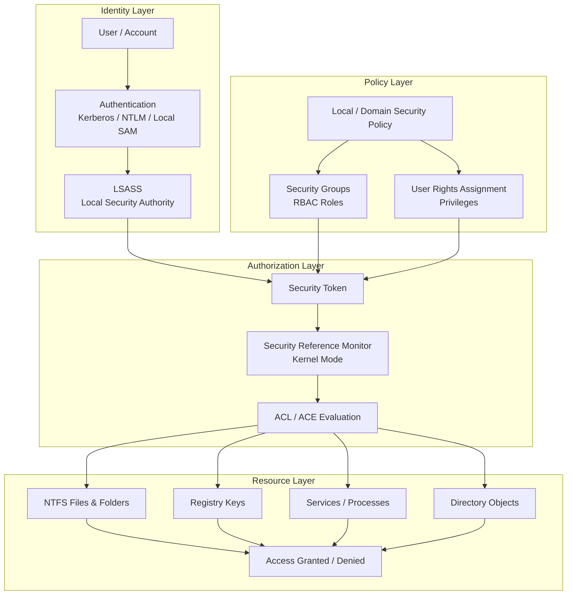

# **Windows Security Brain**

### The Master Security Architecture Map for OSYS2020



---

# How to Read the Windows Security Brain

This diagram shows that Windows security is built like a **decision-making system**.

The operating system must answer one core question:

> **Should this identity be allowed to perform this action on this resource?**

To answer that question, Windows uses multiple layers.

---

# 1. Identity Layer

This is where security begins.

It includes:

* the **user or account**
* the **authentication method**
* the **Local Security Authority (LSASS)**

## What happens here?

A user signs in using:

* domain credentials
* local credentials
* possibly smart card or other mechanisms

Windows then validates the identity through:

* **Kerberos**
* **NTLM**
* **Local SAM**

LSASS is the core component that processes this authentication.

---

# 2. Policy Layer

After identity is validated, Windows must determine:

* What groups is this user in?
* What rights and privileges does this user have?
* What policy rules affect this user?

This is the **policy and role-definition layer**.

It includes:

## Security Groups

Examples:

* Domain Users
* HR-Users
* Backup Operators
* Administrators

## User Rights Assignment

Examples:

* Log on locally
* Back up files and directories
* Shut down the system
* Debug programs

## Security Policy

This may come from:

* local policy
* domain policy
* Group Policy

This layer determines what **capabilities** are associated with the user before access is even attempted.

---

# 3. Authorization Layer

This is where Windows makes the actual security decision.

It includes:

## Security Token

The token is the **runtime identity package** created after authentication.

It includes:

* user SID
* group SIDs
* privileges
* session information

## Security Reference Monitor (SRM)

The SRM runs in **kernel mode** and is responsible for enforcing security.

It compares:

```text
Security Token
vs
ACL / ACE rules
```

## ACL / ACE Evaluation

The Access Control List contains the actual permissions for the object.

Each ACE says:

```text
Who
Can do what
Under what inheritance/scope
```

---

# 4. Resource Layer

This is where the protected resources live.

Students often think only of **files**, but Windows protects many object types.

Examples include:

* **NTFS files and folders**
* **Registry keys**
* **Services and processes**
* **Active Directory objects**

Each of these can have an ACL.

The result of evaluation is:

* **Access Granted**
* **Access Denied**

---

# Why This Diagram Is Powerful

This diagram helps students understand that Windows security is not one thing.

It is a **pipeline of coordinated decisions**.

A security outcome depends on:

```text
Identity
→ Policy
→ Token
→ Authorization
→ Resource ACL
→ Access Decision
```

This explains many common security questions, such as:

* Why does one user have access and another does not?
* Why can a Backup Operator bypass NTFS restrictions?
* Why do group memberships matter so much?
* Why is LSASS such a critical process?
* Why are ACLs only one part of the full security picture?

---

# Connection to Your Workshops

This master diagram also helps unify the workshop sequence:

| Workshop | Main Concept                   | Layer                    |
| -------- | ------------------------------ | ------------------------ |
| WS04     | Users and Groups               | Identity / Policy        |
| WS05     | NTFS ACLs and Inheritance      | Authorization / Resource |
| WS06     | Built-in Groups and Privileges | Policy                   |
| WS07     | LSASS, Tokens, SRM             | Identity / Authorization |

This is why WS07 is such an important turning point: it explains **how all earlier workshops fit together inside the operating system**.

---

# Student Memory Trigger

A very strong memory model for students is:

```text
Who are you?
↓
What roles do you have?
↓
What privileges come with those roles?
↓
What token represents you?
↓
What does the ACL say?
↓
Can you access the resource?
```

---
