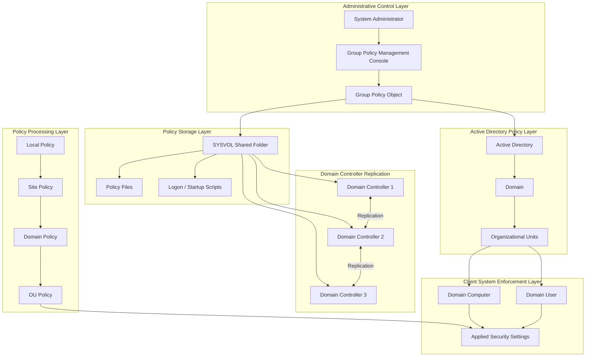
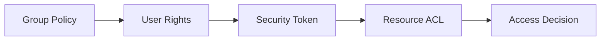

# **Group Policy Brain**

## Visual Architecture of Enterprise Policy Enforcement



---

# How to Read the Group Policy Brain

This diagram shows that Group Policy is **not just a configuration tool**, but a **distributed policy enforcement system**.

It has several layers.

---

# 1. Administrative Control Layer

This is where administrators define security rules.

Tools used:

```
Group Policy Management Console (GPMC)
```

Administrators create:

```
Group Policy Objects (GPOs)
```

A GPO may contain:

* password policies
* firewall settings
* audit rules
* software restrictions
* security templates

---

# 2. Active Directory Policy Layer

GPOs are linked to **Active Directory containers**.

These include:

```
Domain
Organizational Units (OUs)
Sites
```

Policies apply to objects within those containers.

Example:

```
Engineering OU
Finance OU
Workstations OU
Servers OU
```

This allows **policy targeting**.

---

# 3. Policy Storage Layer

The actual policy files are stored in **SYSVOL**.

Example path:

```
C:\Windows\SYSVOL
```

Inside SYSVOL:

```
Policies
Scripts
Administrative templates
```

Each GPO is stored as a **GUID folder**.

Example:

```
SYSVOL
   Policies
      {A1B2C3D4}
```

---

# 4. Domain Controller Replication Layer

Organizations typically have **multiple domain controllers**.

SYSVOL is replicated using:

```
DFS Replication (DFSR)
```

This ensures:

* identical policy data
* fault tolerance
* consistent security enforcement

---

# 5. Policy Processing Layer (LSDOU)

Policies are processed in a specific order.

Students should remember:

```
LSDOU
```

Meaning:

```
Local
Site
Domain
Organizational Unit
```

Policies applied later override earlier policies.

---

# 6. Host Enforcement Layer

Once policies are processed, they are applied to:

```
Computers
Users
```

Examples of applied security settings:

* firewall rules
* password policies
* login restrictions
* auditing rules

These settings become part of the system's **security configuration**.

---

# Why This Diagram Is Important

This diagram explains the **complete lifecycle of policy enforcement**.

```
Administrator creates policy
↓
Policy stored in Active Directory
↓
Policy files stored in SYSVOL
↓
SYSVOL replicated to domain controllers
↓
Clients retrieve policy
↓
Policies processed (LSDOU)
↓
Security settings applied
```

---

# Connection to the Windows Security Brain

Group Policy interacts with the Windows security architecture.

It modifies:

* **privileges**
* **security policies**
* **system configurations**

Before access control decisions are made.



---

# Instructor Insight

Group Policy is one of the **most important enterprise security systems** in Windows environments.

Without it:

```
administrators would configure systems manually
security settings would drift
policies would become inconsistent
```

Group Policy provides:

* centralized management
* consistent configuration
* scalable security enforcement

---

# Student Memory Model

Students should remember the **Group Policy Brain flow** as:

```
Administrator
↓
Group Policy Object
↓
Active Directory
↓
SYSVOL storage
↓
Domain controller replication
↓
Client retrieves policy
↓
Policy processing (LSDOU)
↓
Security settings enforced
```

---
