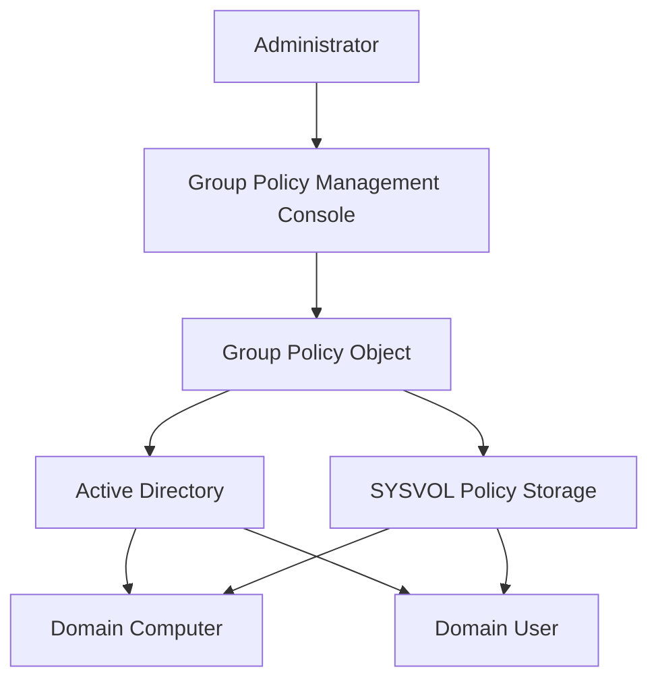
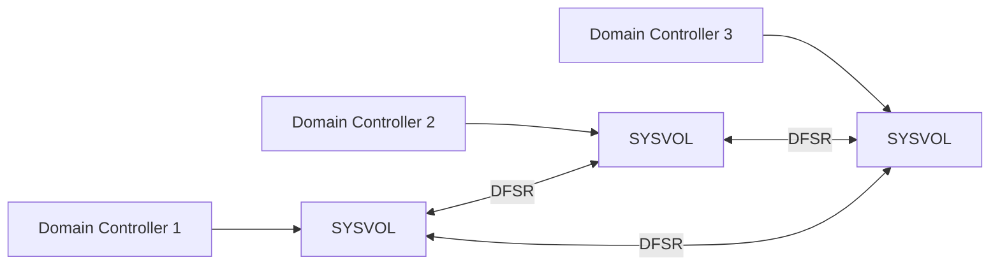
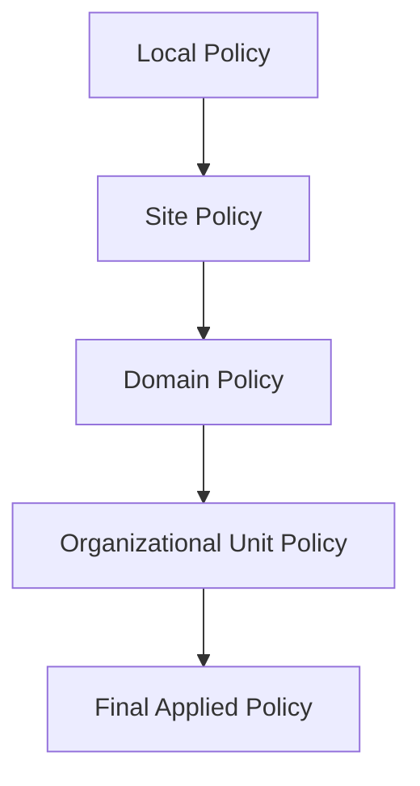
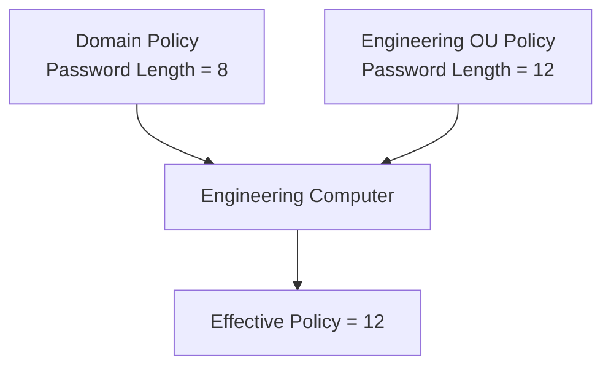
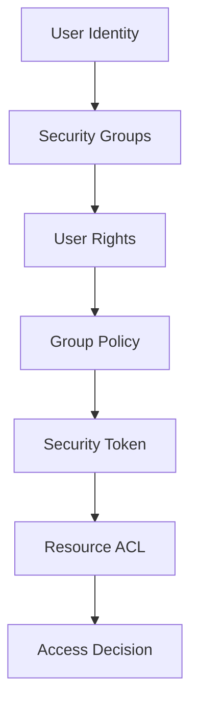
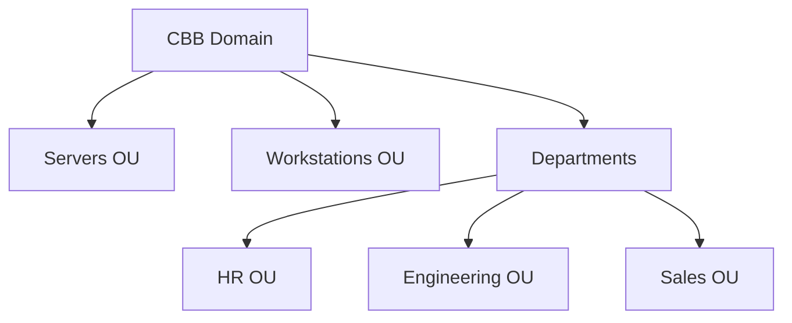

# **OSYS2020 – Windows Security**

# **Workshop 08 Takeaway: Group Policy Architecture & Enterprise Security Enforcement**

After completing Workshop 08, you should understand how **Windows administrators deploy and enforce security configurations across many computers simultaneously**.

Earlier workshops introduced:

| Workshop | Concept                       |
| -------- | ----------------------------- |
| WS04     | Identity and Groups           |
| WS05     | NTFS Permissions              |
| WS06     | System Roles and Privileges   |
| WS07     | Windows Security Architecture |

Workshop 08 explains **how administrators enforce security policy across an entire domain environment**.

Without centralized management, maintaining consistent security across hundreds or thousands of systems would be impossible.

Group Policy solves this problem.

---

# 1. What Group Policy Really Is

**Group Policy** is a centralized configuration management system used to control Windows security and system settings.

Administrators define rules once and Windows automatically applies them to computers and users within the domain.

Examples of settings controlled by Group Policy include:

| Category              | Example                          |
| --------------------- | -------------------------------- |
| Password Policy       | Minimum password length          |
| Account Lockout       | Lock account after failed logins |
| Firewall              | Enable Windows Defender Firewall |
| Audit Policy          | Log authentication attempts      |
| Software Restrictions | Prevent unauthorized programs    |

Group Policy acts as the **policy enforcement layer** within Windows security architecture.

---

# 2. Group Policy Architecture Map

Group Policy integrates several core components of Active Directory.



---

## What the Diagram Shows

When administrators create a **Group Policy Object (GPO)**:

1. The GPO is linked to **Active Directory containers**
2. Policy files are stored inside **SYSVOL**
3. Domain computers retrieve policies from domain controllers
4. Security settings are applied locally on the system

This allows administrators to enforce security policies across **entire organizational environments**.

---

# 3. What a Group Policy Object Contains

A **Group Policy Object** contains configuration settings divided into two categories.

| Category               | Description                       |
| ---------------------- | --------------------------------- |
| Computer Configuration | Settings applied to machines      |
| User Configuration     | Settings applied to user accounts |

Examples include:

Computer configuration may control:

```
Windows Defender
Firewall rules
Security auditing
Password policies
```

User configuration may control:

```
Desktop restrictions
Login scripts
Drive mappings
Application restrictions
```

---

# 4. Understanding SYSVOL

Every domain controller contains a shared folder named **SYSVOL**.

Example path:

```
C:\Windows\SYSVOL
```

SYSVOL stores **Group Policy files and scripts**.

---

## SYSVOL Directory Structure

Example:

```
SYSVOL
   domain
      Policies
      Scripts
```

Within the Policies folder:

```
Policies
   {GUID}
      Machine
      User
```

Each folder represents a **Group Policy Object**.

---

# 5. SYSVOL Replication

In enterprise environments, organizations typically have **multiple domain controllers**.

All domain controllers must have identical copies of Group Policy.

SYSVOL is replicated across domain controllers using **DFS Replication (DFSR)**.

---

## SYSVOL Replication Model



---

## Why Replication Is Important

SYSVOL replication ensures that:

* every domain controller distributes identical policies
* administrators can modify policy from any domain controller
* policy enforcement remains consistent across the organization

Without replication, security policies would quickly become inconsistent.

---

# 6. Group Policy Processing Order (LSDOU)

Group Policy settings are processed in a specific order.

Students should remember the **LSDOU model**:

```
Local
Site
Domain
Organizational Unit
```

---

## Policy Processing Flow



Policies applied later in the order override earlier policies.

This allows administrators to apply **more specific rules at lower levels of the directory hierarchy**.

---

# 7. Policy Conflict Resolution

Sometimes multiple policies attempt to control the same setting.

Windows resolves conflicts using **processing order and precedence rules**.

---

## Example Policy Conflict



Because the **OU policy is applied later**, it overrides the domain setting.

---

# 8. Group Policy and the Windows Security Brain

Group Policy operates at the **Policy Layer** of the Windows security architecture.



Group Policy modifies:

* privileges
* security configuration
* system restrictions

before the security token is used to evaluate resource access.

---

# 9. Enterprise OU Design Model

Large organizations design Active Directory structures carefully to support policy enforcement.

Example structure:



---

## Why OU Design Matters

OUs determine where policies are applied.

For example:

| OU           | Example Policy                |
| ------------ | ----------------------------- |
| Servers      | Restrictive security settings |
| Workstations | User security restrictions    |
| HR           | Confidential data controls    |

Proper OU design allows organizations to **apply policies logically and predictably**.

---

# 10. Real-World Group Policy Examples

Administrators often use Group Policy to enforce critical security controls.

Examples include:

### Password Security

```
Minimum length = 12
Password history = 10
Maximum age = 60 days
```

---

### Security Auditing

Enable logging for:

```
Logon events
Account lockouts
Privilege use
```

---

### System Restrictions

Prevent unauthorized software execution using:

```
AppLocker
Software Restriction Policies
```

---

# 11. Why Group Policy Is Critical for Security

Without Group Policy, administrators would have to configure security settings manually on every system.

This would lead to:

```
inconsistent security
configuration drift
administrative errors
```

Group Policy provides:

* centralized security management
* consistent policy enforcement
* scalable administration

---

# 12. Final Key Takeaways

After Workshop 08 you should remember:

1. **Group Policy is the centralized security configuration system for Windows domains.**

2. **Policies are defined using Group Policy Objects (GPOs).**

3. **GPO settings are stored in Active Directory and SYSVOL.**

4. **SYSVOL replicates policy data across domain controllers.**

5. **Policies are applied according to LSDOU processing order.**

6. **Later policies override earlier policies during conflict resolution.**

7. **Active Directory OU design determines how policies are applied across the organization.**

8. **Group Policy allows administrators to enforce security controls at enterprise scale.**

---


