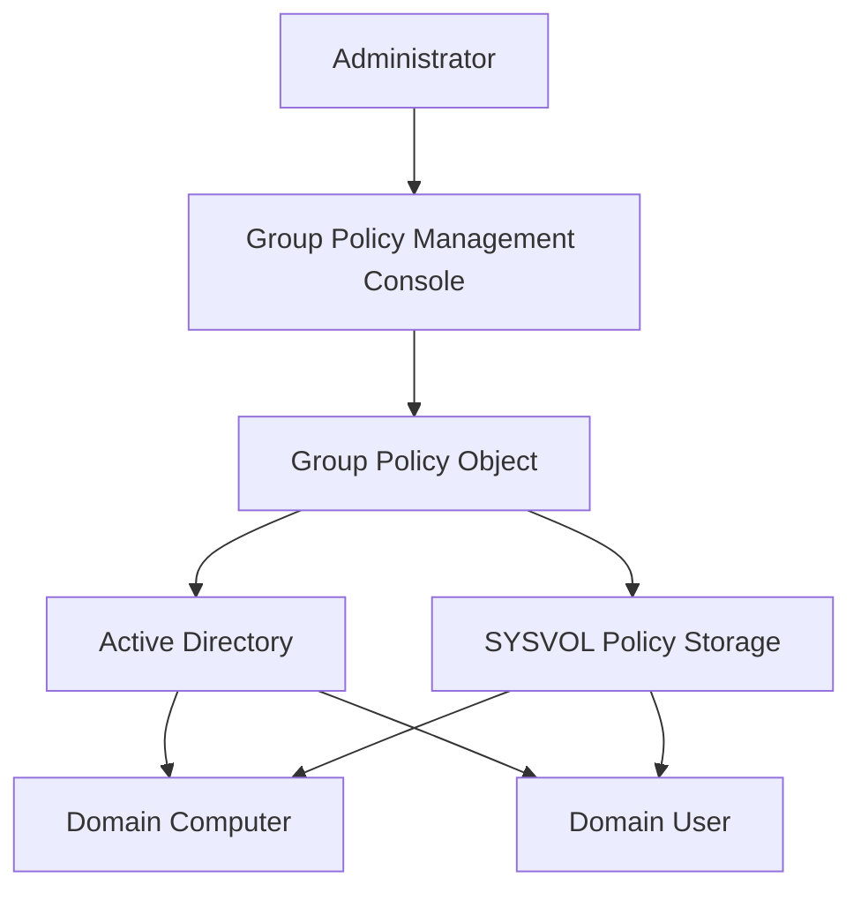
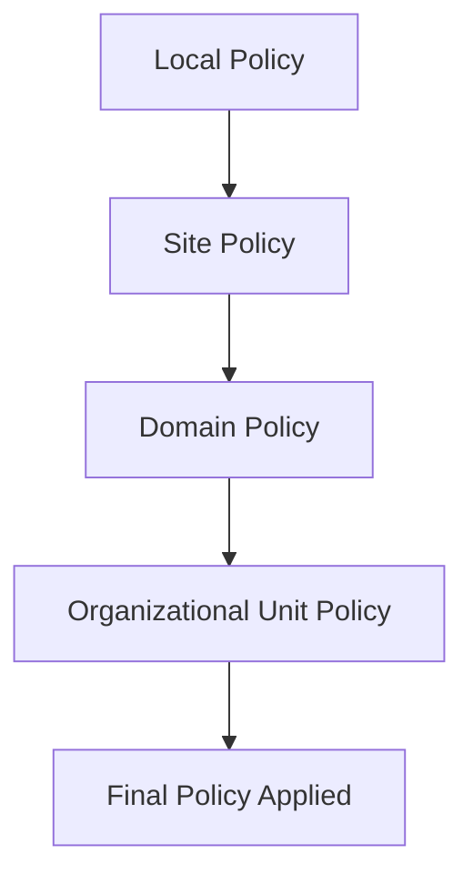
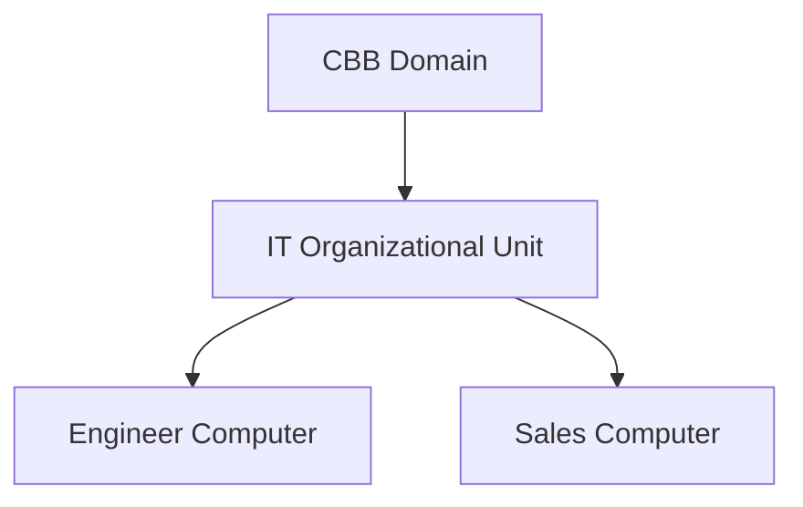
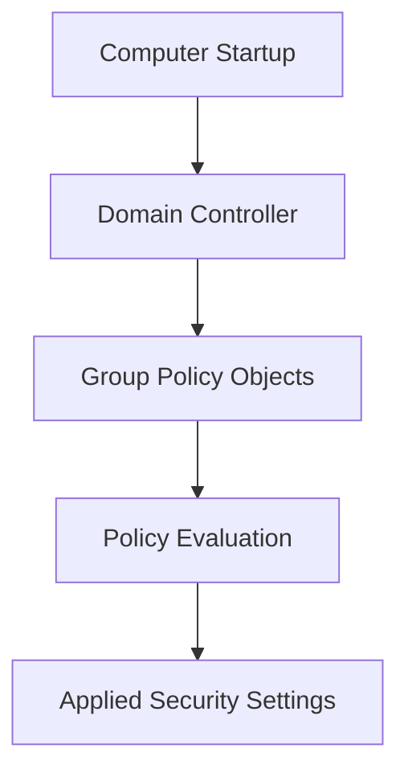

# **OSYS2020 – Windows Security**

# **Workshop 08 (WS08): Group Policy Security Architecture and Policy Enforcement**

**Case Study Organization:** **CBB – Circuit Board Breakers**
**Continues from:** WS04–WS07

---

# 1. Assignment Details

| Field            | Information                         |
| ---------------- | ----------------------------------- |
| Workshop Title   | Workshop 08 – Group Policy Security |
| Course Code      | OSYS2020                            |
| Course Title     | Windows Security                    |
| Instructor       | Davis Boudreau                      |
| Assignment Type  | Guided Architecture + Lab           |
| Weight           | Formative                           |
| Estimated Effort | 2–3 hours                           |
| Delivery Mode    | Lab                                 |
| Prerequisites    | WS04–WS07                           |
| Due              | See LMS (Brightspace)               |

---

# 2. Overview / Purpose / Objectives

In small systems administrators can configure security manually.

In enterprise environments containing:

```
hundreds of computers
thousands of users
```

manual configuration becomes impossible.

Windows solves this problem using **Group Policy**.

Group Policy allows administrators to **define security rules once and automatically apply them across the domain**.

---

## Workshop Objectives

Students will learn to:

• explain the purpose of Group Policy
• identify Group Policy architecture components
• understand how policies propagate across the domain
• analyze security policies applied through GPOs
• evaluate policy enforcement using diagnostic tools

---

# 3. Group Policy Architecture

Group Policy is a **centralized configuration system** for Windows domains.

It allows administrators to enforce settings across:

* computers
* users
* applications
* security configurations

---

## Group Policy Architecture Diagram



---

# 4. What a Group Policy Object (GPO) Contains

A **Group Policy Object** contains configuration rules.

Examples include:

| Category               | Example Setting         |
| ---------------------- | ----------------------- |
| Password Policy        | Minimum password length |
| Account Lockout        | Lockout threshold       |
| Audit Policy           | Log security events     |
| User Rights Assignment | Allow RDP               |
| Firewall Rules         | Enable Windows Firewall |
| Software Restrictions  | Prevent certain apps    |

---

# 5. Group Policy Processing Order

Group Policy settings are applied in a specific order.

This order determines **which policy wins when conflicts occur**.

Students should remember the **LSDOU model**.

```
Local
Site
Domain
Organizational Unit
```

---

## Policy Processing Diagram



Policies applied later override earlier settings.

---

# 6. Example Security Policy Flow

In the CBB environment:



A policy applied to the **IT OU** will automatically affect all systems within that OU.

---

# 7. Group Policy Investigation Lab

Students will explore existing policies in the domain.

---

## Step 1 – Open Group Policy Management

On **OSYS-DC01**

```
Server Manager
 → Tools
 → Group Policy Management
```

---

## Step 2 – Explore Existing GPOs

Students should record:

| GPO Name                          | Scope              |
| --------------------------------- | ------------------ |
| Default Domain Policy             | Domain             |
| Default Domain Controllers Policy | Domain Controllers |

Students should identify:

* password policies
* audit policies
* user rights

---

# 8. Policy Diagnostics

Administrators must be able to determine **which policies are applied to a system**.

Students will use diagnostic tools.

---

## Tool 1 – gpresult

Run:

```
gpresult /r
```

This command displays applied policies.

---

## Tool 2 – Resultant Set of Policy

Open:

```
rsop.msc
```

This tool shows the **effective policy configuration**.

---

## Policy Evaluation Flow



---

# 9. Case Study – Password Security

CBB wants to enforce stronger password security.

The administrator creates a GPO with:

| Setting                 | Value   |
| ----------------------- | ------- |
| Minimum Password Length | 12      |
| Password History        | 10      |
| Maximum Age             | 60 days |

Once applied at the domain level, all users automatically receive the new policy.

---

# 10. Student Discovery Exercise

Students must determine:

```
Which security policies are currently applied to their system?
```

Steps:

1. Run `gpresult /r`
2. Identify applied GPOs
3. Identify security settings enforced by those policies

Students must answer:

```
Which policies are coming from the domain?
Which policies are local?
```

---

# 11. Reflection Questions

Students should answer:

1. Why is centralized security management necessary in large organizations?

2. How does Group Policy enforce security consistency?

3. What happens if two policies conflict?

4. Why must administrators carefully design GPO structure?

---

# 12. Key Takeaway

Group Policy is the **centralized enforcement system for Windows security**.

It allows administrators to apply policies across an entire domain.

Security enforcement follows this path:

```
Administrator
 ↓
Group Policy Object
 ↓
Active Directory
 ↓
Domain Computers
 ↓
Applied Security Settings
```

Without Group Policy, managing Windows security at enterprise scale would be extremely difficult.

---

