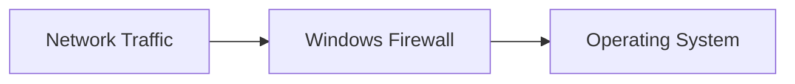
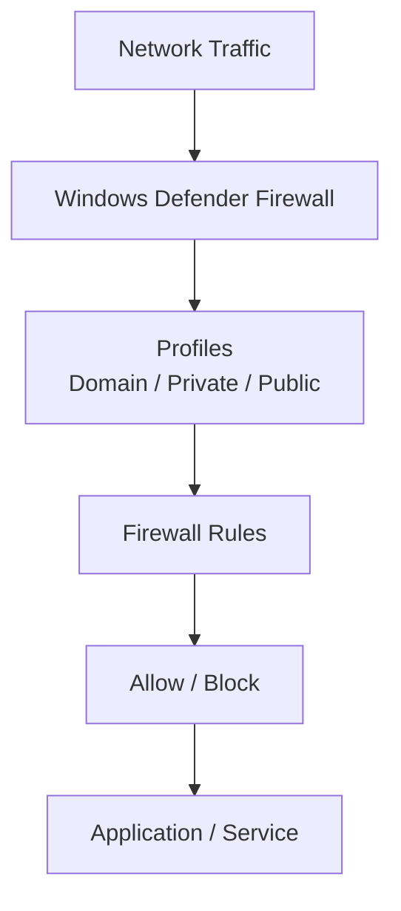
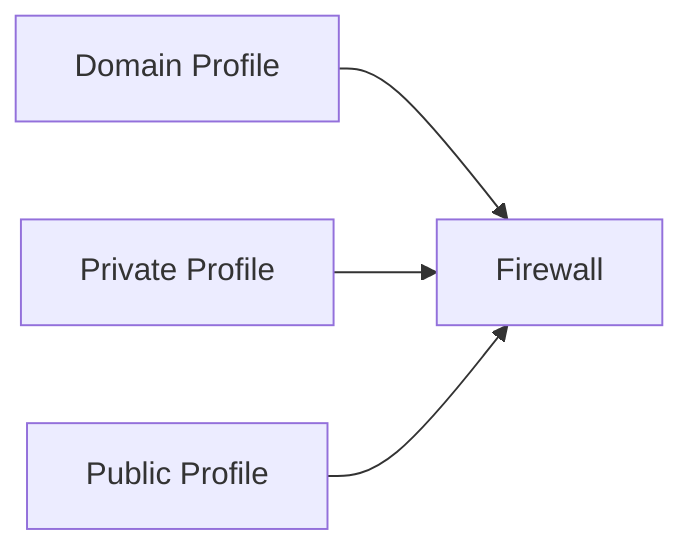
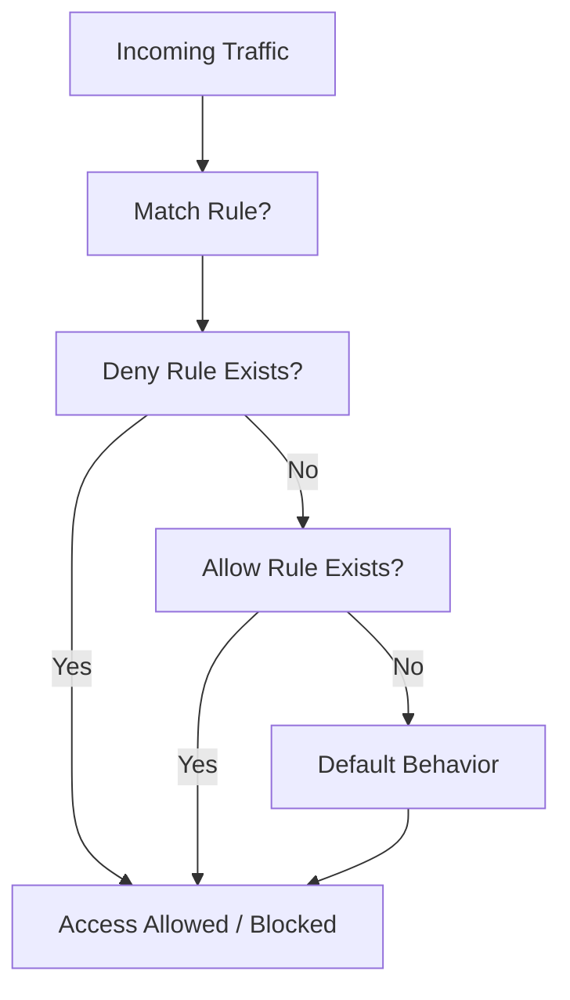
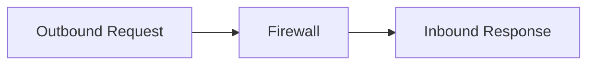
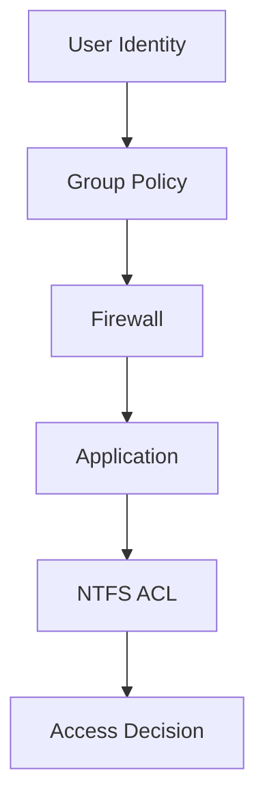
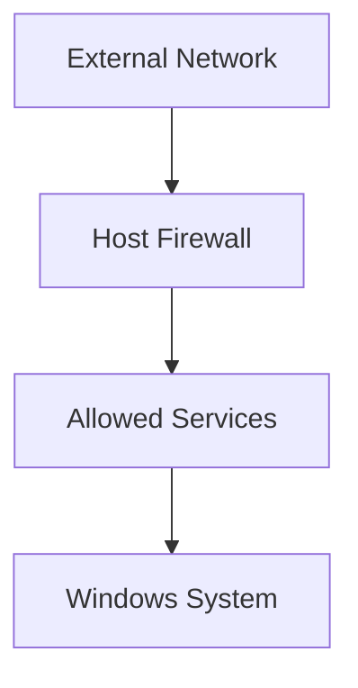

# **OSYS2020 – Windows Security**

# **Workshop 09 Takeaway: Windows Firewall Architecture & Host-Based Network Protection**

After completing Workshop 09, you should now understand how Windows systems **control network traffic at the host level**.

Previous workshops secured:

| Workshop | Security Layer                             |
| -------- | ------------------------------------------ |
| WS04     | Identity (Users & Groups)                  |
| WS05     | Resource Access (NTFS ACLs)                |
| WS06     | Privileges (System Roles)                  |
| WS07     | Security Architecture (LSASS, Tokens, SRM) |
| WS08     | Policy Enforcement (Group Policy)          |

Workshop 09 introduces the **Network Protection Layer**.

Even if permissions are correctly configured, systems remain vulnerable if **network access is not controlled**.

---

# 1. What the Windows Firewall Really Does

The **Windows Defender Firewall** controls **network traffic entering and leaving the system**.

It acts as a **gatekeeper** between:

```text
The network
and
The operating system
```

---

## Conceptual Model



Only permitted traffic is allowed through.

---

# 2. Firewall Architecture Overview

The firewall evaluates traffic using:

* profiles
* rules
* connection state

---

## Firewall Architecture Map



---

## Key Insight

All network traffic must pass through the firewall **before reaching applications or services**.

---

# 3. Firewall Profiles

Windows Firewall applies different rules depending on the network environment.

---

## Profile Types

| Profile | Purpose                               |
| ------- | ------------------------------------- |
| Domain  | Trusted enterprise network            |
| Private | Trusted local network                 |
| Public  | Untrusted networks (most restrictive) |

---

## Profile Behavior



---

## Critical Understanding

Each profile has **its own rule set**.

Example:

```text
RDP allowed on Domain
RDP blocked on Public
```

---

# 4. Firewall Rules and Control

Firewall rules determine **what traffic is allowed or denied**.

---

## Rule Types

| Type     | Example                    |
| -------- | -------------------------- |
| Inbound  | Allow RDP (3389)           |
| Outbound | Block external connections |
| Program  | Allow chrome.exe           |
| Port     | Allow TCP 443              |
| Protocol | Allow ICMP (ping)          |

---

## Example Rule

```text
Allow TCP 3389 (Remote Desktop)
```

---

# 5. How Firewall Rules Are Evaluated

Windows evaluates rules in a specific order.

---

## Rule Evaluation Flow



---

## Key Rules

* **Deny rules override Allow rules**
* If no rule exists → default action applies
* Firewall is **stateful**

---

# 6. Stateful Firewall Behavior

Windows Firewall tracks connection state.

---

## Stateful Model



---

## Key Insight

If a connection is allowed outbound:

```text
The return traffic is automatically allowed
```

This is called **stateful inspection**.

---

# 7. Firewall in the Windows Security Brain

Firewall operates **before application and file-level security**.

---

## Security Layer Integration



---

## Critical Insight

Even if NTFS allows access:

```text
Firewall can still block the connection
```

Firewall is an **outer layer of defense**.

---

# 8. Real-World Security Scenarios

---

## Scenario 1 – Open Port Exposure

A system has:

```text
Port 3389 open (RDP)
```

If exposed:

```text
Attackers can attempt brute-force login attacks
```

---

## Scenario 2 – Misconfigured Public Profile

If Public profile allows:

```text
File sharing
```

Then:

```text
Unauthorized users may access shared resources
```

---

## Scenario 3 – No Firewall Restrictions

If all inbound traffic is allowed:

```text
Attack surface increases dramatically
```

---

# 9. Best Practice Firewall Design

Professional administrators follow strict rules.

---

## Core Principles

### Default Deny (Inbound)

```text
Block all inbound traffic
Allow only required services
```

---

### Least Privilege (Network)

```text
Only allow necessary ports and applications
```

---

### Profile-Based Security

```text
Strict rules for Public networks
More permissive for Domain networks
```

---

### Outbound Control (Advanced)

```text
Restrict outbound connections when required
```

---

# 10. Enterprise Firewall Model



---

## Key Insight

Firewall reduces **attack surface exposure**.

---

# 11. Common Misconfigurations

Poor firewall configuration can lead to:

---

### Overly Permissive Rules

```text
Allow All Inbound
```

---

### Unrestricted Public Profile

```text
Public network behaves like trusted network
```

---

### Forgotten Rules

Old rules may leave unnecessary ports open.

---

### No Logging

Without logs:

```text
Administrators cannot detect suspicious activity
```

---

# 12. Final Key Takeaways

After Workshop 09, you should remember:

1. **Windows Firewall controls network traffic at the host level.**

2. **All traffic must pass through the firewall before reaching applications.**

3. **Firewall profiles (Domain, Private, Public) determine rule behavior.**

4. **Firewall rules define what traffic is allowed or blocked.**

5. **Deny rules override Allow rules.**

6. **Windows Firewall is stateful and tracks connections.**

7. **Firewall operates before NTFS permissions and application access.**

8. **Proper firewall configuration reduces attack surface and prevents unauthorized access.**

---

# Student Memory Model

Students should remember firewall behavior as:

```text
Traffic arrives
↓
Firewall profile selected
↓
Rules evaluated
↓
Allow or Block decision
↓
Application receives traffic (if allowed)
```
