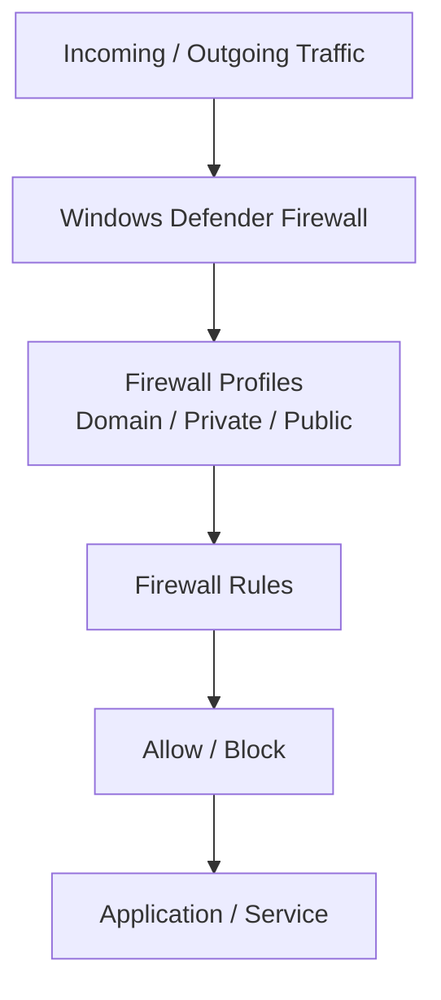
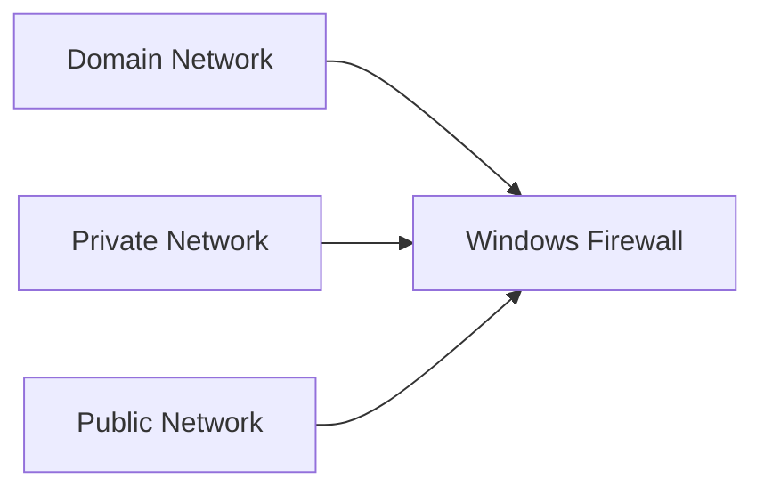
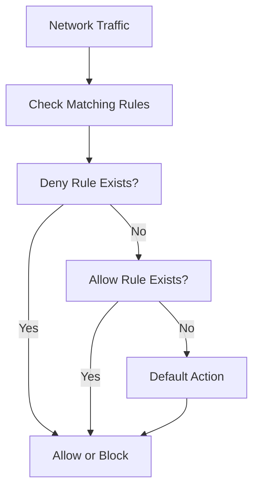
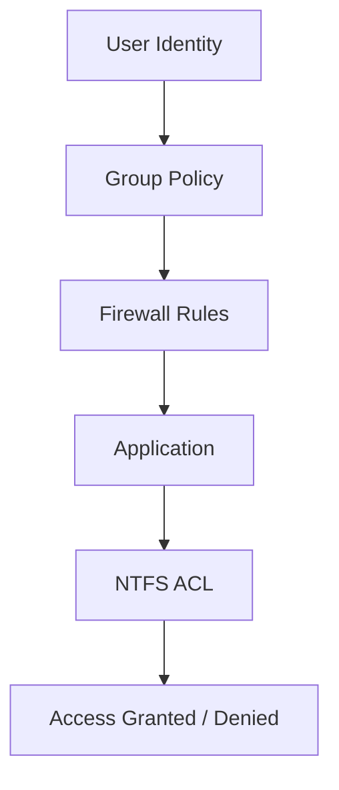
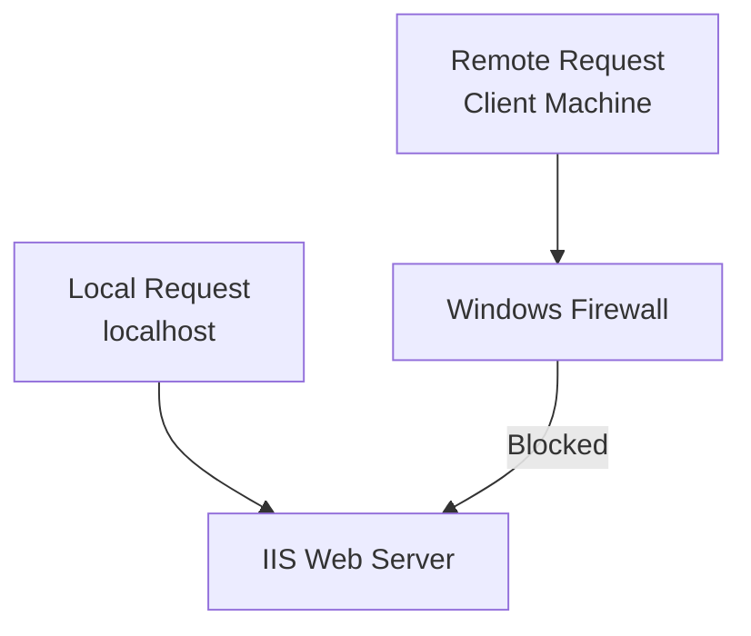

# **OSYS2020 – Windows Security**

# **Workshop 09 (WS09): Windows Firewall Security & Host-Based Network Protection**

**Case Study Organization:** **CBB – Circuit Board Breakers**
**Continues from:** WS04–WS08

---

# 1. Assignment Details

| Field            | Information                             |
| ---------------- | --------------------------------------- |
| Workshop Title   | Workshop 09 – Windows Firewall Security |
| Course Code      | OSYS2020                                |
| Course Title     | Windows Security                        |
| Instructor       | Davis Boudreau                          |
| Assignment Type  | Guided Lab + Security Investigation     |
| Weight           | Formative                               |
| Estimated Effort | 2–3 hours                               |
| Delivery Mode    | In-class / Remote Lab                   |
| Prerequisites    | WS04–WS08                               |
| Due              | See LMS (Brightspace)                   |

---

# 2. Overview / Purpose / Objectives

## Overview

In previous workshops, you secured:

* identities (users & groups)
* resources (NTFS permissions)
* privileges (system roles)
* policies (Group Policy)

However, systems must also control **network traffic at the host level**.

Even if permissions are correctly configured, attackers may still:

* scan open ports
* exploit exposed services
* establish unauthorized connections

Windows uses the **Windows Defender Firewall** to control network access.

---

## Purpose

This workshop teaches students how to:

* control inbound and outbound traffic
* implement host-based network security
* understand firewall rule processing
* test and validate security configurations

---

## Objectives

By the end of this workshop students will be able to:

* explain firewall architecture
* configure firewall rules
* analyze rule precedence and behavior
* test blocked vs allowed traffic
* understand host-level network protection

---

# 3. Windows Firewall Architecture

The Windows Firewall is part of the **host security layer**.

It evaluates network traffic before it reaches applications.

---

## Firewall Architecture Map



---

## What This Diagram Shows

Every packet of network traffic:

1. passes through the firewall
2. is evaluated against active rules
3. is either allowed or blocked
4. only reaches applications if permitted

---

# 4. Firewall Profiles

Windows Firewall uses three profiles.

| Profile | When Used                   |
| ------- | --------------------------- |
| Domain  | Connected to domain network |
| Private | Trusted internal networks   |
| Public  | Untrusted networks          |

---

## Profile Model



---

## Key Insight

Each profile has **independent rule sets**.

A rule allowed on:

```
Domain
```

may be blocked on:

```
Public
```

---

# 5. Types of Firewall Rules

Firewall rules define how traffic is handled.

---

## Rule Categories

| Rule Type | Description                          |
| --------- | ------------------------------------ |
| Inbound   | Controls traffic entering the system |
| Outbound  | Controls traffic leaving the system  |
| Program   | Applies to specific applications     |
| Port      | Applies to specific ports            |
| Protocol  | Applies to TCP/UDP/ICMP              |

---

## Example

```text
Allow TCP port 3389 (RDP)
Block inbound HTTP (port 80)
Allow application chrome.exe outbound
```

---

# 6. Firewall Rule Processing

Firewall rules are evaluated in a specific order.

---

## Rule Evaluation Model



---

## Key Rule Behavior

* **Deny rules override Allow rules**
* If no rule exists → default behavior applies
* Firewall is **stateful** (tracks connections)

---

# 7. Firewall and the Windows Security Brain

Firewall operates at the **network layer** of security.



---

## Key Insight

Firewall decisions happen **before NTFS permissions**.

Even if a user has access:

```
NTFS allows
```

If the firewall blocks traffic:

```
Access is denied
```

---

Excellent enhancement — this turns WS09 into a **real-world, scenario-driven lab** where students clearly see the difference between:

* **local vs remote access**
* **service availability vs network exposure**
* **firewall enforcement boundaries**

Below is the **rewritten Section 8 – Lab: Firewall Configuration** aligned to your standard and learning depth.

---

# **8. Lab – Firewall Configuration (IIS Web Server Scenario)**

In this lab, you will simulate a **real-world server exposure scenario** and use the Windows Firewall to control access.

You will:

* install a web server (IIS)
* verify local functionality
* test remote access
* apply a firewall rule to block external traffic
* observe how firewall rules affect access differently

---

## **Scenario Context (CBB Case Study)**

CBB has deployed a web service on a Windows server.

The service must:

```text
Work locally for administrators
Be restricted from remote access unless explicitly allowed
```

You have been tasked with **securing the service using Windows Firewall**.

---

# **Step 1 – Install IIS Web Server**

On your **Windows Server (OSYS-DC01 or Server VM)**:

1. Open:

```text
Server Manager → Add Roles and Features
```

2. Install:

```text
Web Server (IIS)
```

3. Accept default features and complete installation

---

# **Step 2 – Verify Web Server Locally**

On the server, open a browser and navigate to:

```text
http://localhost
```

You should see the **default IIS page**.

---

## **Checkpoint**

This confirms:

```text
The web service is running
The server can serve HTTP requests locally
```

---

# **Step 3 – Test Remote Access from Client**

From your **Windows client machine**:

1. Open a browser
2. Navigate to:

```text
http://<Server-IP-Address>
```

Example:

```text
http://192.168.x.x
```

---

## **Expected Result**

You should be able to:

```text
Access the IIS web page from the client
```

---

## **What This Demonstrates**

At this stage:

```text
The web server is exposed to the network
Remote systems can access the service
```

This represents a **potential attack surface**.

---

# **Step 4 – Create Firewall Rule to Block HTTP (Port 80)**

On the **server**:

1. Open:

```text
Windows Defender Firewall with Advanced Security
```

2. Navigate to:

```text
Inbound Rules → New Rule
```

3. Configure:

* Rule Type: **Port**
* Protocol: **TCP**
* Port: **80**
* Action: **Block the connection**
* Profile: **Domain (or all profiles for testing)**
* Name:

```text
Block HTTP (Port 80)
```

---

# **Step 5 – Test Remote Access Again**

From the **client machine**:

```text
http://<Server-IP-Address>
```

---

## **Expected Result**

```text
Connection fails / page does not load
```

---

## **What This Demonstrates**

The firewall is now:

```text
Blocking inbound HTTP traffic from remote systems
```

The web server is still running, but **no longer accessible externally**.

---

# **Step 6 – Verify Local Access Still Works**

Return to the **server** and navigate again to:

```text
http://localhost
```

---

## **Expected Result**

```text
The IIS page still loads successfully
```

---

## **Critical Insight**

This demonstrates a key firewall principle:

```text
Firewall rules control network traffic, not local system processes
```

---

# **Conceptual Model – Local vs Remote Access**



---

## **What This Diagram Shows**

* Local traffic **bypasses firewall restrictions**
* Remote traffic is **filtered by firewall rules**
* The service remains operational internally but protected externally

---

# **Step 7 – Analyze the Security Impact**

Students should reflect:

### Before Firewall Rule

```text
Service accessible locally and remotely
High exposure risk
```

### After Firewall Rule

```text
Service accessible locally only
Remote attack surface reduced
```

---

# **Step 8 – Optional Extension (Advanced)**

Students may:

* Modify the rule to:

  * Allow specific IP addresses
* Enable firewall logging
* Create outbound rules

---

# **Instructor Insight**

This lab replicates a very common real-world scenario:

```text
A service is installed and works correctly
But is unintentionally exposed to the network
```

Firewall rules allow administrators to:

* isolate services
* restrict access
* protect systems without disabling functionality

---

# **Student Memory Model**

Students should remember:

```text
Service running ≠ Service exposed

Local access = allowed
Remote access = controlled by firewall
```

---


# 9. Security Scenario – Unauthorized Access Attempt

## Scenario

An attacker attempts to connect to a workstation using:

```text
Remote Desktop (RDP – port 3389)
```

---

## Investigation

Students must determine:

* Is the port open?
* Is the firewall allowing traffic?
* Which rule controls access?

---

## Expected Outcome

Students identify:

* firewall rule configuration
* allowed/blocked traffic
* system exposure level

---

# 10. Student Discovery Exercise

Students must answer:

```text
Which firewall rules are currently protecting your system?
```

Tasks:

1. Identify active firewall profile
2. List enabled rules
3. Identify rules that expose services

---

# 11. Reflection Questions

1. Why is host-based firewall protection important?

2. What is the difference between inbound and outbound rules?

3. Why should public networks have stricter rules?

4. How does firewall security complement NTFS permissions?

---

# 12. Deliverables

Students must submit:

* firewall rule configuration screenshots
* rule analysis
* test results (blocked vs allowed)
* reflection responses

File name:

```text
StudentID_OSYS2020_WS09_Firewall.docx
```

Submit via **Brightspace**.

---

# 13. Instructor Deep Dive

In enterprise environments:

```text
Thousands of endpoints
Multiple network segments
Constant external threats
```

Firewalls provide:

* attack surface reduction
* service exposure control
* segmentation enforcement

---

## Real-World Best Practice

Organizations often configure:

```text
Block all inbound by default
Allow only required services
Restrict outbound traffic where possible
```

---

# 14. Final Key Takeaways

After WS09, students should remember:

1. **Windows Firewall controls network traffic at the host level.**

2. **Firewall rules determine whether traffic is allowed or blocked.**

3. **Profiles (Domain, Private, Public) control rule application.**

4. **Deny rules override Allow rules.**

5. **Firewall decisions occur before application and NTFS access.**

6. **Host-based firewalls are critical for defense-in-depth.**

7. **Installing a service does not mean it should be exposed to the network**

8. **Firewall rules control remote access to services**

9. **Blocking inbound traffic does not stop local service functionality**

10. **Firewall is a critical tool for reducing attack surface**

11. **Services should only be exposed when necessary**

---
