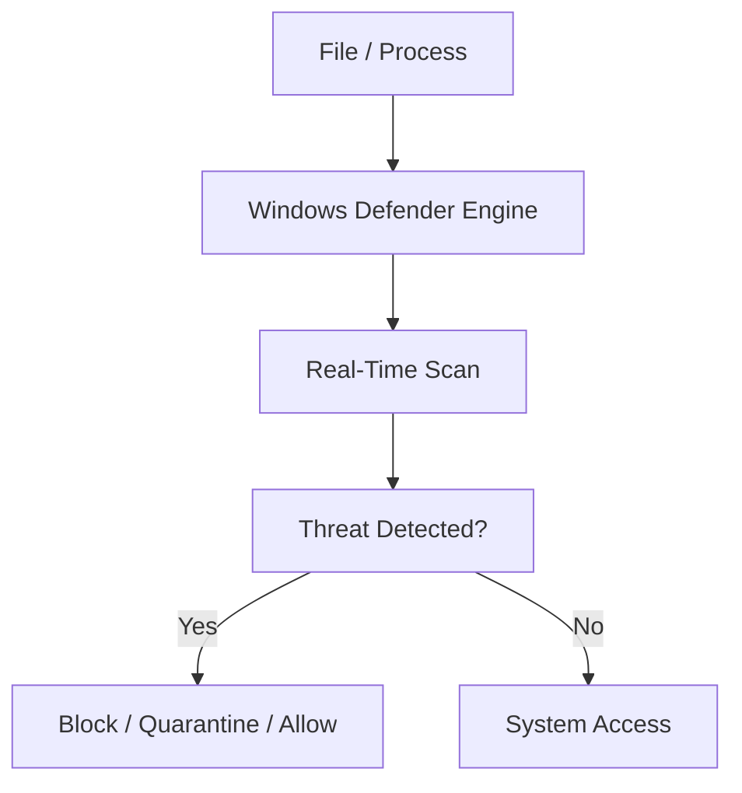
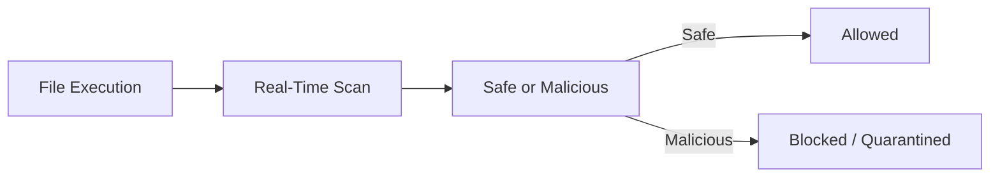
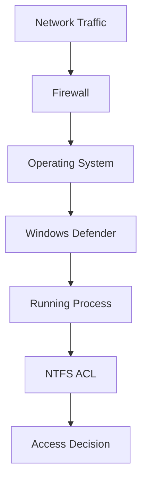

# **OSYS2020 – Windows Security**

# **Workshop 10 (WS10): Endpoint Protection with Windows Defender**

**Case Study Organization:** **CBB – Circuit Board Breakers**
**Continues from:** WS04–WS09

---

# 1. Assignment Details

| Field            | Information                                          |
| ---------------- | ---------------------------------------------------- |
| Workshop Title   | Workshop 10 – Endpoint Protection (Windows Defender) |
| Course Code      | OSYS2020                                             |
| Course Title     | Windows Security                                     |
| Instructor       | Davis Boudreau                                       |
| Assignment Type  | Guided Lab + Security Investigation                  |
| Weight           | Formative                                            |
| Estimated Effort | 2–3 hours                                            |
| Delivery Mode    | In-class / Remote Lab                                |
| Prerequisites    | WS04–WS09                                            |
| Due              | End of Week 11                                       |

---

# 2. Overview / Purpose / Objectives

## Overview

So far, you have secured:

* Identity (users, groups, tokens)
* Resources (NTFS ACLs)
* Privileges (system roles)
* Policy (Group Policy)
* Network access (Firewall)

However, systems are still vulnerable to:

```text
Malware
Ransomware
Unauthorized executables
Exploit-based attacks
```

This is where **endpoint protection** becomes critical.

---

## Purpose

This workshop introduces **Windows Defender**, which protects systems by:

* scanning files and processes
* blocking malicious activity
* enforcing real-time protection
* integrating with system security components

---

## Objectives

By the end of this workshop students will be able to:

* explain how endpoint protection works
* configure Windows Defender
* perform malware scans
* analyze threat detection behavior
* understand real-time protection
* investigate security alerts

---

# 3. Endpoint Protection Architecture

Windows Defender operates at the **endpoint layer** of security.

---

## Defender Architecture Map



---

## Key Insight

Defender actively monitors:

```text
Files
Processes
Memory activity
System behavior
```

---

# 4. Real-Time Protection

Windows Defender continuously monitors system activity.

---

## Real-Time Protection Flow



---

## Key Concept

```text
Protection happens BEFORE execution
```

---

# 5. Types of Threat Protection

| Protection Type       | Description                 |
| --------------------- | --------------------------- |
| Virus Detection       | Identifies known malware    |
| Behavior Analysis     | Detects suspicious activity |
| Cloud Protection      | Uses Microsoft intelligence |
| Ransomware Protection | Protects sensitive files    |
| Exploit Protection    | Blocks advanced attacks     |

---

# 6. Defender in the Windows Security Brain

Defender operates after firewall but before full system compromise.

---

## Integrated Security Model



---

## Critical Insight

Even if:

```text
Firewall allows traffic
```

Defender can still:

```text
Block malicious execution
```

---

# 7. Lab – Windows Defender Investigation

---

## Step 1 – Open Windows Security

Navigate to:

```text
Windows Security → Virus & Threat Protection
```

---

## Step 2 – Review Protection Status

Students should identify:

* real-time protection status
* virus definitions status
* last scan information

---

## Step 3 – Run a Quick Scan

Run:

```text
Quick Scan
```

Observe:

* scan duration
* results

---

## Step 4 – Perform a Full Scan

Run:

```text
Full Scan
```

Discuss:

* performance impact
* thoroughness

---

## Step 5 – Simulate a Detection (Safe Test)

Use the **EICAR test file** (safe antivirus test file).

Students will:

1. Download EICAR test string
2. Save file locally

---

## Expected Result

```text
Windows Defender detects and blocks the file
```

---

## What This Demonstrates

* real-time protection is active
* Defender prevents malicious file storage

---

## Step 6 – Review Protection History

Students must:

* open Protection History
* identify detected threats
* review actions taken

---

## Step 7 – Configure Defender Settings

Students explore:

* real-time protection toggle
* cloud-delivered protection
* automatic sample submission

---

# 8. Security Scenario – Malware Infection Attempt

## Scenario

A user downloads a suspicious file from the internet.

---

## Investigation

Students determine:

* does Defender detect the file?
* what action is taken?
* is the file quarantined?

---

## Expected Outcome

```text
Malicious file blocked or quarantined
```

---

# 9. Student Discovery Exercise

Students answer:

```text
What types of threats can Windows Defender detect?
```

Tasks:

* identify detection categories
* review logs
* analyze system protection status

---

# 10. Reflection Questions

1. Why is endpoint protection critical even with a firewall?

2. What is real-time protection?

3. How does Defender prevent malware execution?

4. What happens when a threat is detected?

---

# 11. Deliverables

Students submit:

* screenshots of scans
* detection results
* protection history
* reflection answers

File name:

```text
StudentID_OSYS2020_WS10_Defender.docx
```

Submit via **Brightspace**.

---

# 12. Instructor Deep Dive

In enterprise environments:

```text
Thousands of endpoints
Constant malware threats
Zero-day vulnerabilities
```

Endpoint protection:

* detects threats in real time
* blocks malicious behavior
* provides centralized security

---

## Real-World Insight

Many attacks bypass network defenses:

```text
Phishing emails
USB devices
User downloads
```

Defender protects **inside the network perimeter**.

---

# 13. Real-World Failure Example

Without endpoint protection:

```text
User downloads ransomware
File executes
System encrypts data
Organization loses access
```

---

# 14. Best Practices

### Keep Defender Enabled

```text
Never disable real-time protection
```

---

### Keep Definitions Updated

```text
Outdated signatures = missed threats
```

---

### Monitor Alerts

```text
Detection logs provide security insights
```

---

### Use Layered Security

```text
Firewall + Defender + NTFS + Policy
```

---

# 15. Final Key Takeaways

After WS10, students should remember:

1. **Windows Defender provides endpoint protection against malware and threats.**

2. **Real-time protection scans files before execution.**

3. **Defender can block, quarantine, or allow files.**

4. **Endpoint protection is critical even when firewall and permissions are configured.**

5. **Threat detection logs provide visibility into system security.**

6. **Modern security relies on layered protection across multiple systems.**

---

# Where This Leads Next

WS10 prepares students for:

```text
WS11 – Security Monitoring (Event Logs)
WS12 – Incident Detection & Response
```

Students now understand:

```text
Network → Endpoint → Detection → Response
```

---
