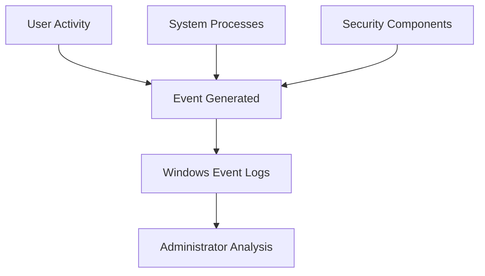
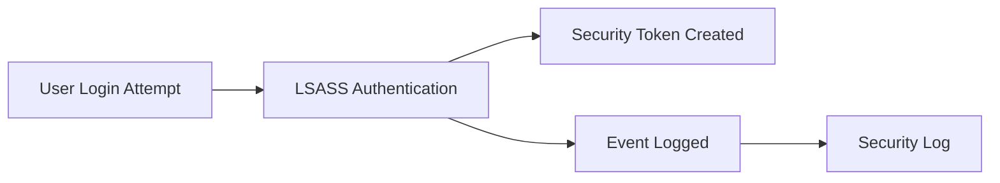
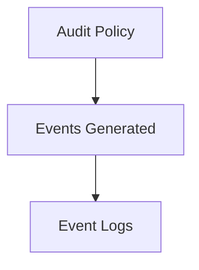
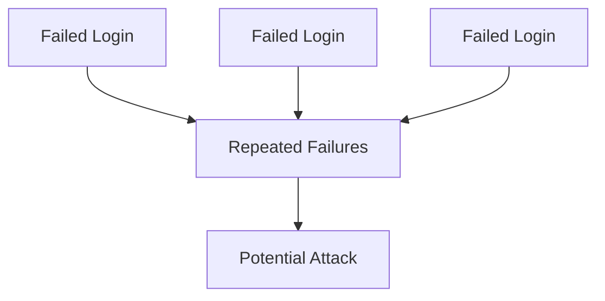

# 1. Assignment Details

| Field            | Information                                    |
| ---------------- | ---------------------------------------------- |
| Workshop Title   | Workshop 11 – Security Monitoring & Event Logs |
| Course Code      | OSYS2020                                       |
| Course Title     | Windows Security                               |
| Instructor       | Davis Boudreau                                 |
| Assignment Type  | Guided Lab + Investigation                     |
| Weight           | Formative                                      |
| Estimated Effort | 1–2 hours                                      |
| Delivery Mode    | In-class / Remote Lab                          |
| Prerequisites    | WS04–WS10                                      |
| Due              | See LMS (Brightspace)                          |

---

# 2. Overview / Purpose / Objectives

## Overview

So far, you have implemented multiple layers of security:

* Identity (users, groups, tokens)
* Access control (NTFS)
* Privileges
* Policy (GPO)
* Network protection (Firewall)
* Endpoint protection (Defender)

However, security systems are only effective if administrators can:

```text id="x7prr1"
Detect suspicious activity
Monitor system behavior
Identify potential attacks
```

This is where **security monitoring** becomes critical.

---

## Purpose

This workshop introduces **Windows Event Logs**, which provide visibility into:

* authentication events
* system changes
* security violations
* application activity

---

## Objectives

By the end of this workshop students will be able to:

* explain the role of security monitoring
* navigate Windows Event Viewer
* identify important security events
* analyze authentication logs
* detect suspicious activity patterns
* understand audit policies

---

# 3. Security Monitoring Architecture

Windows logs events generated by:

* system processes
* user activity
* security components

---

## Event Logging Architecture Map



---

## Key Insight

Event logs provide:

```text
A historical record of system activity
```

They are critical for:

* detection
* investigation
* auditing

---

# 4. Types of Windows Event Logs

Windows organizes logs into categories.

---

## Core Logs

| Log Type         | Purpose                        |
| ---------------- | ------------------------------ |
| Security         | Authentication, access control |
| System           | OS and service events          |
| Application      | Application activity           |
| Setup            | Installation events            |
| Forwarded Events | Centralized logs               |

---

## Most Important Log

```text
Security Log
```

This log tracks:

* logins
* account changes
* access attempts

---

# 5. Authentication Event Flow

When a user logs in, multiple components generate logs.

---

## Authentication Logging Model



---

## Key Insight

Every authentication attempt leaves **evidence in the Security Log**.

---

# 6. Important Security Event IDs

Students must learn key Event IDs.

---

## Critical Event IDs

| Event ID | Meaning                     |
| -------- | --------------------------- |
| 4624     | Successful logon            |
| 4625     | Failed logon                |
| 4634     | Logoff                      |
| 4672     | Special privileges assigned |
| 4688     | Process creation            |
| 4720     | User account created        |
| 4726     | User account deleted        |

---

## Example

```text
Event ID 4625 = Failed Login Attempt
```

---

# 7. Audit Policies

Events are only logged if auditing is enabled.

---

## Audit Policy Model



---

## Key Concept

```text
No auditing = No visibility
```

---

# 8. Lab – Event Log Investigation

---

## Step 1 – Open Event Viewer

```text
Event Viewer → Windows Logs → Security
```

---

## Step 2 – Generate Events

Students must:

1. Log out and log back in
2. Attempt incorrect password login
3. Open applications

---

## Step 3 – Identify Events

Students locate:

* successful logon (4624)
* failed logon (4625)

---

## Step 4 – Analyze Event Details

Students examine:

* username
* timestamp
* source IP (if applicable)
* logon type

---

## Step 5 – Filter Logs

Students apply filters:

```text
Filter by Event ID = 4625
```

---

## Step 6 – Identify Suspicious Activity

Students must determine:

```text
Multiple failed login attempts
```

---

# 9. Security Scenario – Brute Force Attack

## Scenario

An attacker attempts repeated logins.

---

## Detection Pattern

```text
Multiple 4625 events
Same account
Short time interval
```

---

## Detection Model



---

# 10. Student Discovery Exercise

Students answer:

```text
What evidence indicates suspicious login activity?
```

Tasks:

* identify failed login patterns
* analyze timestamps
* detect anomalies

---

# 11. Reflection Questions

1. Why are event logs critical for security?

2. What happens if auditing is disabled?

3. How can logs help detect attacks?

4. What patterns indicate suspicious behavior?

---

# 12. Deliverables

Students submit:

* screenshots of event logs
* analysis of login events
* detection of suspicious activity
* reflection answers

File name:

```text
StudentID_OSYS2020_WS11_EventLogs.docx
```

---

# 13. Instructor Deep Dive

In enterprise environments:

```text
Millions of events generated daily
```

Security teams rely on:

* centralized logging
* SIEM systems
* automated detection

---

## Real-World Insight

Attackers often:

```text
Attempt multiple logins
Escalate privileges
Execute processes
```

Logs provide the **only evidence** of these actions.

---

# 14. Real-World Failure Example

Without logging:

```text
Attack occurs
No record exists
No investigation possible
```

---

# 15. Best Practices

### Enable Auditing

```text
Always log security events
```

---

### Monitor Logs Regularly

```text
Logs must be reviewed
```

---

### Use Filtering

```text
Focus on critical events
```

---

### Centralize Logs (Advanced)

```text
Use SIEM systems
```

---

# 16. Final Key Takeaways

After WS11, students should remember:

1. **Windows Event Logs provide visibility into system activity.**

2. **Security logs record authentication and access events.**

3. **Event IDs help identify specific activities.**

4. **Audit policies determine what gets logged.**

5. **Patterns in logs reveal potential attacks.**

6. **Monitoring is essential for detecting security incidents.**

---
