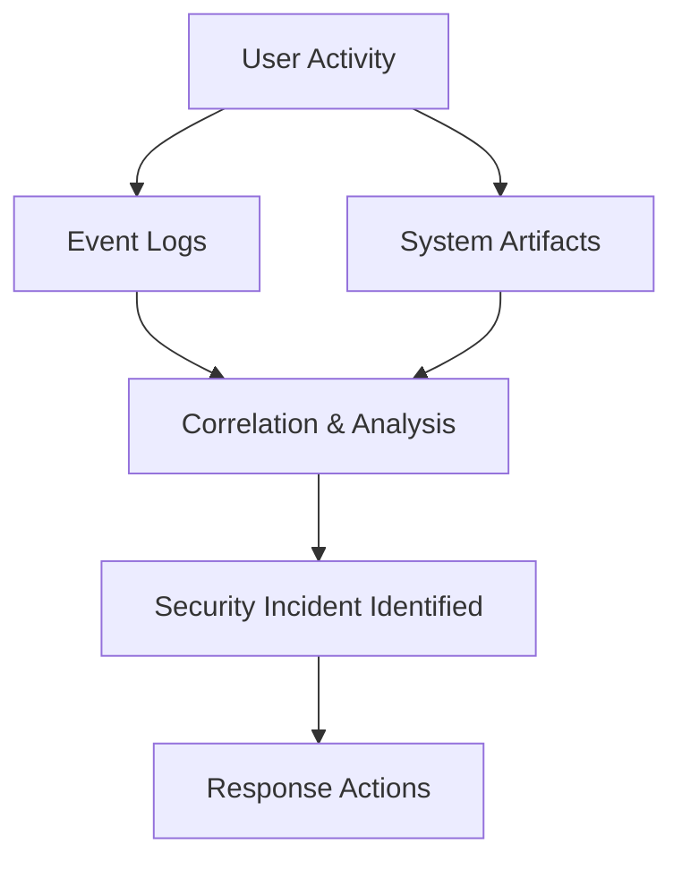
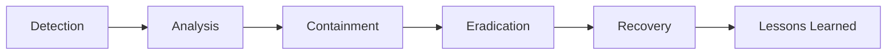
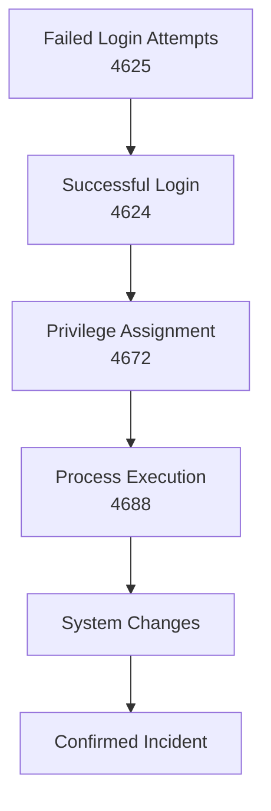
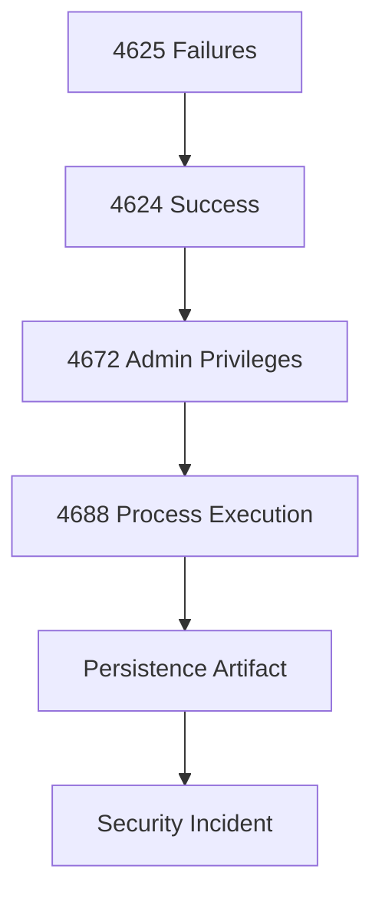

# **OSYS2020 – Windows Security**

# **Workshop 12 (WS12): Security Incident Detection & Response (Host-Based Investigation)**

**Case Study Organization:** **CBB – Circuit Board Breakers**
**Continues from:** WS04–WS11

---

# 1. Assignment Details

| Field            | Information                                 |
| ---------------- | ------------------------------------------- |
| Workshop Title   | Workshop 12 – Incident Detection & Response |
| Course Code      | OSYS2020                                    |
| Course Title     | Windows Security                            |
| Instructor       | Davis Boudreau                              |
| Assignment Type  | Investigation Lab + Case Study              |
| Weight           | Formative                                   |
| Estimated Effort | 1–2 hours                                   |
| Delivery Mode    | In-class / Remote Lab                       |
| Prerequisites    | WS04–WS11                                   |
| Due              | See LMS (Brightspace)                       |

---

# 2. Overview / Purpose / Objectives

## Overview

Up to this point, you have built a layered security system:

* Identity & authentication (WS04, WS07)
* Access control (WS05)
* Privileges (WS06)
* Policy enforcement (WS08)
* Network protection (WS09)
* Endpoint protection (WS10)
* Monitoring & logging (WS11)

Now, you must answer the most important question:

```text id="q0uvb6"
What happens when security controls fail?
```

---

## Purpose

This workshop introduces **incident detection and response** using:

* event logs
* system artifacts
* security evidence

Students will learn how to:

* identify suspicious activity
* correlate events
* reconstruct an attack timeline
* determine impact and response

---

## Objectives

By the end of this workshop students will be able to:

* define a security incident
* analyze event logs for attack patterns
* correlate multiple events into a timeline
* identify compromise indicators
* understand response strategies
* apply structured investigation techniques

---

# 3. Incident Response Architecture

Security incidents are identified through **correlated evidence across systems**.

---

## Incident Detection Model



---

## Key Insight

A single event rarely indicates an attack.

```text id="s6o79t"
Incidents are identified through patterns of multiple events
```

---

# 4. The Incident Lifecycle

Security incidents follow a structured lifecycle.

---

## Incident Lifecycle Model



---

## Workshop Focus

This workshop emphasizes:

```text id="5ap9c0"
Detection → Analysis → Initial Response
```

---

# 5. Indicators of Compromise (IoC)

Indicators of compromise are **evidence of malicious activity**.

---

## Common IoCs

| Type           | Example                 |
| -------------- | ----------------------- |
| Authentication | Multiple failed logins  |
| Privilege      | Unexpected admin access |
| Process        | Unknown executable      |
| Persistence    | Registry startup entry  |
| Network        | Unexpected connections  |

---

## Key Insight

```text id="l5b0x3"
IoCs must be interpreted together, not individually
```

---

# 6. Attack Timeline Correlation

Investigators reconstruct events over time.

---

## Timeline Model



---

## Key Insight

An attack is identified by:

```text id="lj9t9g"
Sequence + Timing + Context
```

---

# 7. Lab – Security Incident Investigation

---

## Scenario – CBB Security Breach

CBB suspects unauthorized access to a workstation.

Students are provided with:

* system access
* event logs
* system artifacts

---

## Step 1 – Identify Suspicious Events

Students must locate:

* failed logins (4625)
* successful logins (4624)
* privilege escalation (4672)

---

## Step 2 – Detect Patterns

Students analyze:

```text id="lj8wsi"
Repeated failed login attempts
Followed by successful login
```

---

## Step 3 – Investigate Process Activity

Students identify:

```text id="p9mx0q"
Event ID 4688 (Process creation)
```

Questions:

* what process was executed?
* was it expected?

---

## Step 4 – Identify Potential Persistence

Students examine:

* startup programs
* registry keys (Run / RunOnce)

---

## Step 5 – Build an Attack Timeline

Students must construct:

```text id="t9t0jx"
A chronological sequence of events
```

---

## Step 6 – Determine Impact

Students answer:

```text id="2dczrh"
Was the system compromised?
What actions were taken?
```

---

## Step 7 – Recommend Response

Students propose:

* account lockdown
* firewall adjustments
* system scan
* password resets

---

# 8. Evidence Correlation Diagram



---

# 9. Student Discovery Exercise

Students must answer:

```text id="qaq9v3"
What sequence of events confirms a security incident?
```

Tasks:

* identify event correlation
* determine attacker behavior
* explain evidence

---

# 10. Reflection Questions

1. What defines a security incident?

2. Why is a single event not enough to confirm an attack?

3. How does event correlation improve detection?

4. What steps should be taken after detecting an incident?

---

# 11. Deliverables

Students must submit:

* identified event logs
* attack timeline
* incident analysis
* response recommendations

File name:

```text id="b1g2o1"
StudentID_OSYS2020_WS12_IncidentResponse.docx
```

Submit via **Brightspace**.

---

# 12. Instructor Deep Dive

In enterprise environments:

```text id="yqqx3r"
Security incidents are constant
Detection requires correlation across systems
```

---

## Real-World Insight

Security teams rely on:

* SIEM systems
* automated alerting
* correlation engines

---

## Key Professional Skill

Students are learning:

```text id="e9p6jz"
How to think like a security analyst
```

---

# 13. Real-World Failure Example

If incidents are not detected:

```text id="y1ryso"
Attack persists undetected
Data is exfiltrated
System remains compromised
```

---

# 14. Best Practices

### Correlate Events

```text id="d9m2pg"
Look for patterns, not isolated events
```

---

### Investigate Timelines

```text id="c2dpxe"
Sequence reveals intent
```

---

### Validate Evidence

```text id="87tqvh"
Confirm before concluding
```

---

### Respond Quickly

```text id="y8ql5h"
Contain threats immediately
```

---

# 15. Final Key Takeaways

After WS12, students should remember:

1. **A security incident is identified through correlated evidence.**

2. **Event logs provide the primary source of investigation data.**

3. **Attack timelines reveal attacker behavior.**

4. **Multiple event types must be analyzed together.**

5. **Incident response includes detection, analysis, and containment.**

6. **Security analysts must think critically and systematically.**

---
