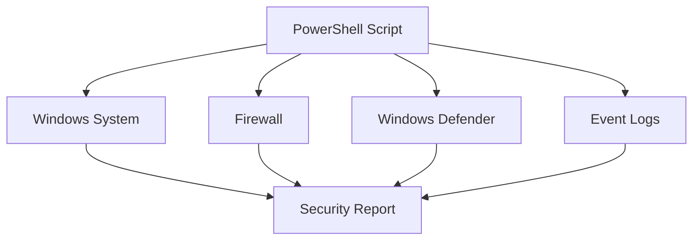
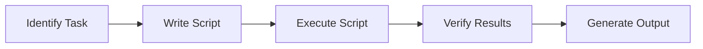
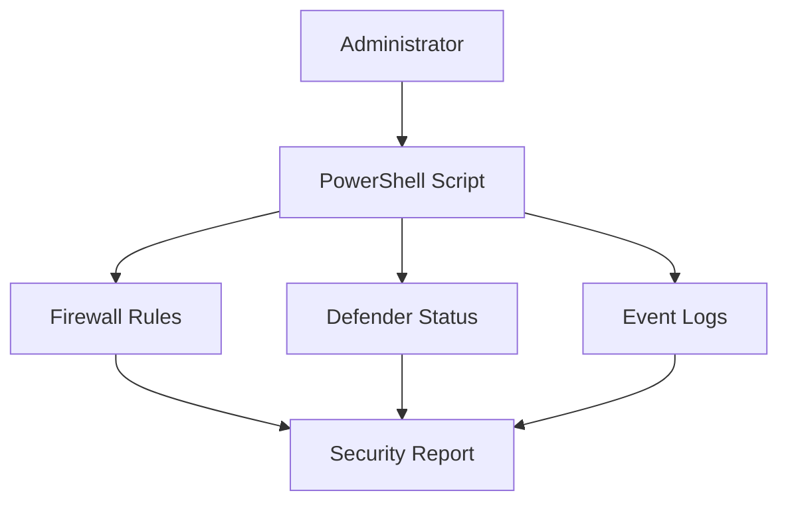

# **OSYS2020 – Windows Security**

# **Workshop 13 (WS13): PowerShell for Security Automation & System Hardening**

**Case Study Organization:** **CBB – Circuit Board Breakers**
**Continues from:** WS04–WS12

---

# 1. Assignment Details

| Field            | Information                                  |
| ---------------- | -------------------------------------------- |
| Workshop Title   | Workshop 13 – PowerShell Security Automation |
| Course Code      | OSYS2020                                     |
| Course Title     | Windows Security                             |
| Instructor       | Davis Boudreau                               |
| Assignment Type  | Guided Lab + Automation Exercise             |
| Weight           | Formative                                    |
| Estimated Effort | 1-2 hours                                    |
| Delivery Mode    | In-class / Remote Lab                        |
| Prerequisites    | WS04–WS12                                    |
| Due              | See LMS (Brightspace)                        |

---

# 2. Overview / Purpose / Objectives

## Overview

Throughout this course, you have learned how to:

* configure security controls
* enforce policies
* protect systems
* monitor activity
* investigate incidents

However, enterprise environments require:

```text id="y3s7wz"
Consistency
Scalability
Automation
```

Manual configuration is not practical when managing:

```text id="5pdy8r"
Hundreds or thousands of systems
```

---

## Purpose

This workshop introduces **PowerShell as a security automation tool**.

Students will learn how to:

* automate security configurations
* audit system settings
* query logs
* enforce security controls

---

## Objectives

By the end of this workshop students will be able to:

* explain the role of automation in security operations
* use PowerShell to query system information
* automate firewall and Defender configurations
* retrieve and analyze event logs
* build basic security scripts
* understand repeatable security enforcement

---

# 3. Security Automation Architecture

Automation connects multiple security systems.

---

## Security Automation Model



---

## Key Insight

PowerShell acts as a:

```text id="yyrv8x"
Central control layer for Windows security
```

---

# 4. Why Automation Is Critical

Manual security management leads to:

* inconsistent configurations
* human error
* slow response times

---

## Automation Benefits

| Benefit      | Description                       |
| ------------ | --------------------------------- |
| Consistency  | Same configuration across systems |
| Speed        | Rapid execution                   |
| Scalability  | Manage many systems               |
| Auditability | Repeatable processes              |

---

# 5. Core PowerShell Security Commands

Students must become familiar with key commands.

---

## System & User Commands

```powershell
Get-LocalUser
Get-LocalGroup
Get-LocalGroupMember
```

---

## Firewall Commands

```powershell
Get-NetFirewallRule
New-NetFirewallRule
Set-NetFirewallRule
```

---

## Defender Commands

```powershell
Get-MpPreference
Start-MpScan
Get-MpThreat
```

---

## Event Log Commands

```powershell
Get-EventLog
Get-WinEvent
```

---

# 6. Automation Workflow

---

## Security Automation Flow



---

## Key Insight

Automation must always include:

```text id="t4rq4q"
Verification and validation
```

---

# 7. Lab – Security Automation Tasks

---

## Scenario – CBB Security Operations

CBB requires automation to:

* audit firewall rules
* check Defender status
* monitor login activity

---

## Task 1 – Retrieve System Users

```powershell
Get-LocalUser
```

Students identify:

* enabled accounts
* suspicious accounts

---

## Task 2 – Audit Firewall Rules

```powershell
Get-NetFirewallRule | Where-Object {$_.Enabled -eq "True"}
```

Students analyze:

* active rules
* exposed services

---

## Task 3 – Scan System with Defender

```powershell
Start-MpScan -ScanType QuickScan
```

---

## Task 4 – Retrieve Threat History

```powershell
Get-MpThreat
```

---

## Task 5 – Analyze Security Events

```powershell
Get-WinEvent -LogName Security -MaxEvents 20
```

Students identify:

* login attempts
* suspicious activity

---

## Task 6 – Create Firewall Rule via Script

```powershell
New-NetFirewallRule -DisplayName "Block HTTP" -Direction Inbound -Protocol TCP -LocalPort 80 -Action Block
```

---

## Task 7 – Build a Basic Security Script

Students create a script that:

* checks users
* checks firewall
* checks logs

---

# 8. Automation Use Case Diagram



---

# 9. Student Discovery Exercise

Students answer:

```text id="rc0wy4"
How can PowerShell improve security operations?
```

Tasks:

* compare manual vs automated tasks
* identify efficiency gains
* explain scalability

---

# 10. Reflection Questions

1. Why is automation critical in enterprise security?

2. What risks exist when automating security tasks?

3. How does PowerShell interact with system components?

4. What should always follow automation?

---

# 11. Deliverables

Students must submit:

* PowerShell script file
* command outputs
* analysis of results
* reflection answers

File name:

```text id="7c1nkt"
StudentID_OSYS2020_WS13_Automation.ps1
```

Submit via **Brightspace**.

---

# 12. Instructor Deep Dive

In enterprise environments:

```text id="7p7l3c"
Security is automated through scripts and tools
```

Examples include:

* automated patching
* centralized monitoring
* compliance checks

---

## Real-World Insight

Security teams use:

```text id="9q7w4l"
PowerShell + SIEM + automation frameworks
```

---

## Key Professional Skill

Students are learning:

```text id="6mxtnq"
How to scale security operations
```

---

# 13. Real-World Failure Example

Without automation:

```text id="p2wqdf"
Inconsistent configurations
Missed vulnerabilities
Delayed incident response
```

---

# 14. Best Practices

### Validate Scripts

```text id="xv3p9m"
Always test before deployment
```

---

### Use Least Privilege

```text id="n0n5z5"
Avoid running scripts with unnecessary privileges
```

---

### Log Output

```text id="3n1d5y"
Track script results
```

---

### Automate Carefully

```text id="bbwb6q"
Automation errors scale quickly
```

---

# 15. Final Key Takeaways

After WS13, students should remember:

1. **PowerShell enables automation of Windows security tasks.**

2. **Automation improves consistency, speed, and scalability.**

3. **Security systems (Firewall, Defender, Logs) can be controlled through scripts.**

4. **Automation must always include verification.**

5. **Poor automation can introduce large-scale risk.**

6. **Modern security operations rely heavily on automation.**

---
