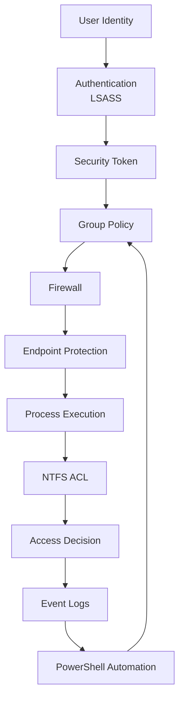
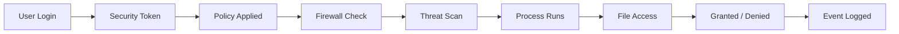
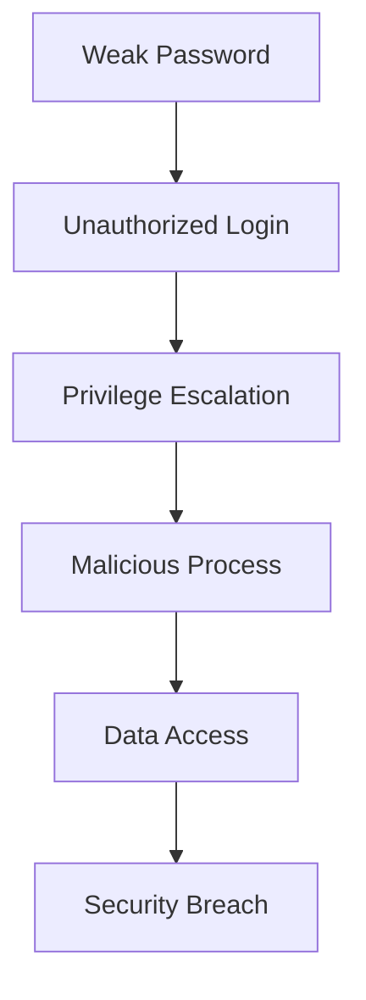

# **OSYS2020 – Windows Security**

# **Workshop 14 (WS14): Security Integration, Review & Capstone Readiness**

**Case Study Organization:** **CBB – Circuit Board Breakers**
**Continues from:** WS01–WS13

---

# 1. Assignment Details

| Field            | Information                                 |
| ---------------- | ------------------------------------------- |
| Workshop Title   | Workshop 14 – Security Integration & Review |
| Course Code      | OSYS2020                                    |
| Course Title     | Windows Security                            |
| Instructor       | Davis Boudreau                              |
| Assignment Type  | Capstone Review + Integrated Scenario       |
| Weight           | Formative (Final Preparation)               |
| Estimated Effort | 1-2 hours                                   |
| Delivery Mode    | In-class / Guided Review                    |
| Prerequisites    | WS01–WS13                                   |
| Due              | Final Week (Pre-Test Preparation)           |

---

# 2. Overview / Purpose / Objectives

## Overview

Throughout this course, you have built a complete **Windows Security Architecture**:

* Identity & authentication
* Access control (NTFS)
* Privileges & roles
* Security architecture (tokens, LSASS, SRM)
* Policy enforcement (GPO)
* Network protection (Firewall)
* Endpoint protection (Defender)
* Monitoring (Event Logs)
* Incident response
* Automation (PowerShell)

---

## Purpose

This workshop consolidates all learning into a **single integrated model**.

Students will:

* connect all security layers
* analyze a full system scenario
* reinforce key concepts
* prepare for final evaluation

---

## Objectives

By the end of this workshop students will be able to:

* explain the complete Windows security architecture
* identify how all layers interact
* analyze security weaknesses across layers
* apply a structured security mindset
* prepare confidently for final assessment

---

# 3. The Complete Windows Security Architecture

This course is built around a **layered security model**.

---

## Windows Security Brain (Full Integration)



---

## Key Insight

Security is not one control — it is:

```text
A coordinated system of interacting components
```

---

# 4. Security Layers Review

---

## Layered Model

| Layer          | Workshop |
| -------------- | -------- |
| Identity       | WS04     |
| Access Control | WS05     |
| Privileges     | WS06     |
| Architecture   | WS07     |
| Policy         | WS08     |
| Network        | WS09     |
| Endpoint       | WS10     |
| Monitoring     | WS11     |
| Response       | WS12     |
| Automation     | WS13     |

---

## Key Understanding

Each layer:

```text
Protects the system
Depends on other layers
Can fail independently
```

---

# 5. Integrated Security Flow

---

## End-to-End Security Flow



---

## Critical Insight

At every step:

```text
Security decisions are being made
```

---

# 6. Lab – Integrated Security Scenario

---

## Scenario – CBB Security Review

CBB has deployed a workstation and wants to validate its security posture.

Students must evaluate:

* user access
* firewall exposure
* Defender status
* event logs
* system configuration

---

## Step 1 – Identity & Access Check

Students verify:

* user accounts
* group memberships
* privileges

---

## Step 2 – NTFS Review

Students analyze:

* folder permissions
* inheritance
* effective access

---

## Step 3 – Firewall Review

Students check:

* active rules
* exposed ports
* profile configuration

---

## Step 4 – Defender Review

Students verify:

* real-time protection
* scan status
* threat history

---

## Step 5 – Event Log Analysis

Students review:

* login activity
* suspicious events

---

## Step 6 – Identify Weaknesses

Students must identify:

```text
Misconfigurations
Over-permissive access
Security gaps
```

---

## Step 7 – Recommend Improvements

Students propose:

* policy changes
* permission adjustments
* firewall rules
* monitoring improvements

---

# 7. Security Failure Chain

---

## Failure Model



---

## Key Insight

A breach is rarely one failure:

```text
It is a chain of failures across multiple layers
```

---

# 8. Student Discovery Exercise

Students answer:

```text
Where can security fail in a layered system?
```

Tasks:

* identify weak points
* explain impact
* propose mitigation

---

# 9. Reflection Questions

1. Why is layered security important?

2. What happens if one layer fails?

3. How do different security systems interact?

4. What is the role of monitoring and automation?

---

# 10. Deliverables

Students must submit:

* system security analysis
* identified weaknesses
* recommended improvements
* reflection responses

File name:

```text
StudentID_OSYS2020_WS14_Review.docx
```

Submit via **Brightspace**.

---

# 11. Instructor Deep Dive

In real enterprise environments:

```text
Security is continuous, not static
```

Organizations must:

* monitor constantly
* respond quickly
* adapt controls
* automate processes

---

## Professional Insight

Security professionals do not:

```text
Configure once and forget
```

They:

```text
Continuously assess and improve
```

---

# 12. Real-World Perspective

Major breaches occur when:

* layers are misconfigured
* monitoring is ignored
* response is delayed

---

# 13. Best Practices Summary

### Defense in Depth

```text
Multiple layers of protection
```

---

### Least Privilege

```text
Minimum required access
```

---

### Continuous Monitoring

```text
Always observe system activity
```

---

### Automation

```text
Scale security operations
```

---

# 14. Final Key Takeaways

After WS14, students should remember:

1. **Windows security is a layered architecture of multiple systems.**

2. **Each layer contributes to overall protection.**

3. **Security failures occur when multiple layers fail together.**

4. **Monitoring and response are critical for detecting threats.**

5. **Automation enables scalable security operations.**

6. **Security is an ongoing process, not a one-time configuration.**

---

# Final Student Mental Model

Students should leave the course understanding:

```text
Security is a system:

Identity → Access → Policy → Network → Endpoint → Monitoring → Response → Automation
```

---
