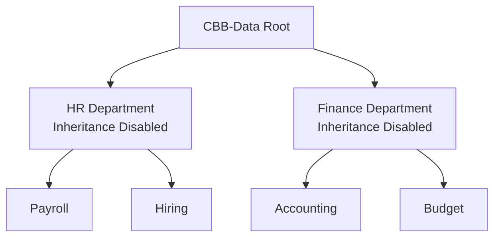
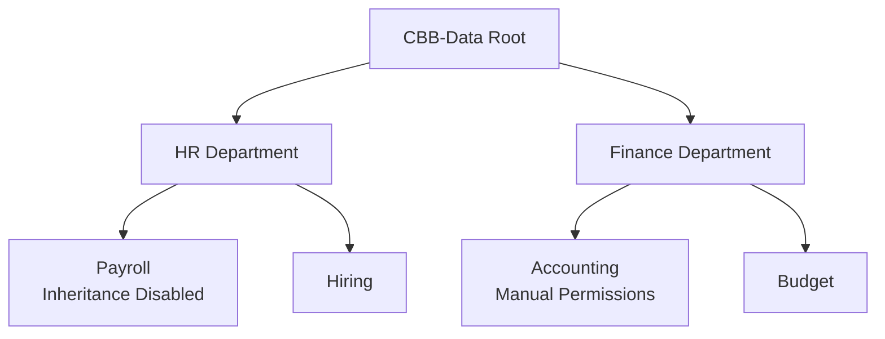

# What Happens When Inheritance Is Broken Incorrectly

NTFS inheritance is powerful because it allows administrators to manage permissions **once at a higher level** and have those permissions automatically propagate throughout the folder structure.

However, if inheritance is disabled **improperly**, security can become inconsistent and difficult to manage.

This problem is commonly referred to as **permission drift**.

Permission drift occurs when:

* inheritance is disabled unnecessarily
* permissions are manually modified at many levels
* administrators lose visibility into the overall access structure

Over time, the security model becomes unpredictable.

---

## Example: Correct Permission Architecture

In a properly designed structure, permissions flow cleanly from the department folder to all child folders.



In this design:

* HR permissions apply to **Payroll and Hiring**
* Finance permissions apply to **Accounting and Budget**
* Security boundaries remain **predictable and easy to audit**

Administrators can easily verify access control.

---

## Example: Broken Inheritance and Permission Drift

Now consider what happens when inheritance is disabled in multiple locations without a clear design.



Problems now occur:

* Payroll no longer follows HR security rules
* Accounting permissions may differ from Finance policies
* Administrators must manually inspect each folder
* Access becomes inconsistent across the organization

In large file servers containing **hundreds of thousands of folders**, this situation becomes extremely difficult to manage.

---

## Real-World Consequences of Permission Drift

Improper inheritance design can lead to serious issues:

### Data Exposure

Sensitive files may become accessible to unauthorized users.

Example:

```
Payroll records accidentally readable by Sales staff
```

---

### Access Failures

Employees cannot access files required for their job.

Example:

```
Finance staff blocked from budget documents
```

---

### Administrative Complexity

IT staff must troubleshoot folder permissions manually.

This often requires:

* reviewing ACL entries
* examining inheritance settings
* analyzing group membership
* using Effective Access tools

---

### Audit and Compliance Risks

Many regulatory frameworks require strict data access control:

* PCI-DSS
* HIPAA
* ISO 27001
* SOC 2

Broken inheritance chains can result in **failed security audits**.

---

## Best Practice: Control Where Inheritance Is Broken

Professional administrators follow a simple rule:

```
Inheritance should only be broken at defined security boundaries.
```

Examples:

| Folder  | Reason                                |
| ------- | ------------------------------------- |
| HR      | Confidential employee data            |
| Finance | Payroll and financial information     |
| Legal   | Contracts and sensitive documentation |

Folders that do **not represent security boundaries** should typically **retain inheritance**.

---

## Visual Summary

A healthy NTFS design looks like this:


Permissions flow consistently downward through the structure.

When inheritance is controlled carefully, administrators gain:

* predictable security
* simplified management
* scalable file server architecture

---

## Instructor Insight

In real enterprise environments, file servers can contain:

```
Millions of files
Hundreds of thousands of folders
Thousands of users
```

Without inheritance, managing NTFS permissions at this scale would be nearly impossible.

This is why **understanding inheritance is one of the most important skills for Windows system administrators**.

---
