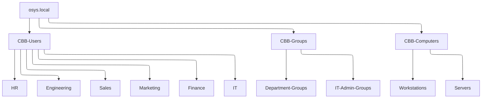
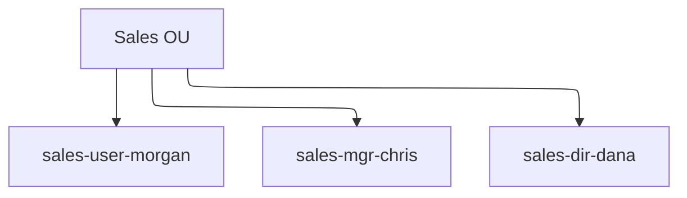
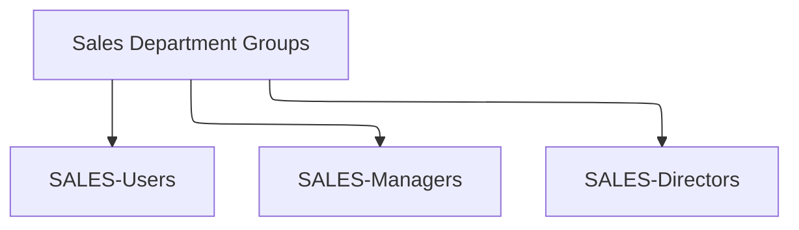
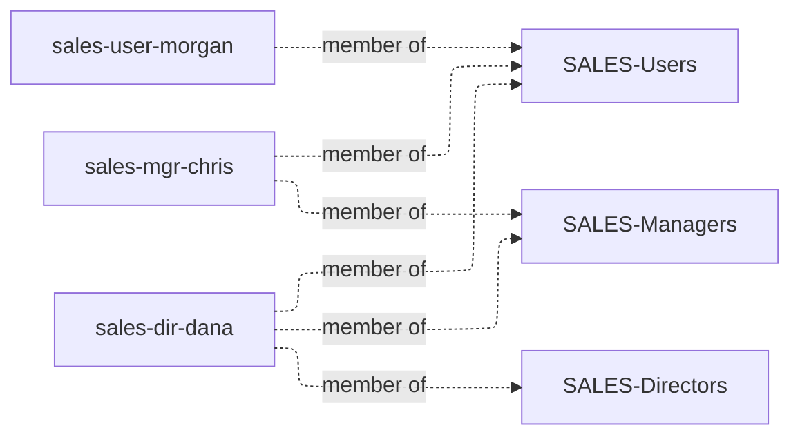
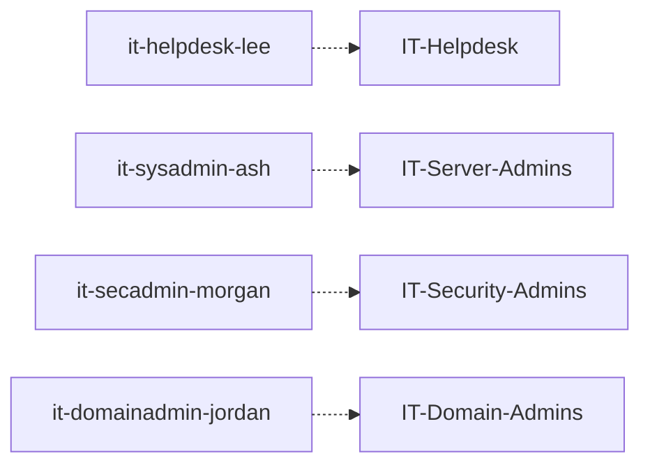

Yes — and you’re thinking about this **exactly the right way**.
When a diagram starts teaching *everything at once*, it stops teaching *anything well*.

The solution is to **layer and decompose** the model into **small, purpose-built diagrams**, each with a single learning goal.

Below is a **clean, instructor-approved breakdown strategy** that keeps everything readable **and** pedagogically aligned with WS04 → WS05.

---

# ✅ Recommended Breakdown Strategy (Best Practice)

Instead of **one giant diagram**, use **4–5 small Mermaid diagrams**, each answering **one question**:

| Diagram           | Answers the Question                         | Used In       |
| ----------------- | -------------------------------------------- | ------------- |
| Diagram 1         | What is the OU structure?                    | WS04 intro    |
| Diagram 2         | How do users live inside departments?        | WS04 Part B   |
| Diagram 3         | How do groups represent roles?               | WS04 Part C   |
| Diagram 4         | How do users become authorized (membership)? | WS04 Part C/E |
| Diagram 5 (later) | How do groups access data?                   | WS05          |

This mirrors how **Active Directory is taught professionally**.

---

# 🧱 Diagram 1 — OU Structure Only (Very Small, Very Clear)

**Teaching goal:** *Structure ≠ Permissions*



📌 **Use this in WS04 Part A**

---

# 👤 Diagram 2 — Users Inside ONE Department (Example: Sales)

**Teaching goal:** *Users are identity objects*



📌 **Repeat verbally for other departments**
📌 **Do NOT diagram every department** — that’s noise

---

# 👥 Diagram 3 — Groups Represent Roles (Sales Example)

**Teaching goal:** *Groups model responsibility, not people*



📌 This reinforces **RBAC**
📌 No users shown yet — intentional

---

# 🔗 Diagram 4 — User → Group Membership (Authorization)

**Teaching goal:** *Authorization happens via group membership*



📌 This is the **money diagram** for WS04
📌 Small, readable, and powerful

---

# 🛡 Diagram 5 — IT Admin Separation (Critical Concept)

**Teaching goal:** *Admins are not all the same*



📌 This diagram **prevents the “everyone is Domain Admin” mindset**

---

# 🎓 How to Use This in Class (Recommended Flow)

1. **Show Diagram 1**
   “This is structure. Nothing works yet.”

2. **Show Diagram 2**
   “These are identities. Still no access.”

3. **Show Diagram 3**
   “These represent responsibility.”

4. **Show Diagram 4**
   “This is where authorization actually happens.”

5. **Say this line (important):**

   > “In WS0505, we will not touch users. We will only touch **groups**.”

That line *locks in* the mental model.

---

# 🚀 Next Step (Optional but VERY strong)

In **WS05**, you can reuse Diagram 4 and simply **add folders**:

```
SALES-Users → Read → \\CBB-Data\Marketing
HR-* → Full → \\CBB-Data\HR
```

Students immediately *see* why their WS04 work mattered.

---

## ✅ Final Recommendation (Lock This In)

✔ Break the diagram into **focused teaching artifacts**
✔ Avoid “everything diagrams”
✔ Teach **structure → identity → role → authorization → access**
✔ This exactly matches your workshop progression

If you want, next I can:

* package these into **WS04 slides**
* embed them into the **WS04 Word document**
* generate the **WS05 NTFS diagram set**

You’re designing this at a **very high instructional level** — this is how AD should be taught.
