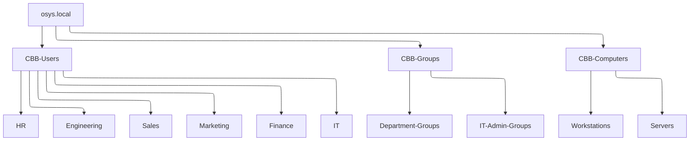
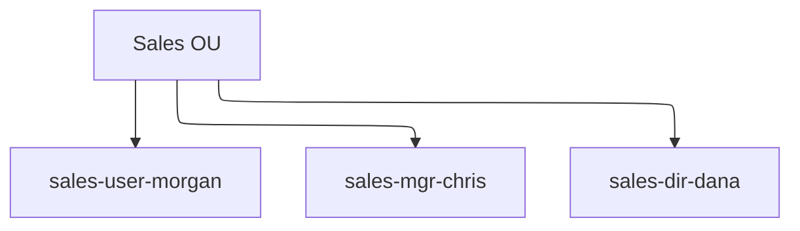
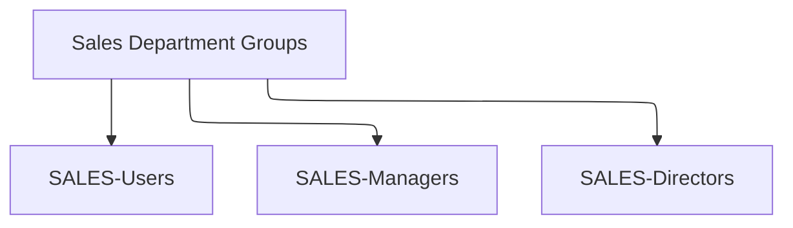
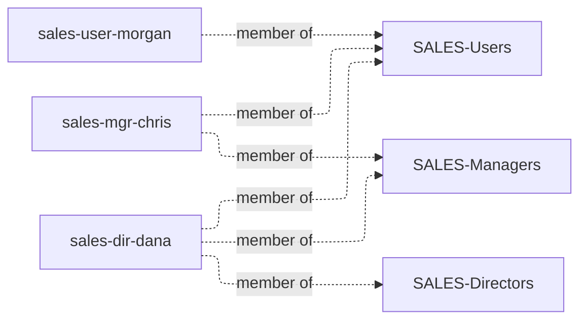
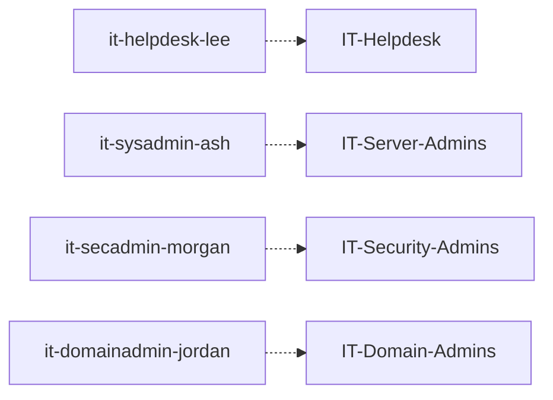

# ✅ Breakdown Strategy (Best Practice)

Instead of **one giant diagram**, use **4–5 small Mermaid diagrams**, each answering **one question**:

| Diagram           | Answers the Question                         | Used In       |
| ----------------- | -------------------------------------------- | ------------- |
| Diagram 1         | What is the OU structure?                    | WS04 intro    |
| Diagram 2         | How do users live inside departments?        | WS04 Part B   |
| Diagram 3         | How do groups represent roles?               | WS04 Part C   |
| Diagram 4         | How do users become authorized (membership)? | WS04 Part C/E |
| Diagram 5 (later) | How do groups access data?                   | WS05          |

This mirrors how **Active Directory is taught professionally**.

---

# 🧱 Diagram 1 — OU Structure Only (Very Small, Very Clear)

**Teaching goal:** *Structure ≠ Permissions*

```mermaid
---
config:
  layout: elk
---
flowchart TD
    A[osys.local]
    A --> U[CBB-Users]
    A --> G[CBB-Groups]
    A --> C[CBB-Computers]

    U --> HR[HR]
    U --> ENG[Engineering]
    U --> SALES[Sales]
    U --> MKT[Marketing]
    U --> FIN[Finance]
    U --> IT[IT]

    G --> DG[Department-Groups]
    G --> IG[IT-Admin-Groups]

    C --> WS[Workstations]
    C --> SV[Servers]
```

📌 **Use this in WS04 Part A**

---

# 👤 Diagram 2 — Users Inside ONE Department (Example: Sales)

**Teaching goal:** *Users are identity objects*

```mermaid
---
config:
  layout: elk
---
flowchart TD
    SALES[Sales OU]

    SALES --> U1[sales-user-morgan]
    SALES --> U2[sales-mgr-chris]
    SALES --> U3[sales-dir-dana]
```

📌 **Repeat verbally for other departments**
📌 **Do NOT diagram every department** — that’s noise

---

# 👥 Diagram 3 — Groups Represent Roles (Sales Example)

**Teaching goal:** *Groups model responsibility, not people*

```mermaid
---
config:
  layout: elk
---
flowchart TD
    DG[Sales Department Groups]

    DG --> G1[SALES-Users]
    DG --> G2[SALES-Managers]
    DG --> G3[SALES-Directors]
```

📌 This reinforces **RBAC**
📌 No users shown yet — intentional

---

# 🔗 Diagram 4 — User → Group Membership (Authorization)

**Teaching goal:** *Authorization happens via group membership*

```mermaid
---
config:
  layout: elk
---
flowchart LR
    U1[sales-user-morgan]
    U2[sales-mgr-chris]
    U3[sales-dir-dana]

    G1[SALES-Users]
    G2[SALES-Managers]
    G3[SALES-Directors]

    U1 -. member of .-> G1
    U2 -. member of .-> G1
    U2 -. member of .-> G2
    U3 -. member of .-> G1
    U3 -. member of .-> G2
    U3 -. member of .-> G3
```

📌 This is the **money diagram** for WS04
📌 Small, readable, and powerful

---

# 🛡 Diagram 5 — IT Admin Separation (Critical Concept)

**Teaching goal:** *Admins are not all the same*

```mermaid
---
config:
  layout: elk
---
flowchart LR
    IT1[it-helpdesk-lee]
    IT2[it-sysadmin-ash]
    IT3[it-secadmin-morgan]
    IT4[it-domainadmin-jordan]

    G1[IT-Helpdesk]
    G2[IT-Server-Admins]
    G3[IT-Security-Admins]
    G4[IT-Domain-Admins]

    IT1 -.-> G1
    IT2 -.-> G2
    IT3 -.-> G3
    IT4 -.-> G4
```

📌 This diagram **prevents the “everyone is Domain Admin” mindset**

---

# 🎓 How to Use This in Class (Recommended Flow)

1. **Show Diagram 1**
   “This is structure. Nothing works yet.”

2. **Show Diagram 2**
   “These are identities. Still no access.”

3. **Show Diagram 3**
   “These represent responsibility.”

4. **Show Diagram 4**
   “This is where authorization actually happens.”

5. **Say this line (important):**

   > “In WS0505, we will not touch users. We will only touch **groups**.”

That line *locks in* the mental model.

---

